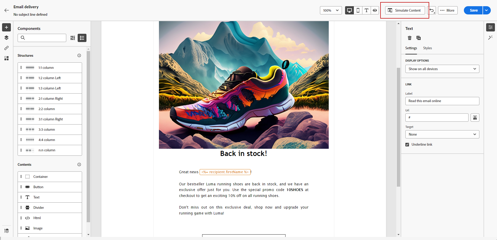

# 使用内容助手生成图像 {#generative-image}

在您精心制作电子邮件并使其个性化后，可以使用由创作AI提供支持的内容助手来增强内容。 此功能简化了个性化和内容改进的过程。

要使用内容助手生成和改进电子邮件中的图像，请执行以下步骤。 您还可以使用内容助手创建完整的HTML内容，如中所述 [此页面](generative-email.md)，或生成文本内容，如中所述 [此页面](generative-content.md).

>[!NOTE]
>
>在开始使用此功能之前，请阅读相关内容 [护栏和限制](generative-gs.md#guardrails-and-limitations).

在下面的示例中，了解如何利用Content Assistant优化和改进您的内容，确保获得对用户更友好的体验。 执行以下步骤：

1. 创建和配置电子邮件投放后，单击 **[!UICONTROL 编辑内容]**.

   有关如何配置电子邮件投放的更多信息，请参阅 [此页面](../content/create-email-content.md).

1. 填写 **[!UICONTROL 基本详细信息]** 用于您的投放。 完成后，单击 **[!UICONTROL 编辑电子邮件内容]**.

1. 选择要使用内容助手更改的资源。

1. 从右侧菜单中，选择 **[!UICONTROL 体验生成]**.

   

1. 添加提示以更好地优化结果。

   

1. 选择 **[!UICONTROL 上传文件]** 如果要添加任何品牌资产，并且资产中包含可以提供其他上下文的内容，请转至“内容助手”。

   您还可以单击 **[!UICONTROL 上传的内容]** 以查找以前更新的文件。 请注意，上传的内容仅供当前用户重复使用。

1. 选择 **[!UICONTROL 宽高比]** 您的资产的。 这会确定资源的宽度和高度。

   您可以选择常用比率，如16:9、4:3、3:2或1:1，也可以输入自定义大小。

1. 自定义 **[!UICONTROL 颜色和色调]**， **[!UICONTROL 内容类型]**， **[!UICONTROL 照明]** 和 **[!UICONTROL 合成]** 设置以匹配所需的资源特征。

   

1. 对提示配置感到满意后，单击 **[!UICONTROL 生成]**.

1. 浏览 **[!UICONTROL 变量建议]** 以查找所需的资产。 单击 **[!UICONTROL 预览]** 以查看所选变体的全屏版本。

   

1. 单击 **[!UICONTROL 选择]** 找到相应的内容后。

   

1. 定义消息内容后，单击 **[!UICONTROL 模拟内容]** 按钮来控制渲染，并使用测试用户档案检查个性化设置。  [了解详情](../preview-test/preview-content.md)

   

1. 定义内容、受众和计划后，便可以准备电子邮件投放。 [了解详情](../monitor/prepare-send.md)