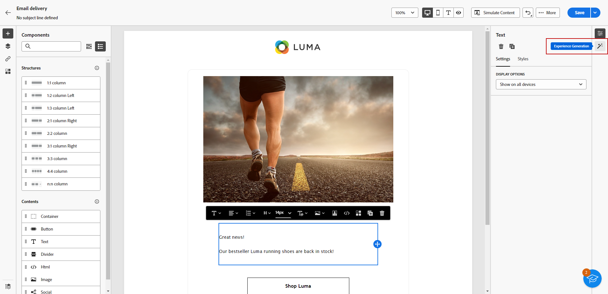
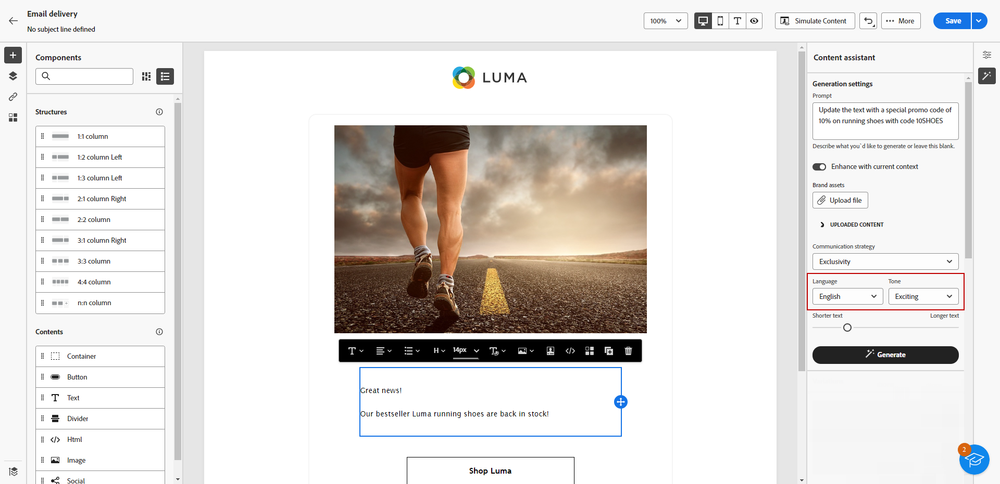
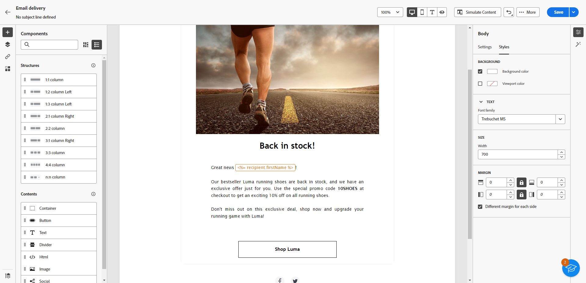

# 使用AI助手生成文本 {#generative-text}

>[!IMPORTANT]
>
>在开始使用此功能之前，请阅读相关的[护栏和限制](generative-gs.md#generative-guardrails)。
> 
>
>在Adobe Campaign Web中使用AI助手之前，必须同意[用户协议](https://www.adobe.com/cn/legal/licenses-terms/adobe-dx-gen-ai-user-guidelines.html){target="_blank"}。 有关更多信息，请与您的 Adobe 代表联系。

使用Adobe Campaign Web中的AI助手生成与受众产生共鸣的引人入胜的文本。 无论您是增强电子邮件复制、制作有说服力的登陆页面内容、编写推送通知消息还是撰写短信文本，AI Assistant都可以帮助您提供清晰、高效的通信。

## 用于电子邮件和登陆页面 {#email-web-channels}

AI助手可以为您的电子邮件投放和登陆页面生成高质量的文本内容。 此功能使您能够创建引人注目的品牌内消息传送，通过数字接触点与受众连接。

### 访问和配置 {#access-configure}

在使用AI助手开始生成文本内容之前，您需要设置投放并访问内容编辑器。 按照以下步骤准备工作区并打开AI助手面板。

1. 创建和配置投放：

   * **电子邮件**：创建和配置电子邮件投放后，单击&#x200B;**[!UICONTROL 编辑内容]**。 [了解详情](../email/create-email-content.md)
   * **登陆页面**：创建和配置登陆页面后，单击&#x200B;**[!UICONTROL 编辑内容]**。 [了解详情](../landing-pages/create-lp.md)

1. 选择&#x200B;**[!UICONTROL 文本组件]**&#x200B;以定位特定内容，并访问&#x200B;**[!UICONTROL AI助手]**&#x200B;菜单。

   {zoomable="yes"}

### 生成内容 {#generate-content}

了解如何使用AI Assistant制作清晰的提示、微调设置并生成定制的文本，确保您的消息传递与品牌和沟通目标保持一致。

1. 选择您的&#x200B;**[!UICONTROL 品牌]**&#x200B;以确保AI生成的内容与您的品牌规格一致。 [了解有关Brands的更多信息](brands.md)。

1. 通过描述您要在&#x200B;**[!UICONTROL 提示]**&#x200B;字段中生成的内容，微调内容。

   如果您在编写提示时需要帮助，请访问&#x200B;**[!UICONTROL 提示库]**，该库提供了多种提示想法以改进投放。 [了解有关提示最佳实践的更多信息](ai-assistant-prompting-guide.md)

   {zoomable="yes"}

1. 使用&#x200B;**[!UICONTROL 文本设置]**&#x200B;选项定制提示：

   * **[!UICONTROL 通信策略]**：为生成的文本选择最合适的通信样式。
   * **[!UICONTROL 语言]**：选择所生成内容的语言。
   * **[!UICONTROL 音调]**：确保您的电子邮件音调可与您的受众引起共鸣。 无论您想听起信息性、娱乐性还是说服力，AI Assistant都会相应地调整消息。
   * **文本长度**：使用滑块选择所需文本长度。

     {zoomable="yes"}

1. 从&#x200B;**[!UICONTROL 引用内容]**&#x200B;菜单中，单击&#x200B;**[!UICONTROL 上载文件]**&#x200B;以添加任何品牌资产，这些品牌资产包含可以提供其他上下文AI助手的内容或选择以前上载的内容。

   以前上载的文件在&#x200B;**[!UICONTROL 上载的引用内容]**&#x200B;下拉列表中可用。 只需切换您想要包含到层代中的资产。

1. 提示就绪后，单击&#x200B;**[!UICONTROL 生成]**。

### 优化并完成 {#refine-finalize}

了解如何审查生成的文本、进行细化并应用个性化来最终确定内容，创建经过优化的消息并参与准备投放。

1. 浏览生成的&#x200B;**[!UICONTROL 变体]**。

1. 单击百分比图标可查看您的&#x200B;**[!UICONTROL 品牌一致性得分]**&#x200B;并识别与您的品牌的所有不一致性。

   了解有关[品牌一致性分数](brands-score.md)的更多信息。

   {zoomable="yes"}

1. 单击&#x200B;**[!UICONTROL 预览]**&#x200B;以查看所选变体的全屏版本，或单击&#x200B;**[!UICONTROL 应用]**&#x200B;以替换当前内容。

1. 导航到&#x200B;**[!UICONTROL 预览]**&#x200B;窗口中的&#x200B;**[!UICONTROL 优化]**&#x200B;选项以访问其他自定义功能：

   * **[!UICONTROL 用作引用内容]**：所选变量用作用于生成其他结果的引用内容。
   * **[!UICONTROL 详述]**：展开特定主题，提供更多详细信息，以便更好地了解和参与。
   * **[!UICONTROL 摘要]**：将关键点浓缩为清晰、简洁的摘要，以吸引注意并鼓励进一步阅读。
   * **[!UICONTROL 重述]**：以不同的方式重述您的消息，使您的写作保持新鲜，吸引各种受众。
   * **[!UICONTROL 使用更简单的语言]**：简化您的语言，确保更广大的受众能够清晰地访问这些内容。
   * **[!UICONTROL 翻译]**：简化您的语言，确保更广大的受众能够清晰地访问这些内容。

   您还可以更改文本的&#x200B;**[!UICONTROL 音调]**&#x200B;和&#x200B;**[!UICONTROL 通信策略]**。

   {zoomable="yes"}

1. 打开&#x200B;**[!UICONTROL 品牌一致性]**&#x200B;选项卡，查看内容如何与[品牌指南](../content/brands.md)保持一致。

1. 找到相应的内容后，单击&#x200B;**[!UICONTROL 选择]**。

1. 插入个性化字段以根据用户档案数据自定义您的内容。 然后，单击&#x200B;**[!UICONTROL 模拟内容]**&#x200B;按钮以控制渲染并检查测试用户档案的个性化设置。 [了解详情](../preview-test/preview-content.md)

1. 查看并激活您的内容：
   * **电子邮件**：定义内容、受众和计划后，您就可以准备电子邮件投放了。 [了解详情](../monitor/prepare-send.md)
   * **登陆页面**：登陆页面准备就绪后，您可以发布该登陆页面，以供在消息中使用。 [了解详情](../landing-pages/create-lp.md)

## 适用于移动渠道 {#mobile-channels}

AI Assistant可以为您的推送通知和短信消息生成引人入胜的文本内容，帮助您创建引人注目的移动通信，在所有移动接触点上与受众连接。

### 访问和配置 {#mobile-access-configure}

在使用AI助手为移动渠道生成文本之前，必须设置投放并访问AI助手。

1. 创建和配置移动投放：
   * **推送通知**：创建和配置推送通知投放后，单击&#x200B;**[!UICONTROL 编辑内容]**。 [了解详情](../push/create-push.md)
   * **短信**：创建和配置短信投放后，单击&#x200B;**[!UICONTROL 编辑内容]**。 [了解详情](../sms/create-sms.md)

1. 根据需要个性化您的消息：
   * **推送通知**： [了解更多](../push/content-push.md)
   * **短信**：[了解详情](../sms/content-sms.md)

1. 访问&#x200B;**[!UICONTROL 显示AI助手]**&#x200B;菜单。

   {zoomable="yes"}

### 生成内容 {#mobile-generate-content}

访问AI助手后，您可以配置生成设置以创建与您的品牌和交付目标匹配的移动内容。 自定义文本参数、添加品牌资产并提供提示以指导AI生成相关变体。

1. 选择您的&#x200B;**[!UICONTROL 品牌]**&#x200B;以确保AI生成的内容与您的品牌规格一致。 [了解有关Brands的更多信息](brands.md)。

1. 通过描述要在&#x200B;**[!UICONTROL 提示]**&#x200B;字段中生成的内容，优化内容。

   如果您在制作提示时寻求帮助，请访问&#x200B;**[!UICONTROL 提示库]**，该库提供各种提示想法以改进您的投放。 [了解有关提示最佳实践的更多信息](ai-assistant-prompting-guide.md)

   具有提示字段和选项的{zoomable="yes"}

1. **对于推送通知**，选择要生成的文本字段：**[!UICONTROL 标题]**、**[!UICONTROL 子标题]**&#x200B;和/或&#x200B;**[!UICONTROL 消息]**。

1. 使用&#x200B;**[!UICONTROL 文本设置]**&#x200B;选项定制提示：

   * **[!UICONTROL 通信策略]**：为生成的文本选择最合适的通信样式。
   * **[!UICONTROL 语言]**：选择所生成内容的语言。
   * **[!UICONTROL 音调]**：该音调应与您的受众产生共鸣。 无论您是要提供信息、好玩还是具有说服力，AI Assistant都可以相应地调整消息。
   * **[!UICONTROL 长度]**：使用范围滑块选择内容的长度。

     {zoomable="yes"}

1. 从&#x200B;**[!UICONTROL 引用内容]**&#x200B;菜单中，单击&#x200B;**[!UICONTROL 上载文件]**&#x200B;以添加任何品牌资产，这些品牌资产包含可以提供其他上下文AI助手的内容或选择以前上载的内容。

   以前上载的文件在&#x200B;**[!UICONTROL 上载的引用内容]**&#x200B;下拉列表中可用。 只需切换您想要包含到层代中的资产。

1. 提示就绪后，单击&#x200B;**[!UICONTROL 生成]**。

### 优化并完成 {#mobile-refine-finalize}

在为移动消息生成文本变体后，您可以微调结果以确保它们符合您的确切要求。 审查品牌定位，调整语调和语言，并准备内容以进行激活。

1. 生成后，浏览&#x200B;**[!UICONTROL 变体]**。

1. 单击百分比图标可查看您的&#x200B;**[!UICONTROL 品牌一致性得分]**&#x200B;并识别与您的品牌的所有不一致性。

   了解有关[品牌一致性分数](brands-score.md)的更多信息。

   {zoomable="yes"}

1. 单击&#x200B;**[!UICONTROL 预览]**&#x200B;以查看所选变体的全屏版本，或单击&#x200B;**[!UICONTROL 应用]**&#x200B;以替换当前内容。

1. 导航到&#x200B;**[!UICONTROL 预览]**&#x200B;窗口中的&#x200B;**[!UICONTROL 优化]**&#x200B;选项以访问其他自定义功能：

   * **[!UICONTROL 用作引用内容]**：所选变量将用作用于生成其他结果的引用内容。

   * **[!UICONTROL 重写]**：重写邮件，同时保留其含义。 此选项可帮助您在不更改核心消息的情况下生成替代措辞、改善流量或调整词语。

   * **[!UICONTROL 使用更简单的语言]**：利用AI Assistant简化您的语言，确保为更广泛的受众提供清晰易懂的语言。

   * **[!UICONTROL 翻译]**：简化您的语言，确保更广大的受众能够清晰地访问这些内容。

   * **[!UICONTROL 更改语调]**：调整消息语调以更好地匹配您的沟通风格，即使其更友好、更专业、更紧急或更励志。

   * **[!UICONTROL 更改沟通策略]**：根据您的目标修改消息传送方式，如创建紧急消息或强调令人兴奋的吸引力。

     {zoomable="yes"}

1. 打开&#x200B;**[!UICONTROL 品牌一致性]**&#x200B;选项卡，查看内容如何与[品牌指南](brands.md)保持一致。

1. 找到相应的内容后，单击&#x200B;**[!UICONTROL 选择]**。

1. 插入个性化字段以根据用户档案数据自定义您的内容。 然后，单击&#x200B;**[!UICONTROL 模拟内容]**&#x200B;按钮以控制渲染，并使用测试配置文件检查个性化设置。 [了解详情](../personalization/personalize.md)

1. 查看并激活您的内容：
   * **推送通知**：定义内容、受众和计划后，您就可以准备推送通知投放了。 [了解详情](../push/send-push.md)
   * **短信**：短信准备就绪后，您可以发布该短信，以供在消息中使用。 [了解详情](../sms/send-sms.md)
