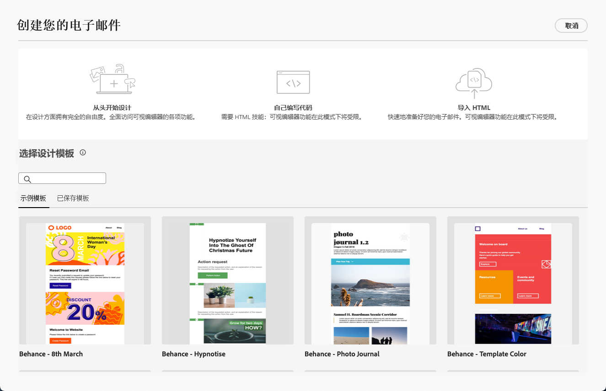

# Email Designer 入门 {#get-started-email-designer}

您可以在中导入现有内容 [!DNL Journey Optimizer] 或利用内容设计功能：

* 使用 [!DNL Campaign] 电子邮件设计功能，可轻松构建响应式电子邮件。 [了解详情](create-email-content.md)

* 根据客户的用户档案属性创建个性化内容，从而增强客户体验。 [了解详情](../personalization/personalize.md)

* 配置条件内容字段以根据收件人的配置文件创建动态个性化。 [了解详情](../personalization/conditions.md)

## 电子邮件设计最佳实践 {#best-practices}

在发送电子邮件时，务必要考虑收件人可能会转发它们，这有时可能会导致电子邮件的呈现出现问题。 当使用电子邮件提供商可能不支持用于转发的CSS类时，尤其是当使用“is-desktop-hidden”CSS类隐藏移动设备上的图像时，更是如此。

为了最大限度地减少这些渲染问题，我们建议尽可能简化您的电子邮件设计结构。 尝试使用适用于桌面和移动设备的单一设计，并避免使用复杂的CSS类或并非所有电子邮件客户端完全支持的其他设计元素。 通过遵循这些最佳实践，您可以帮助确保始终正确呈现电子邮件，而不管收件人如何查看或转发电子邮件。

## 开始创作内容 {#start-authoring}

在电子邮件投放仪表板中，浏览 [编辑内容](edit-content.md) 屏幕打开Email Designer主页。 从该位置，从以下选项中选择您希望如何设计电子邮件：

* **从头开始设计电子邮件** 通过email designer的界面。 了解如何在中设计您的电子邮件内容 [本节](create-email-content.md).

* **编码或粘贴原始HTML** 直接在email designer中。 了解如何在中编码您自己的内容 [本节](code-content.md).

* **导入现有HTML内容** 文件或.zip文件夹中的文件。 了解如何在中导入电子邮件内容 [本节](existing-content.md).

* **选择现有内容** 来自内置或自定义模板列表。 了解如何使用电子邮件模板 [本节](email-templates.md).

   

