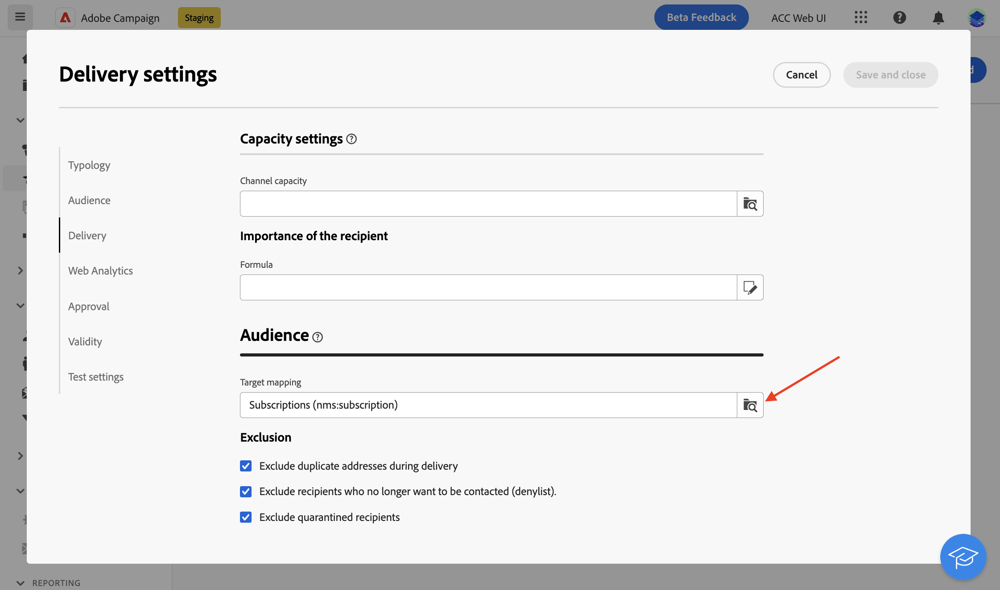

# 向服务的订阅者发送消息

您可以在Adobe Campaign中创建订阅服务，并向订阅者发送消息。 了解如何在中创建订阅服务 [此页面](../audience//manage-services.md#create-service).

要向订阅者发送消息，请创建特定受众以识别订阅者，然后创建投放，如下所述。

1. 创建受众. 要了解有关受众的更多信息，请参阅 [此页面](../audience/create-audience.md).

1. 在 **[!UICONTROL 构建受众]** 活动，显示高级属性，然后选择 **[!UICONTROL 收件人]** > **[!UICONTROL 订阅]** > **[!UICONTROL 服务]**.

   在此示例中，选择订阅了服务的用户，该服务具有 **Luma新闻稿** 标签。

   

1. 保存受众。
1. 创建投放. 有关创建投放的详细步骤，请参见 [此页面](../msg/gs-messages.md#create-delivery).
1. 浏览到您的投放设置，将默认目标映射更改为 **订阅(nms：subscriptions)**.

   

1. 在投放的主目标部分中，选择您在上面创建的受众。

   

1. 创建消息内容、测试并发送投放，如中所述 [本节](../preview-test/preview-test.md).

   

您的投放仅发送给该服务的订阅者。
