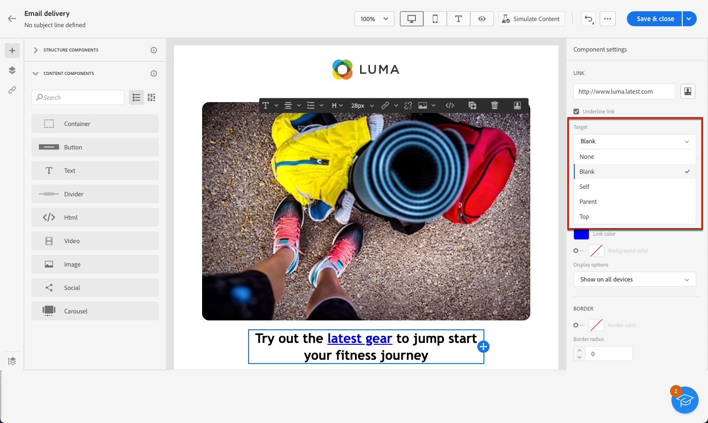

# 为链接定义样式 {#styling-links}

>[!NOTE]
>
>此文档正在构建中并且经常更新。 此内容的最终版本将于2023年1月准备就绪。

您可以在Email Designer中为链接加下划线并选择其颜色和目标。

1. 在 **[!UICONTROL 文本]** 插入链接的组件，请选择您的链接。

1. 在 **[!UICONTROL 组件设置]** 菜单，勾选 **[!UICONTROL 下划线链接]** 标签加下划线。

   

1. 选择如何通过 **[!UICONTROL Target]** 下拉列表：

   * **[!UICONTROL 无]**:在点击链接的同一帧中打开该链接（默认）。
   * **[!UICONTROL 空白]**:在新窗口或选项卡中打开链接。
   * **[!UICONTROL Self]**:在点击链接的同一帧中打开该链接。
   * **[!UICONTROL 父项]**:在父框架中打开链接。
   * **[!UICONTROL 顶部]**:在窗口的完整正文中打开链接。

   

1. 要更改链接的颜色，请单击 **[!UICONTROL 链接颜色]** 从右窗格。

   

1. 保存更改。
