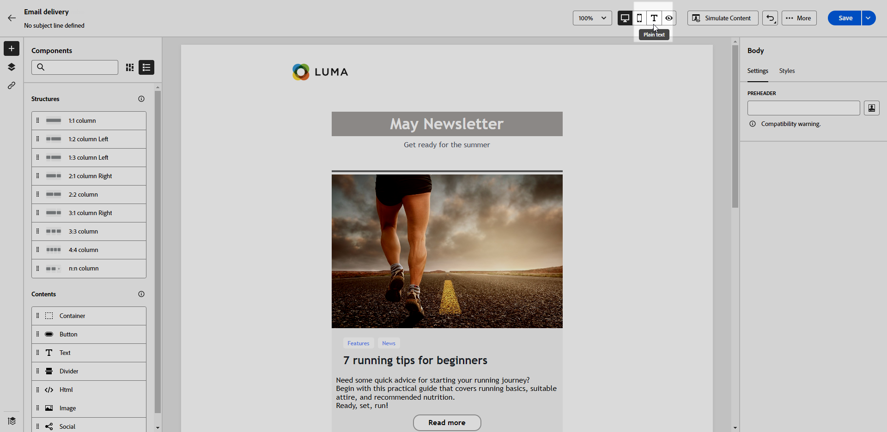

# 创建文本版本的电子邮件 {#text-version-email}

建议创建文本版本的电子邮件正文，以便在无法显示 HTML 内容时使用。

默认情况下，电子邮件设计器会创建&#x200B;**[!UICONTROL 纯文本]**&#x200B;版本的电子邮件，包括个性化字段。此版本将自动生成并与 HTML 版本的内容同步。

如果您希望为纯文本版本使用其他内容，请执行以下步骤：

1. 从电子邮件中，选择&#x200B;**[!UICONTROL 纯文本]**&#x200B;选项卡。

   

1. 使用&#x200B;**[!UICONTROL 与 HTML 同步]**&#x200B;开关以禁用同步。

   

1. 单击复选标记以确认您的选择。

   

1. 之后，您可以根据需要编辑纯文本版本。

>[!CAUTION]
>
>* 在&#x200B;**[!UICONTROL 纯文本]**&#x200B;视图中所做的更改不会反映在 HTML 视图中。
>
>* 如果您在更新纯文本内容后重新启用&#x200B;**[!UICONTROL 与 HTML 同步]**&#x200B;选项，您的更改将丢失，并替换为从 HTML 版本生成的文本内容。
