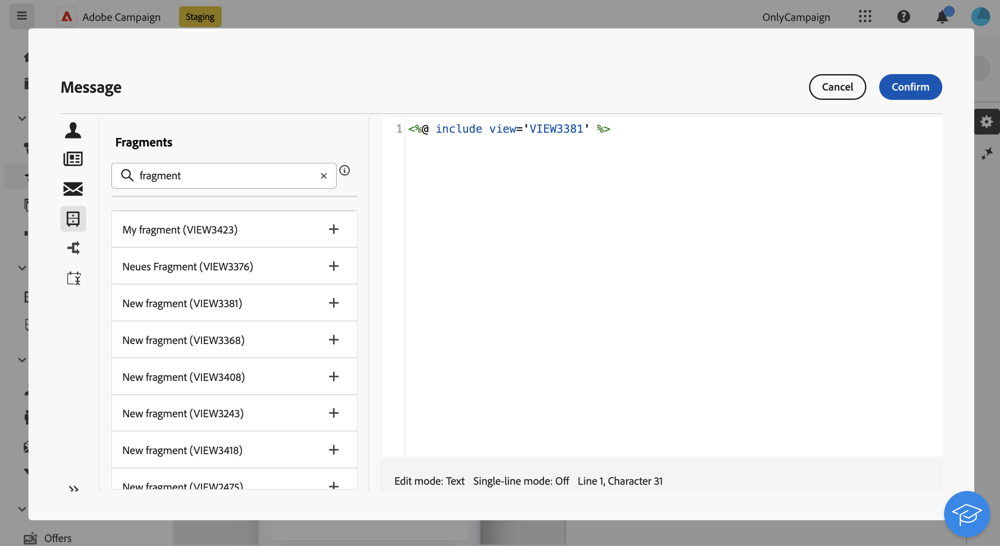

# 在表达式编辑器中添加表达式片段 {#expression}

>[!CONTEXTUALHELP]
>id="acw_fragments_list"
>title="片段"
>abstract="当前沙盒中创建的所有表情片段都显示在此列表中。要使用片段，请单击+按钮以将片段ID添加到编辑器中。"

<!-- pas vu dans l'UI-->

表达式片段可用于可使用表达式编辑器编辑的任何字段。 要向内容添加表达式片段，请执行以下步骤。

1. 打开[表达式编辑器](../personalization/gs-personalization.md)，然后在左窗格中选择&#x200B;**[!UICONTROL 片段]**&#x200B;菜单。

   该列表显示在当前沙盒上创建的所有表达式片段。

1. 单击表达式片段旁边的`+`图标以将其添加到您的内容。

   

1. 片段ID将添加到编辑器中。 如果打开相应的表达式片段并从界面编辑它，更改将自动同步。 它们会传播到包含该片段ID的所有&#x200B;**[!UICONTROL 草稿]**&#x200B;投放。