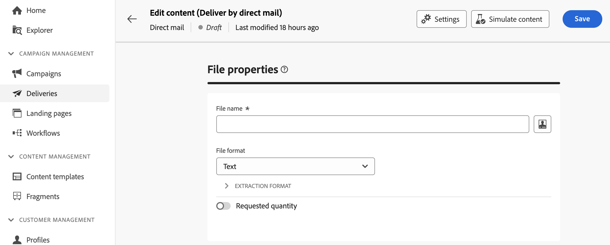

# 设计提取文件 {#design-direct-mail}

>[!CONTEXTUALHELP]
>id="acw_directmail_content"
>title="提取文件内容"
>abstract="单击&#x200B;**编辑内容**&#x200B;按钮开始设计直邮提供商所需的提取文件。这允许您定义文件属性（如其标签和格式），并指定要包含在文件中的列。"

>[!CONTEXTUALHELP]
>id="acw_directmail_properties_file"
>title="文件属性"
>abstract="配置提取文件的属性，如名称和格式。 您可以使用表达式编辑器使用数据库中的属性对文件名进行个性化设置。"

>[!CONTEXTUALHELP]
>id="acw_directmail_properties_content"
>title="内容"
>abstract="在此部分中，指定要在提取文件中显示的列。完成后，您可以使用&#x200B;**模拟内容**&#x200B;按钮预览提取文件。"

要设计直邮投放生成的提取文件的内容，请在投放页面中单击&#x200B;**[!UICONTROL 编辑内容]**&#x200B;按钮，然后配置文件属性和内容。

## 配置提取文件属性 {#properties}

1. 在&#x200B;**[!UICONTROL 文件名]**&#x200B;字段中，为提取文件指定所需的名称。 您可以使用数据库中的属性对文件名进行个性化设置。 为此，请单击&#x200B;**[!UICONTROL 打开个性化对话框]**&#x200B;图标以打开表达式编辑器。 [了解如何个性化您的内容](../personalization/personalize.md)

1. 在&#x200B;**[!UICONTROL 文件格式]**&#x200B;字段中，为提取文件选择所需的格式：**文本**、**使用固定宽度列的文本**、**CSV (Excel)**&#x200B;或&#x200B;**XML**。

1. 展开&#x200B;**[!UICONTROL 提取格式]**&#x200B;部分以访问与提取文件格式相关的特定选项。 可用的值取决于所选的格式。

+++ 可用的提取格式选项

   * **[!UICONTROL 使用第一行作为列标题]**(文本/CSV (Excel)格式)：启用此选项以使用第一列作为标题。
   * **[!UICONTROL 列分隔符]**（文本格式）：指定在提取文件中用作列分隔符的字符。
   * **[!UICONTROL 字符串分隔符]**（文本格式）：指定如何在提取文件中分隔字符串。
   * **[!UICONTROL 行尾]** （文本格式）：指定提取文件中行尾的分隔方式。
   * **[!UICONTROL 编码]**：选择提取文件的编码。
   * **[!UICONTROL 日期格式和分隔符]**：指定在提取文件中日期应如何格式化。
   * **[!UICONTROL 数字格式]**：指定如何在提取文件中设置数字的格式。
   * **[!UICONTROL 导出标签而不是枚举的内部值]**：如果导出枚举值并想要检索列标签（而不是内部ID），请打开此选项。

+++

1. 打开&#x200B;**[!UICONTROL 请求的数量]**&#x200B;选项以限制投放的收件人数量。

   {zoomable="yes"}

## 配置提取文件列 {#content}

在&#x200B;**[!UICONTROL Content]**&#x200B;部分中，指定要显示在提取文件中的列。 为此，请执行以下步骤：

1. 单击&#x200B;**[!UICONTROL 添加属性]**&#x200B;按钮以创建新列。
1. 选择要显示在列中的属性，然后确认。 请注意，可以使用表达式编辑器通过单击&#x200B;**[!UICONTROL 编辑表达式]**&#x200B;按钮来选择属性。 [了解如何选择属性并将其添加到收藏夹](../get-started/attributes.md)

   

1. 添加列后，可以使用编辑图标更改其标签并修改关联的属性。
1. 重复这些步骤以根据需要为提取文件添加任意数量的列。
1. 要使用其中一列对提取文件排序，请单击&#x200B;**[!UICONTROL 排序]**&#x200B;列中的图标并选择所需的排序方法。
1. 要更改列的位置，请使用向上箭头和向下箭头。

您现在可以预览提取文件并发送投放以生成提取文件。 [了解如何测试和发送直邮邮件](send-direct-mail.md)