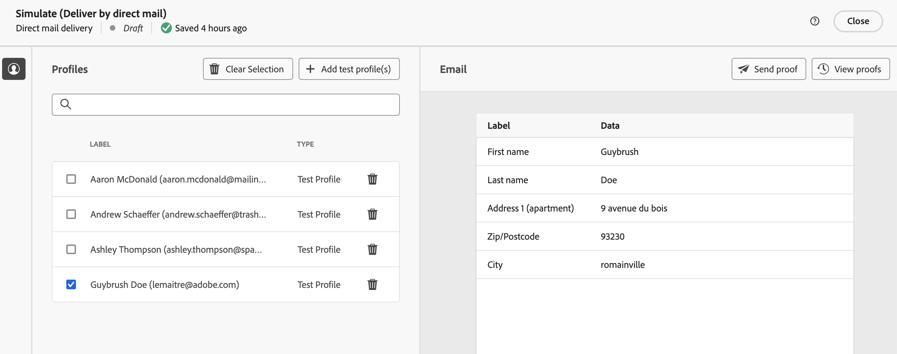

# 预览和发送直邮投放 {#send-direct-mail}

配置直邮投放的提取文件后，您可以利用测试用户档案进行预览。 如果您已包含个性化内容，则可以使用测试配置文件数据检查此内容在列中的显示方式。 这样，您就可以确保正确呈现文件内容，并正确合并个性化元素。

当提取文件就绪后，您可以发送直邮投放，以生成文件并与直邮提供商共享。 [了解如何发送直邮投放](#dm-send)

## 预览提取文件 {#preview-dm}

预览提取文件的主要步骤如下。 有关如何预览投放的更多详细信息，请参阅 [本节](../preview-test/preview-content.md).

1. 在投放内容页面中，使用 **[!UICONTROL 模拟内容]** 以预览您的个性化内容。

   {zoomable=&quot;yes&quot;}

1. 单击 **[!UICONTROL 添加测试配置文件]** 选择一个或多个用户档案，以在提取文件内容中预览其数据。

1. 在右侧窗格中，您将找到提取文件的预览，其中个性化元素会动态替换为所选配置文件中的数据。

   {zoomable=&quot;yes&quot;}

## 发送校样 {#test-dm}

使用 **Adobe Campaign**，则能够在将验证发送到主受众之前发送它们。 此步骤对于验证您的投放和识别任何问题都非常重要。 测试收件人可以查看个性化设置等元素，确保最佳性能并检测任何错误。 此过程可帮助您在联系主受众之前优化提取文件。

对于直邮投放，发送校样会使用来自所选测试用户档案的数据生成提取文件示例。 要访问它，请执行以下步骤：

1. 在模拟内容屏幕中，单击 **[!UICONTROL 发送验证]** 按钮并按照与任何类型的投放相同的步骤发送验证。 [了解如何发送校样](../preview-test/test-deliveries.md)

1. 发送校样后，您可以从 **[!UICONTROL 查看验证]** 按钮或从投放列表中。 [了解如何访问已发送的校样](../preview-test/test-deliveries.md#access-test-deliveries)

1. 在验证投放仪表板中，单击 **[!UICONTROL 预览文件]** 按钮以访问提取文件的预览。

   {zoomable=&quot;yes&quot;}

   >[!NOTE]
   >
   >预览文件中只显示前100行。

## 发送直邮投放 {#send-dm}

一旦直邮准备好发送给客户后，您就可以发送投放，以便在指定的提取文件中开始数据提取。 为此，请执行以下步骤：

1. 设计提取文件的内容后，单击 **[!UICONTROL 审阅并发送]** 来自您的 **[!UICONTROL 投放]** 页面。

   {zoomable=&quot;yes&quot;}

1. 单击 **[!UICONTROL 准备]** 并监测所提供的进度和统计数据。

   如果发生任何错误，请参见 **[!UICONTROL 日志]** 菜单以了解有关失败的详细信息。

   {zoomable=&quot;yes&quot;}

1. 通过单击 **[!UICONTROL 发送]** 以继续进行最终的发送过程。

1. 通过单击 **[!UICONTROL 发送]**.

   如果已计划直邮投放，请单击 **[!UICONTROL 按计划发送]** 按钮。 在中了解有关投放计划的更多信息 [本节](../msg/gs-messages.md#schedule-the-delivery-sending).

发送投放后，将自动生成提取文件并将其导出到 **[!UICONTROL 路由]** 在投放模板的 [高级设置](../advanced-settings/delivery-settings.md).

您可以跟踪投放页面中的KPI（关键绩效指标）数据，以及以下位置的数据： **[!UICONTROL 日志]** 菜单。

您还可以开始使用内置报告衡量消息的影响。 [了解详情](../reporting/direct-mail.md)