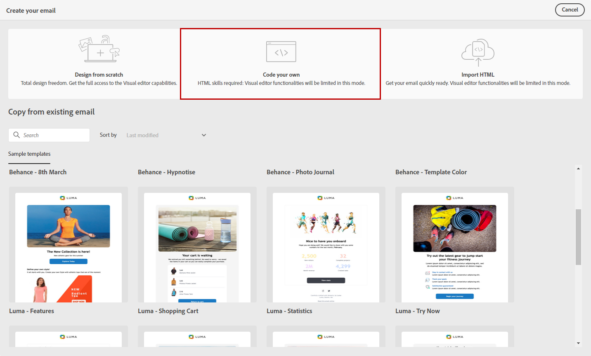

# 为自己的电子邮件内容编写代码 {#code-content}

使用&#x200B;**[!UICONTROL 对您自己的]**&#x200B;模式进行编码，以导入原始HTML并对电子邮件内容进行编码。

>[!CAUTION]
>
>此方法需要了解HTML。

1. 在[电子邮件Designer](get-started-email-designer.md)主页上，选择&#x200B;**[!UICONTROL 自己编写代码]**。

   {zoomable="yes"}

1. 在主画布中输入或粘贴原始HTML代码。

1. 使用左窗格访问个性化功能。 [了解详情](../personalization/gs-personalization.md)

   {zoomable="yes"}

1. 单击&#x200B;**[!UICONTROL 模拟内容]**&#x200B;按钮以预览使用测试用户档案的消息设计和个性化。 [了解详情](../preview-test/preview-test.md)

1. 代码完成后，单击&#x200B;**[!UICONTROL 保存并关闭]**&#x200B;以返回消息创建屏幕并完成消息。