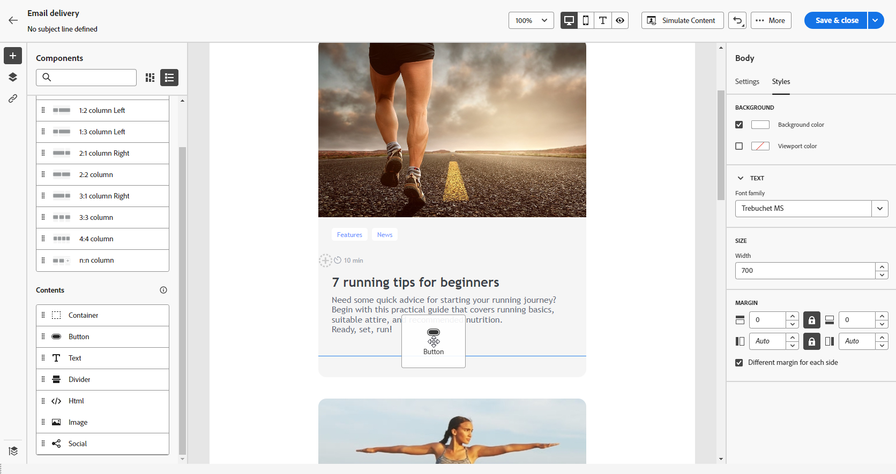
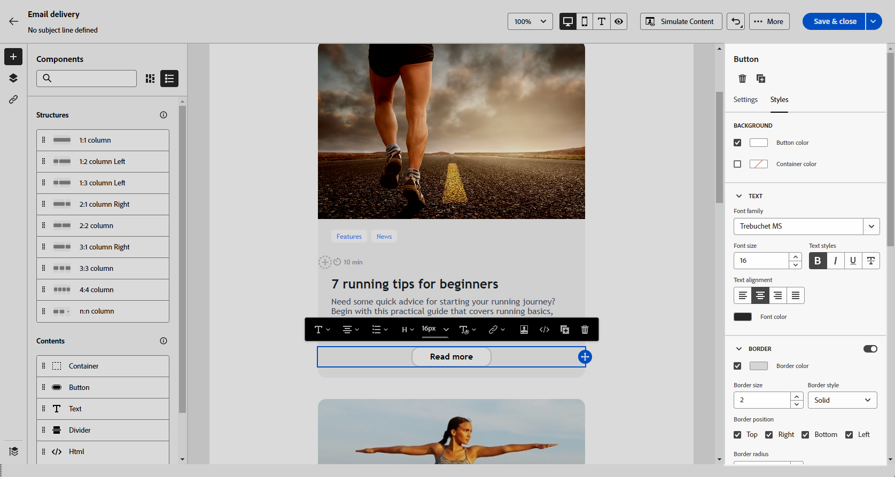
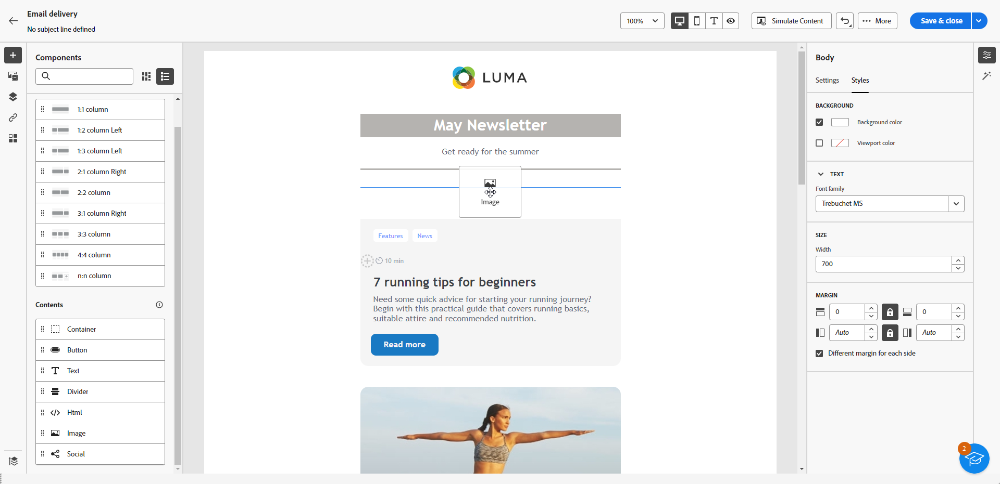

# 使用内容组件 {#content-components}

>[!CONTEXTUALHELP]
>id="ac_content_components_email"
>title="关于内容"
>abstract="内容组件是空的内容占位符，您可用它来创建电子邮件的版面。"

>[!CONTEXTUALHELP]
>id="ac_content_components_landing_page"
>title="关于内容"
>abstract="内容组件是空的内容占位符，您可用它来创建登陆页面的版面。"

>[!CONTEXTUALHELP]
>id="ac_content_components_fragment"
>title="关于内容"
>abstract="内容组件是空的内容占位符，您可用它来创建内容片段的版面。"

>[!CONTEXTUALHELP]
>id="ac_content_components_template"
>title="关于内容"
>abstract="内容组件是空的内容占位符，您可用它来创建模板的版面。"

在创建电子邮件内容时，**[!UICONTROL Content]**&#x200B;组件允许您使用原始空组件对电子邮件进行个性化设置，您可以在放入电子邮件后使用这些组件。

您可以根据需要在&#x200B;**[!UICONTROL 结构]**&#x200B;中添加任意数量的&#x200B;**[!UICONTROL 内容]**，该结构定义了电子邮件的布局。

## 添加内容组件 {#add-content-components}

要将内容组件添加到您的电子邮件中，并根据您的需要调整这些内容组件，请执行以下步骤。

1. 在电子邮件Designer中，使用[现有内容](existing-content.md)或将&#x200B;**[!UICONTROL 结构]**&#x200B;拖放到空内容中，以定义电子邮件的布局。 [了解如何操作](create-email-content.md)

1. 将您选择的&#x200B;**[!UICONTROL Content]**&#x200B;拖放到相关结构中。

   {zoomable="yes"}

   >[!NOTE]
   >
   >可以将多个组件添加到单个结构以及结构的每一列中。

1. 使用上下文&#x200B;**[!UICONTROL 设置]**&#x200B;选项卡调整每个组件的选项。 例如，选择仅在桌面或移动设备上显示，或同时在这两种设备上显示。 您还可以通过此选项卡管理链接选项。 [了解有关管理链接的更多信息](message-tracking.md)

1. 使用&#x200B;**[!UICONTROL 样式]**&#x200B;选项卡调整每个组件的样式属性。 例如，更改每个组件的文本样式、填充或边距。 [了解有关对齐方式和内边距的更多信息](alignment-and-padding.md)

   {zoomable="yes"}

1. 从右窗格上&#x200B;**[!UICONTROL Content]**&#x200B;的高级菜单中，根据需要删除或复制任何内容组件。

## 容器 {#container}

可以添加一个简单容器，并在其中添加另一个内容组件。这允许您向容器应用特定样式，这与内部使用的组件不同。

例如，添加一个&#x200B;**[!UICONTROL 容器]**&#x200B;组件，然后在该容器中添加一个[按钮](#button)组件。为容器使用特定背景，为按钮使用另一个背景。

{zoomable="yes"}

## 按钮 {#buttons}

使用&#x200B;**[!UICONTROL 按钮]**&#x200B;组件可将一个或多个按钮插入电子邮件中，并将电子邮件受众重定向到另一个页面。

1. 从&#x200B;**[!UICONTROL 内容]**&#x200B;列表中，将&#x200B;**[!UICONTROL 按钮]**&#x200B;组件拖放到&#x200B;**[!UICONTROL 结构]**&#x200B;组件中。

   {zoomable="yes"}

1. 单击新添加的按钮以个性化文本，并访问&#x200B;**[!UICONTROL 设置]**&#x200B;和&#x200B;**[!UICONTROL 样式]**&#x200B;选项卡。

   {zoomable="yes"}

1. 在&#x200B;**[!UICONTROL 设置]**&#x200B;选项卡的&#x200B;**[!UICONTROL URL]**&#x200B;字段中，添加单击该按钮时要重定向到的URL。

1. 使用&#x200B;**[!UICONTROL Target]**&#x200B;下拉列表选择内容的显示方式：

   * **[!UICONTROL 无]**：单击时在同一框架中打开链接（默认）。
   * **[!UICONTROL 空白]**：在新窗口或标签页中打开链接。
   * **[!UICONTROL 自身]**：单击时在同一框架中打开链接。
   * **[!UICONTROL 父]**：在父框架中打开链接。
   * **[!UICONTROL 顶部]**：在窗口的整个正文中打开链接。

   {zoomable="yes"}

1. 通过从&#x200B;**[!UICONTROL 样式]**&#x200B;选项卡中更改样式属性（如&#x200B;**[!UICONTROL Border]**、**[!UICONTROL Size]**、**[!UICONTROL Margin]**&#x200B;等），进一步个性化您的按钮。

## 文本 {#text}

使用&#x200B;**[!UICONTROL 文本]**&#x200B;组件将文本插入电子邮件中，并使用&#x200B;**[!UICONTROL 设置]**&#x200B;和&#x200B;**[!UICONTROL 样式]**&#x200B;选项卡调整样式（边框、大小、内边距等等）。

1. 从&#x200B;**[!UICONTROL 内容]**&#x200B;菜单中，将&#x200B;**[!UICONTROL 文本]**&#x200B;拖放到&#x200B;**[!UICONTROL 结构]**&#x200B;组件中。

   {zoomable="yes"}

1. 单击新添加的组件以个性化文本，并访问&#x200B;**[!UICONTROL 设置]**&#x200B;和&#x200B;**[!UICONTROL 样式]**&#x200B;选项卡。

1. 使用上下文工具栏中的以下选项更改文本：

   {zoomable="yes"}

   * **[!UICONTROL 更改文本样式]**：对文本应用粗体、斜体、下划线或删除线。
   * **更改对齐方式**：选择文字的左对齐、右对齐、居中对齐或两端对齐方式。
   * **[!UICONTROL 创建列表]**：在文本中添加项目符号或编号列表。
   * **[!UICONTROL 设置标题]**：向文本添加最多六个标题级别。
   * **字体大小**：选择文本的字体大小（以像素为单位）。
   * **[!UICONTROL 编辑图像]**：将图像或资产添加到文本组件。
   * **[!UICONTROL 显示源代码]**：显示文本的源代码。不能修改。
   * **[!UICONTROL 复制]**：添加文本组件的副本。
   * **[!UICONTROL 删除]**：从电子邮件中删除选定的文本组件。
   * **[!UICONTROL 添加个性化]**：添加个性化字段以自定义轮廓数据中的内容。
   * **[!UICONTROL 启用条件内容]**：添加条件内容，使组件的内容适应目标配置文件。

1. 从&#x200B;**[!UICONTROL 样式]**&#x200B;选项卡中调整其他样式属性，例如文本颜色、字体系列、边框、边距、边距等。

   {zoomable="yes"}

## 分隔条 {#divider}

使用&#x200B;**[!UICONTROL 分隔条]**&#x200B;组件可插入分隔线来整理电子邮件的版面和内容。

您可以从&#x200B;**[!UICONTROL 样式]**&#x200B;选项卡中调整样式属性，例如线条的颜色、样式和高度。

{zoomable="yes"}

## HTML {#HTML}

使用&#x200B;**[!UICONTROL HTML]**&#x200B;组件复制并粘贴现有HTML的各个部分。 这使您能够创建免费的模块化HTML组件以重用外部内容。

1. 从&#x200B;**[!UICONTROL 组件]**&#x200B;中，将 **[!UICONTROL HTML]** 组件拖放到&#x200B;**[!UICONTROL 结构]**&#x200B;组件中。

   {zoomable="yes"}

1. 单击新添加的组件，然后从上下文工具栏中选择&#x200B;**[!UICONTROL 显示源代码]**&#x200B;以添加 HTML。

   {zoomable="yes"}

>[!NOTE]
>
>为了使外部内容与Email Designer兼容，Adobe建议[从头开始创建消息](create-email-content.md)，并将现有电子邮件的内容复制到组件中。

## 图像 {#image}

>[!IMPORTANT]
>
>Assets菜单的访问仅限于拥有有效Adobe Experience Manager as a Cloud Service许可证的用户。 如果您没有此许可证，则 Assets 菜单将不可用。

使用&#x200B;**[!UICONTROL Image]**&#x200B;组件将图像文件从您的计算机插入到您的电子邮件中。

1. 从&#x200B;**[!UICONTROL Content]**&#x200B;菜单中，将&#x200B;**[!UICONTROL Image]**&#x200B;拖放到&#x200B;**[!UICONTROL Structure]**&#x200B;组件中。

   {zoomable="yes"}

1. 单击&#x200B;**[!UICONTROL 浏览]**&#x200B;从资源中选择图像文件。 您还可以选择&#x200B;**[!UICONTROL 导入您的媒体]**。

   要了解有关在Adobe Experience Manager中上传和添加资源的更多信息，请参阅[Adobe Experience Manager as a Cloud Service文档](https://experienceleague.adobe.com/docs/experience-manager-cloud-service/content/assets/manage/add-assets.html?lang=zh-Hans)。

   {zoomable="yes"}

1. 在文件夹中导航以找到所需的特定资源，或使用搜索栏高效地找到所需资源。

   找到要查找的资源后，单击&#x200B;**[!UICONTROL 选择]**。

   {zoomable="yes"}

1. 单击新添加的组件，然后使用&#x200B;**[!UICONTROL 设置]**&#x200B;选项卡设置图像属性：

   * **[!UICONTROL 图像标题]**&#x200B;允许您定义图像的标题。
   * 使用&#x200B;**[!UICONTROL 替代文字]**&#x200B;可以定义链接到图像的题注。这对应于 alt HTML 属性。

   {zoomable="yes"}

1. 添加链接以将受众重定向到其他内容。 [了解详情](message-tracking.md)

1. 使用&#x200B;**[!UICONTROL 样式]**&#x200B;选项卡调整其他样式属性，例如边距、边框和其他样式。

## 社交 {#social}

使用&#x200B;**[!UICONTROL 社交]**&#x200B;组件可将指向社交媒体页面的链接插入到电子邮件内容中。

1. 从&#x200B;**[!UICONTROL 组件]**&#x200B;菜单中，将&#x200B;**[!UICONTROL 社交]**&#x200B;组件拖放到&#x200B;**[!UICONTROL 结构]**&#x200B;组件中。

1. 单击新添加的组件。

1. 在&#x200B;**[!UICONTROL 设置]**&#x200B;选项卡的&#x200B;**[!UICONTROL 社交]**&#x200B;字段中，选择要添加或删除的社交媒体。

   {zoomable="yes"}

1. 在&#x200B;**[!UICONTROL 图像大小]**&#x200B;字段中选择图标的大小。

1. 单击每个社交媒体图标以配置将受众重定向到的 **[!UICONTROL URL]**。

   {zoomable="yes"}

1. 如果需要，请在&#x200B;**[!UICONTROL Source]**&#x200B;字段中更改每个社交媒体的图标。

1. 从&#x200B;**[!UICONTROL 样式]**&#x200B;选项卡中调整其他样式属性，例如样式、边距、边框和其他样式。