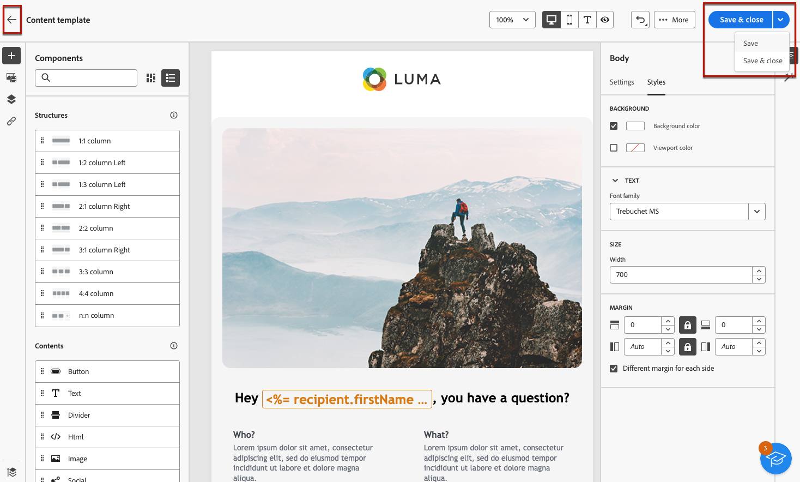

# 使用内容模板 {#content-templates}

>[!CONTEXTUALHELP]
>id="acw_contenttemplate_menu"
>title="定义您自己的内容"
>abstract="从头开始创建独立的自定义模板，这样您的内容便可在多个电子邮件中重复使用。"

为了加快并改进设计过程，您可以创建独立的模板，以轻松地在上下文中重复使用自定义内容 [!DNL Adobe Campaign].

此功能使面向内容的用户能够使用独立的模板，以便营销用户可以重复使用并在其自己的电子邮件促销活动中调整模板。

>[!NOTE]
>
>当前仅限 **电子邮件** 支持内容模板。

## 访问和管理模板 {#access-manage-templates}

>[!CONTEXTUALHELP]
>id="acw_contenttemplate_edition"
>title="编辑您的模板内容"
>abstract="单击&#x200B;**编辑内容**&#x200B;按钮可使用电子邮件设计器更新您的内容。"

要访问内容模板列表，请选择 **[!UICONTROL 内容管理]** > **[!UICONTROL 内容模板]** 从左侧菜单。

创建的所有模板 — 来自使用 [另存为模板](#save-as-template) 选项，来自 **[!UICONTROL 内容模板]** 菜单 — 显示。

<!--You can sort content templates by creation or modification date. You can also choose to display only the items that you created or modified.-->

您可以根据特定的 [文件夹](../get-started/permissions.md#folders) 使用下拉列表或使用添加规则 [查询建模器](../query/query-modeler-overview.md).

要编辑模板内容，请在列表中单击所需的项目。 您可以：

* 编辑其属性。

* 单击 **[!UICONTROL 编辑内容]** 按钮以使用更新您的内容 [电子邮件设计工具](get-started-email-designer.md).

要删除模板，请从 **[!UICONTROL 更多操作]** 菜单。

>[!NOTE]
>
>删除模板时，使用此模板创建的投放不会受到影响。

## 创建内容模板 {#create-content-templates}

>[!CONTEXTUALHELP]
>id="acw_contenttemplate_design"
>title="内容模板设计"
>abstract="内容模板设计"

>[!CONTEXTUALHELP]
>id="acw_contenttemplate_selection"
>title="内容模板选择"
>abstract="内容模板选择"

创建内容模板的方法有两种：

* 使用左边栏从头开始创建内容模板 **[!UICONTROL 内容模板]** 菜单。 [了解如何操作](#create-template-from-scratch)

* 设计电子邮件时，将电子邮件内容另存为模板。 [了解如何操作](#save-as-template)

保存后，无论是从头开始还是从以前的电子邮件创建的，您现在都可以在构建任何模板时使用此模板 [电子邮件](../email/create-email.md) 范围 [!DNL Adobe Campaign]. [了解如何操作](use-email-templates.md)

>[!NOTE]
>
>* 对内容模板所做的更改不会传播到电子邮件。
>
>* 同样，在电子邮件中使用模板时，您对电子邮件内容所做的任何编辑都不会影响以前使用的内容模板。

### 从头开始制定模板 {#create-template-from-scratch}

>[!CONTEXTUALHELP]
>id="acw_contenttemplate_properties"
>title="定义模板属性"
>abstract="从头开始创建模板时，定义其属性以便在需要时轻松检索。"

要从头开始创建内容模板，请执行以下步骤。

1. 通过以下方式访问内容模板列表 **[!UICONTROL 内容管理]** > **[!UICONTROL 内容模板]** 左侧菜单。

1. 选择 **[!UICONTROL 创建模板]**.

   

1. 填写模板详细信息。 您可以选择要存储模板的文件夹。 默认情况下，内容模板存储在Adobe Campaign层次结构的专用文件夹中： **[!UICONTROL 资源管理器]** > **[!UICONTROL 资源]** > **[!UICONTROL 模板]** > **[!UICONTROL 内容模板]**. [了解如何创建文件夹](../get-started/permissions.md#folders)

   

   >[!NOTE]
   >
   >当前仅 **电子邮件** 渠道和 **HTML** 类型受支持。

1. 单击 **[!UICONTROL 创建]** 并从不同的选项中选择所需的模板设计方式：

   * [从头开始设计电子邮件](create-email-content.md) 通过Email Designer的界面。

   * [编码或复制粘贴原始HTML](code-content.md) 直接导入Email Designer。

   * [导入现有HTML内容](existing-content.md) 从文件或.zip文件夹中。

   * 使用内置或自定义模板列表中的现有内容。 有关在电子邮件中使用内容模板的步骤，请参阅 [本节](use-email-templates.md).

   

1. 此 [电子邮件设计工具](get-started-email-designer.md) 显示。 根据所选选项，根据需要编辑内容，就像对任何电子邮件执行编辑操作一样。

   <!--You can test your content if needed. [Learn how](#test-template)-->

1. 模板准备就绪后，单击 **[!UICONTROL 保存]**.

   如果需要，单击模板名称旁边的箭头以返回 **[!UICONTROL 详细信息]** 屏幕并编辑您的模板。

   

模板将保存到Adobe Campaign层次结构的默认文件夹中(**[!UICONTROL 资源管理器]** > **[!UICONTROL 资源]** > **[!UICONTROL 模板]** > **[!UICONTROL 内容模板]**)。 [了解有关文件夹的更多信息](../get-started/permissions.md#folders)

它也显示在 **[!UICONTROL 内容模板]** 列表。 [了解详情](#access-manage-templates)

您现在可以使用此模板来构建新内容：此模板位于 **[!UICONTROL 已保存模板]** 选项卡。 [了解如何操作](use-email-templates.md)

### 将电子邮件内容另存为模板 {#save-as-template}

一旦您 [设计了一封电子邮件](create-email-content.md)，您可以将此内容另存为模板以供将来重用。 保存的模板可供 Adobe Campaign 环境的所有用户使用。

要将电子邮件内容另存为模板，请执行以下步骤：

1. 在电子邮件设计器中，单击 **[!UICONTROL 更多]** 按钮。

1. 选择 **[!UICONTROL 另存为内容模板]** 从下拉菜单中。

   

1. 输入此模板的名称，然后保存。

   

模板将保存到Adobe Campaign层次结构的默认文件夹中(**[!UICONTROL 资源管理器]** > **[!UICONTROL 资源]** > **[!UICONTROL 模板]** > **[!UICONTROL 内容模板]**)。 [了解有关文件夹的更多信息](../get-started/permissions.md#folders)

它也显示在 **[!UICONTROL 内容模板]** 列表。 它会变成一个独立的内容模板，可以像该列表中的任何其他项目一样访问、编辑和删除该模板。 [了解详情](#access-manage-templates)

您现在可以使用此模板来构建新内容：此模板位于 **[!UICONTROL 已保存模板]** 选项卡。 [了解如何操作](use-email-templates.md)

>[!NOTE]
>
>对该新模板所做的任何更改都不会传播到该模板所来自的电子邮件中。 同样，在该电子邮件中编辑原始内容时，不会修改新模板。

<!--

Test your content template {#test-template}

You can test the rendering of any email content template, whether created from scratch or from an email. To do so, follow the steps below.

1. Access the content template list.

1. Click **[!UICONTROL Edit content]** from the **[!UICONTROL Template properties]**.

1. Click **[!UICONTROL Simulate Content]** and select a test profile to check your email rendering. You can choose the desktop or mobile view.

1. You can send a proof to test your content and have it approved by some internal users before using it. To do so, click the **[!UICONTROL Send proof]** button and follow the steps described in .

-->

