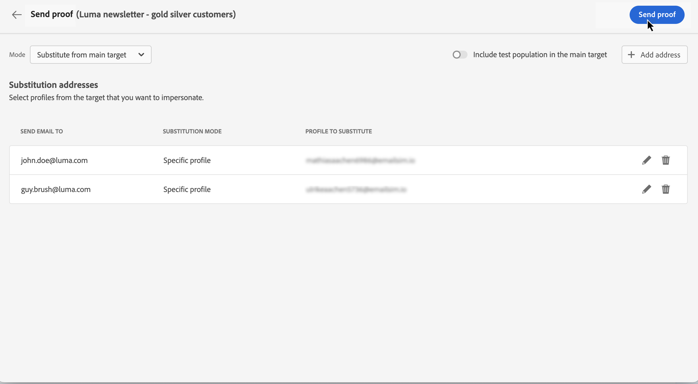

# 发送您的第一封电子邮件 {#first-email}

>[!CONTEXTUALHELP]
>id="acw_homepage_card2"
>title="电子邮件入门"
>abstract="从模板开始，或使用Adobe Campaign的新电子邮件设计工具创建电子邮件，而无需编写一行代码。 了解如何使用Email Designer创建内容、预览和测试内容，以及在端到端用例中向现有受众发送电子邮件。"

了解如何创建您的第一封定向电子邮件。在此用例中，您计划在特定日期向银牌和金牌忠诚度会员发送电子邮件。

根据预定义的设计模板，电子邮件还具有基于客户配置文件属性的个性化内容。

## 创建电子邮件 投放 {#create-email}

>[!CONTEXTUALHELP]
>id="acw_deliveries_email_template_selection"
>title="选择电子邮件模板"
>abstract="电子邮件模板是一种特定的投放配置，其中包含预定义的设置，例如类型规则、个性化或路由参数。模板在 Campaign 客户端控制台中定义。"

>[!CONTEXTUALHELP]
>id="acw_deliveries_email_properties"
>title="电子邮件属性"
>abstract="这些属性是常见的投放参数，可帮助您对投放的内容进行命名和分类。如果您的投放基于 Adobe Campaign v8 控制台中定义的扩展架构，则可以使用某些特定的&#x200B;**自定义选项**。"

要创建新投放，请执行以下步骤：

1. 浏览至 **[!UICONTROL 投放]** 菜单，然后单击  **[!UICONTROL 创建投放]** 按钮。

1. 选择&#x200B;**[!UICONTROL 电子邮件]**&#x200B;作为渠道，并选择一个模板。

   >[!NOTE]
   >
   >模板是已保存以供将来使用的预配置的投放设置。管理员用户可以在 Adobe Campaign 控制台中创建模板。[了解如何使用投放模板](https://experienceleague.adobe.com/docs/campaign/campaign-v8/campaigns/send/create-templates.html){target="_blank"}。

   

1. 单击&#x200B;**[!UICONTROL 创建投放]**&#x200B;按钮以进行确认。
1. 输入投放的标签并根据需要配置其他选项：

   * **[!UICONTROL 内部名称]**：为投放分配一个唯一标识符，
   * **[!UICONTROL 文件夹]**：将投放存储在特定文件夹中，
   * **[!UICONTROL 投放代码]**：使用此字段可根据您自己的命名惯例来整理投放，
   * **[!UICONTROL 描述]**：指定投放的描述，
   * **[!UICONTROL 性质]**：指定电子邮件的性质以进行分类。<!--The content of the list is defined in the delivery template selected when creating the email.-->

   >[!NOTE]
   >
   >如果您已使用特定的自定义字段扩展架构，则可在&#x200B;**[!UICONTROL 自定义选项]**&#x200B;部分中访问它们。

   

   此外，可以单击投放名称旁边的按钮来访问高级设置，例如类型规则和目标映射。虽然已在选定模板中预配置这些设置，但可以根据需要为此特定电子邮件编辑它们。

## 创建电子邮件内容 {#create-content}

有关如何配置电子邮件内容的详细说明，请参阅[此章节](../content/edit-content.md)。

在此用例中，您使用预定义的模板来设计我们的电子邮件。

1. 要开始创建电子邮件内容，请打开您的电子邮件投放并单击&#x200B;**[!UICONTROL 编辑内容]**&#x200B;按钮。

   这会将您转至一个专用界面，您可以在其中配置电子邮件内容并使用电子邮件设计器设计该内容。

   

1. 输入电子邮件的主题行，并使用表达式编辑器对其进行个性化设置。[了解如何个性化您的内容](../personalization/personalize.md)

   

1. 要设计电子邮件的内容，请单击&#x200B;**[!UICONTROL 编辑电子邮件正文]**&#x200B;按钮。

   选择要用于创建电子邮件内容的方法。在此示例中，使用预定义的设计模板。

   

<!--1. Select the HTML or ZIP file to import then click **[!UICONTROL Next]**.

    If your folder contains assets, choose the instance and folder where they should be stored then click **[!UICONTROL Import]**. (+ link to doc on assets?)

    -->

1. 选择模板后，它会显示在电子邮件设计器中，可以在其中进行任何必要的编辑和添加个性化设置。

   例如，要向电子邮件标题添加个性化内容，请选择组件块并单击&#x200B;**[!UICONTROL 添加个性化内容]**。

   

1. 在对内容感到满意后，请保存并关闭您的设计。单击&#x200B;**[!UICONTROL 保存]**&#x200B;返回电子邮件创建屏幕。

   

## 定义受众 {#define-audience}

>[!CONTEXTUALHELP]
>id="acw_deliveries_email_audience"
>title="定义受众"
>abstract="为您的营销信息选择最佳受众。您可以选择已在 Campaign v8 实例中或从 Adobe Experience Platform 定义的现有受众，也可以使用规则构建器创建新受众。未对“从文件选择”启用控制组，反之亦然。"

在此用例中，您将电子邮件发送到现有受众。有关如何使用受众的其他说明，请参阅[此章节](../audience/about-audiences.md)。

1. 要选择电子邮件的受众，请单击&#x200B;**[!UICONTROL 选择受众]**&#x200B;按钮，并从列表中选择一个现有受众。

   在此示例中，我们希望使用定位属于银牌和金牌忠诚度积分等级的客户的现有受众。

   

   >[!NOTE]
   >
   >列表中包含的受众来自您的 Campaign v8 实例或 Adobe Experience Platform（如果已在您的实例上配置目标/源集成）。
   >
   >目标/源集成可让您将 Experience Platform 区段发送到 Adobe Campaign，并将 Campaign 投放和跟踪日志发送到 Adobe Experience Platform。[了解如何使用 Campaign 和 Adobe Experience Platform](https://experienceleague.adobe.com/docs/campaign/campaign-v8/connect/ac-aep.html){target="_blank"}。

1. 选择受众后，可以通过应用其他规则来进一步细化目标。

   您还可以设置一个对照组来分析比较电子邮件收件人的行为与非定向人员的行为。[了解如何使用对照组](../audience/control-group.md)

   

## 计划发送 {#schedule}

>[!CONTEXTUALHELP]
>id="acw_deliveries_email_schedule"
>title="计划发送"
>abstract="定义发送的日期和确切时间。通过为您的营销信息选择最合适的时间，您可以最大限度地提高打开率。"

要计划电子邮件的发送，请打开您的电子邮件投放并浏览到&#x200B;**计划**&#x200B;部分。使用&#x200B;**[!UICONTROL 启用计划]**&#x200B;开关以激活它，并设置所需的发送日期和时间。发送投放后，实际发送将在您定义的联系日期开始。

默认情况下，**[!UICONTROL 启用发送前确认]**&#x200B;选项处于启用状态。此选项要求您在计划的日期和时间发送电子邮件之前确认发送。如果您需要在计划的日期和时间自动发送电子邮件，则可以禁用此选项。

## 预览和测试电子邮件 {#preview-test}

在发送电子邮件之前，您可以预览和测试电子邮件以确保符合您的期望。

在此用例中，您可以预览电子邮件并将测试版本发送到特定的电子邮件地址，同时模拟一些定向配置文件。

有关如何预览和测试电子邮件的其他信息，请参阅[此章节](../preview-test/preview-test.md)。

1. 要查看您的电子邮件，请单击&#x200B;**[!UICONTROL 查看并发送]**。这将显示您的电子邮件预览，以及所有已配置的属性、受众和计划。可以通过单击修改按钮来编辑这些元素中的任一元素。

1. 要预览电子邮件并发送测试版本，请单击&#x200B;**[!UICONTROL 模拟内容]**&#x200B;按钮。

   

1. 在左侧，选择要用于预览电子邮件的配置文件。

   右侧窗格显示基于所选配置文件的电子邮件预览。如果已添加多个配置文件，则可以在它们之间进行切换来预览相应的电子邮件。

   

   <!-- !NOTE
    >
    >Additionally, the **[!UICONTROL Render email]** button allows you to preview the email using mutiple devices or mail providers. Learn on how to preview email rendering-->

1. 要发送电子邮件的测试版本，请单击&#x200B;**[!UICONTROL 测试]**&#x200B;按钮，然后选择要使用的模式。

   在此示例中，使用&#x200B;**[!UICONTROL 从主要目标替代]**&#x200B;模式，它将测试版本发送到特定的电子邮件地址，同时模拟电子邮件所针对的一些配置文件。

   

1. 单击&#x200B;**[!UICONTROL 添加地址]**&#x200B;并指定接收测试版本的电子邮件地址。

   对于每个电子邮件地址，选择要模拟的配置文件。您还可以让 Adobe Campaign 从目标中选择一个随机配置文件。

   

1. 单击&#x200B;**[!UICONTROL 发送测试电子邮件]**&#x200B;并确认发送。

   使用选定的配置文件与 **[Proof x]** 前缀将测试版本发送到指定的电子邮件地址。

   

   可以随时单击模拟内容屏幕中的&#x200B;**[!UICONTROL 查看测试电子邮件日志]**&#x200B;按钮，来查看发送状态和访问已发送的测试电子邮件。

## 发送和监控电子邮件 {#prepare-send}

查看并测试您的电子邮件后，可以启动其准备工作并发送它。

1. 要启动电子邮件准备，请单击&#x200B;**[!UICONTROL 准备]**。[了解如何准备电子邮件](../monitor/prepare-send.md)

   

1. 准备好发送电子邮件后，单击&#x200B;**[!UICONTROL 发送]**&#x200B;按钮（如果您已计划发送，则单击&#x200B;**[!UICONTROL 按计划发送]**）并确认发送。

1. 在发送过程中，您可以直接在该屏幕中实时跟踪发送进度和查看统计数据。

   

   还可以单击&#x200B;**[!UICONTROL 日志]**&#x200B;按钮来访问有关发送的详细信息。[了解如何监控投放日志](../monitor/delivery-logs.md)

1. 发送电子邮件后，可以通过单击&#x200B;**[!UICONTROL 报告]**&#x200B;按钮来访问专用报告以进行深入分析。

