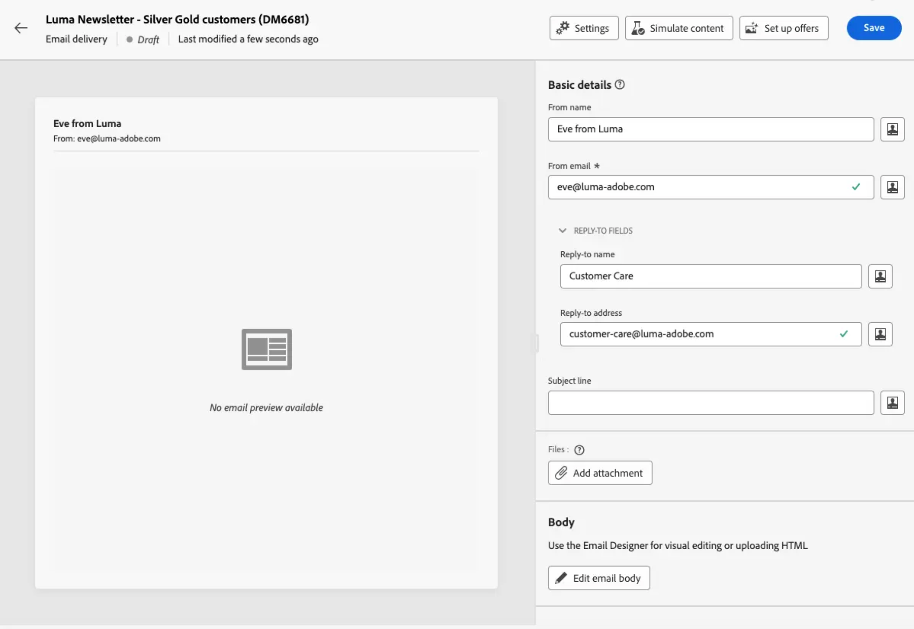
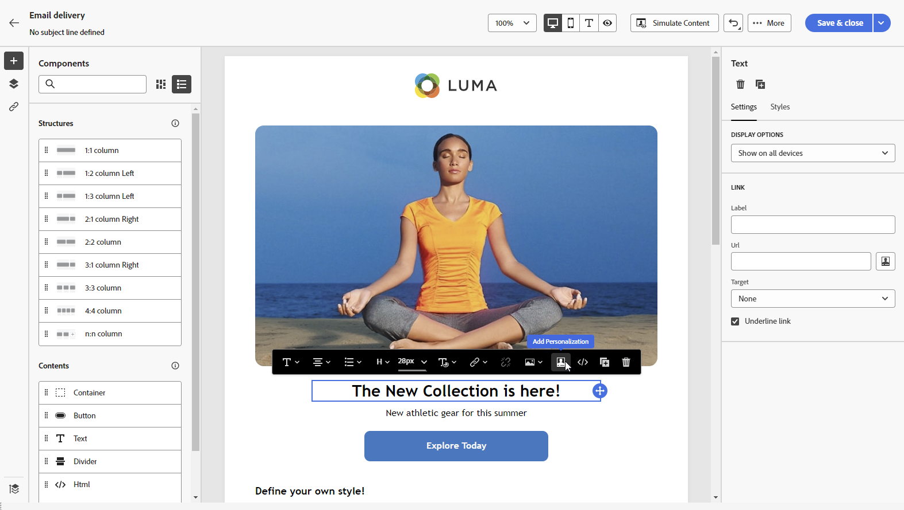

# 发送您的第一封电子邮件 {#first-email}

>[!NOTE]
>
>此文档正在构建中并且经常更新。 此内容的最终版本将于2023年1月准备就绪。

此用例介绍如何创建您的第一封电子邮件。 我们将安排在特定日期向银牌和金牌忠诚客户发送电子邮件。 此电子邮件将使用预定义的模板进行设计，并将包含使用用户档案属性的个性化。

## 创建电子邮件 {#create-email}

>[!CONTEXTUALHELP]
>id="acw_deliveries_email_template_selection"
>title="选择电子邮件模板"
>abstract="模板在Adobe Campaign v8控制台中定义。 这是特定的投放配置，其中包含预定义的参数，如分类规则、个性化或路由参数。"

>[!CONTEXTUALHELP]
>id="acw_deliveries_email_properties"
>title="电子邮件属性"
>abstract="属性是常用的投放参数，可帮助您命名投放并对其进行分类。 如果您的投放基于在Adobe Campaign v8控制台中定义的扩展架构，则某些特定 **自定义选项** 字段。"

1. 从 **[!UICONTROL 投放]** 菜单。

1. 选择 **[!UICONTROL 电子邮件]** 渠道和模板，然后单击 **[!UICONTROL 创建]**.

   >[!NOTE]
   >
   >模板是特定的投放配置，已另存为模板以便重复使用。 投放模板由Adobe Campaign控制台中的管理员用户配置。 [了解如何使用投放模板](https://experienceleague.adobe.com/docs/campaign-classic/using/sending-messages/using-delivery-templates/about-templates.html?lang=zh-Hans){target=&quot;_blank&quot;}

   

1. 为电子邮件提供标签，并根据您的需求配置其他选项：

   * **[!UICONTROL 内部名称]**:为投放分配唯一标识符，
   * **[!UICONTROL 文件夹]**:将投放存储在特定文件夹中，
   * **[!UICONTROL 提交代码]**:使用此字段根据您自己的命名约定组织投放，
   * **[!UICONTROL 描述]**:为投放指定描述，
   * **[!UICONTROL 自然]**:为分类目的指定电子邮件的性质。<!--The content of the list is defined in the delivery template selected when creating the email.-->

   >[!NOTE]
   >
   >如果您已使用特定自定义字段扩展了架构，则可以从 **[!UICONTROL 自定义选项]** 中。

   

   此外，高级设置（分类规则、目标映射等） 可从投放名称旁边的按钮中找到。 创建电子邮件时，会在选定的模板中预定义模板。 您可以根据需要编辑它们。

## 创建电子邮件内容 {#create-content}

>[!CONTEXTUALHELP]
>id="acw_homepage_card3"
>title="了解如何使用Email Designer设计电子邮件内容。"
>abstract="了解如何设计内容"

在此用例中，我们将使用预定义模板来设计电子邮件。 有关如何配置电子邮件内容的详细信息，请参阅 [此部分](../content/edit-content.md).

1. 单击 **[!UICONTROL 编辑内容]** 按钮以开始创建电子邮件的内容。

   利用此屏幕，可配置电子邮件内容并使用Email Designer进行设计。

   

1. 指定电子邮件的主题，然后使用表达式编辑器对其进行个性化。 [了解如何个性化您的内容](../personalization/personalize.md)

   

1. 单击 **[!UICONTROL 编辑电子邮件正文]** 按钮以创建和设计电子邮件的内容。

   选择用于创建电子邮件内容的方法。 在此示例中，我们希望使用现有设计模板。

   

<!--1. Select the HTML or ZIP file to import then click **[!UICONTROL Next]**.

    If your folder contains assets, choose the instance and folder where they should be stored then click **[!UICONTROL Import]**. (+ link to doc on assets?)

    -->

1. 选择模板后，该模板会显示在Email Designer中，允许您根据需要对其进行编辑并添加个性化。

   在此示例中，我们要在电子邮件标题中添加个性化。 要执行此操作，请选择组件块，然后单击 **[!UICONTROL 添加个性化]**.

   

1. 准备好内容后，保存该内容，然后单击箭头以返回到电子邮件创建屏幕。

   

## 定义受众 {#define-audience}

>[!CONTEXTUALHELP]
>id="acw_deliveries_email_audience"
>title="定义受众"
>abstract="为您的营销消息选择最佳受众。 您可以选择已在Campaign v8实例中定义的现有受众，或从Adobe Experience Platform中选择，也可以选择使用区段生成器创建新受众。"

在此用例中，我们将向现有受众发送电子邮件。 有关如何使用受众的其他信息，请参阅 [此部分](../audience/about-audiences.md).

1. 单击 **[!UICONTROL 选择受众]** 按钮，然后选择要定位的现有受众。

   在此示例中，我们希望使用现有受众来定位属于银牌和金牌忠诚度积分级别的客户。

   

   >[!NOTE]
   >
   >列表中可用的受众源自您的Campaign V8实例，或来自Adobe Experience Platform（如果已在您的实例中配置目标/源集成）。
   >
   >通过目标/源集成，您可以将Experience Platform区段发送到Adobe Campaign，并将Campaign投放和跟踪日志发送到Adobe Experience Platform。 [了解如何使用Campaign和Adobe Experience Platform](https://experienceleague.adobe.com/docs/campaign/campaign-v8/connect/ac-aep.html)

1. 选择受众后，您可以使用其他规则优化目标。

   您还可以设置一个控制组，以将电子邮件收件人的行为与未定向用户档案的行为进行比较。 [了解如何与控制组合作](../audience/control-group.md)

## 计划发送 {#schedule}

>[!CONTEXTUALHELP]
>id="acw_deliveries_email_schedule"
>title="计划发送"
>abstract="定义发送的日期和确切时间。 通过为您的营销消息选择最合适的时间，您可以最大限度地提高打开率。"

要计划发送电子邮件，请单击 **[!UICONTROL 启用]** 然后，指定发送所需的日期和时间。

默认情况下， **[!UICONTROL 发送前确认]** 选项，这意味着您需要确认发送以允许在指定的日期和时间发送电子邮件。 禁用此选项，可允许在计划的日期和时间发送电子邮件，无需确认。

## 预览和测试电子邮件 {#preview-test}

电子邮件准备就绪后，您可以先预览并测试该电子邮件，然后再启动其发送。

在此用例中，我们将预览电子邮件，并使用现有用户档案发送校样。

有关如何预览和测试电子邮件的其他信息，请参阅 [此部分](../preview-test/preview-test.md).

1. 单击 **[!UICONTROL 审阅以发送]**. 此时会显示电子邮件的预览，以及所有已配置的属性、受众和计划。 您可以使用修改按钮编辑其中的任何元素。

1. 单击 **[!UICONTROL 模拟内容]** 按钮以预览电子邮件并发送校样。

   

1. 在左侧区域中，选择用于预览电子邮件的用户档案。

1. 右侧窗格中会根据所选的用户档案显示电子邮件的预览。 如果已添加多个用户档案，则可以在其中每个用户档案之间切换，以预览相应的电子邮件。

   

   <!-- !NOTE
    >
    >Additionally, the **[!UICONTROL Render email]** button allows you to preview the email using mutiple devices or mail providers. Learn on how to preview email rendering-->

1. 要发送电子邮件的校样，请单击 **[!UICONTROL 测试]** 按钮，然后选择将接收校样的用户档案。

   <!--TO REPLACE WITH SUBSTITUTION PROFILE-->In this example, we want to send the proofs to a specific test profile, which is a seed address that is not part of the target. [Learn how to work with seed addresses](https://experienceleague.adobe.com/docs/campaign-classic/using/sending-messages/using-seed-addresses/about-seed-addresses.html){target="_blank"}

   

   >[!NOTE]
   >
   >您还可以通过模拟某些定向的用户档案并将校样消息发送到所选的电子邮件地址来测试消息。 [了解如何发送校样](../preview-test/preview-test.md)

1. 单击 **[!UICONTROL 发送测试电子邮件]** 然后确认发送。

   发送校样后，您可以单击 **[!UICONTROL 查看测试电子邮件日志]** 按钮。

## 发送并监视电子邮件 {#prepare-send}

审核并测试电子邮件后，即可启动其准备并发送。

1. 单击 **[!UICONTROL 准备]** 以启动消息的准备工作。 [了解如何准备电子邮件](../monitor/prepare-send.md)

   

1. 准备好发送电子邮件后，单击 **[!UICONTROL 发送]** 然后确认发送。

   您可以实时跟踪发送情况以及统计信息。 此外， **[!UICONTROL 日志]** 按钮，可访问有关电子邮件发送的详细信息。 [了解如何监控投放日志](../monitor/delivery-logs.md)
   

1. 发送电子邮件后，您可以访问专用 [报告](../reporting/reports.md) 供进一步分析之用。

   
