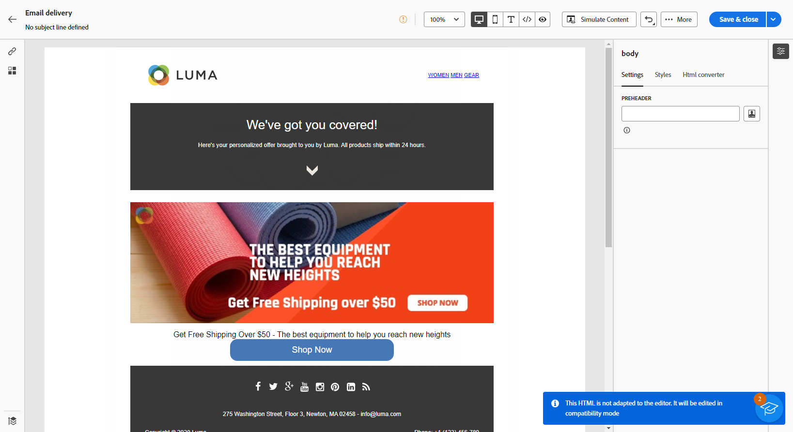

# 导入电子邮件内容 {#existing-content}

>[!CONTEXTUALHELP]
>id="acw_deliveries_email_import_content"
>title="使用现有的电子邮件内容"
>abstract="通过电子邮件设计器，可导入现有的 HTML 内容。此内容可以是内含样式表的 HTML 文件，也可以是具有 HTML 文件、样式表 (.css) 和图像的 .zip 文件夹。"

您可以在电子邮件Designer中导入现有HTML内容。 相关的内容可以是：

* 一个带合并的样式表的 **HTML 文件**，
* 一个 **.zip 文件夹**，其中包含 HTML 文件、样式表 (.css) 和图像。

  >[!NOTE]
  >
  >具体的 .zip 文件结构没有任何限制。但是，引用必须是相对的，并且适合.zip文件夹的树结构。

➡️ [通过观看视频了解此功能](#video)

要导入包含HTML内容的文件，请执行以下步骤。

1. 在[电子邮件Designer](get-started-email-designer.md)主页上，选择&#x200B;**[!UICONTROL 导入HTML]**。

   {zoomable="yes"}

1. 拖放包含 HTML 内容的 HTML 或 .zip 文件，然后单击&#x200B;**[!UICONTROL 导入]**。

1. 上传HTML内容后，您的内容将处于&#x200B;**[!UICONTROL 兼容模式]**。

   在此模式下，您只能对文本进行个性化，向内容添加链接或包含资源。

   {zoomable="yes"}

1. 若要利用Email Designer内容组件，请访问&#x200B;**[!UICONTROL HTML转换器]**&#x200B;选项卡，然后单击&#x200B;**[!UICONTROL 转换]**。

   {zoomable="yes"}

   >[!NOTE]
   >
   > 在HTML文件中使用`<table>`标记作为第一层可能会导致样式丢失，包括顶层标记中的背景和宽度设置。

1. 您现在可以根据需要使用Email Designer功能[了解详情](content-components.md)个性化导入的文件。

## 操作说明视频 {#video}

了解如何通过上传HTML创建电子邮件、如何使其与Email Designer兼容以及如何将其转换为模板。

>[!VIDEO](https://video.tv.adobe.com/v/3427633/?quality=12)
