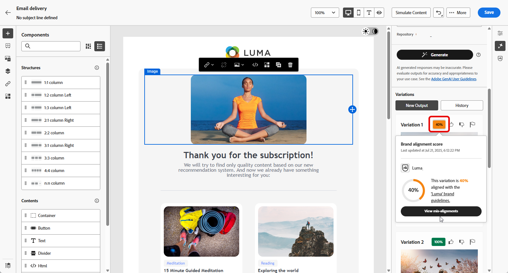
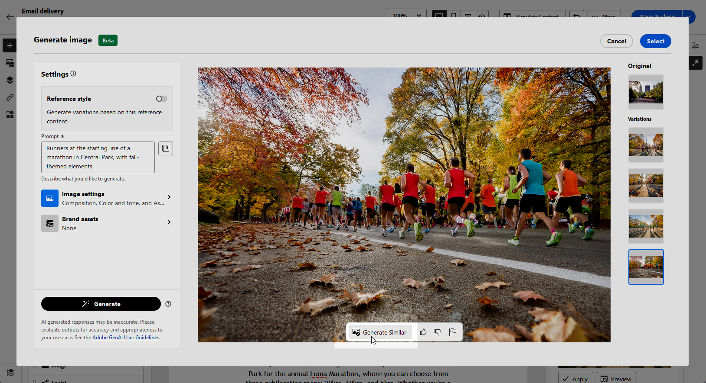

# 使用 AI 助手生成电子邮件 {#generative-content}

>[!BEGINSHADEBOX]

**目录**

* [开始使用 AI 助手](generative-gs.md)
* **[使用AI助手生成电子邮件](generative-content.md)**
* [使用 AI 助手生成短信](generative-sms.md)
* [使用 AI 助手生成推送通知](generative-push.md)

>[!ENDSHADEBOX]

创建电子邮件并使其个性化后，可使用由创作AI提供支持的Campaign中的Journey Optimizer AI Assistant将您的内容提升到新的水平。

AI Assistant可以通过建议更可能引起受众共鸣的不同内容来帮助您优化投放的影响。

>[!NOTE]
>
>在开始使用此功能之前，请阅读相关内容 [护栏和限制](generative-gs.md#guardrails-and-limitations).

## 使用AI助手生成内容 {#generative-text}

下面是您的AI助手如何帮助您编写引人入胜的电子邮件：

* **总结**：过长的信息可能会使电子邮件收件人过载。 使用AI Assistant将要点整合为清晰、简洁的摘要，以吸引注意并鼓励他们进一步阅读。

* **详细**：AI助手可以帮助您展开特定主题，提供其他详细信息以便更好地了解和参与。

* **简化语言**：利用AI Assistant简化您的语言，确保为更广泛的受众提供清晰易用的功能。

* **重新短语**：AI Assistant可以通过不同的方式重新表述您的消息，保持您写作的新鲜度并吸引各种受众。

* **更改色调**：电子邮件的基调应该会引起受众的共鸣。 无论您是要提供信息、好玩还是具有说服力，AI Assistant都可以相应地调整消息。

在以下示例中，我们将利用AI助手来增强即将举行的活动的电子邮件邀请的内容。

1. 创建和配置电子邮件投放后，单击 **[!UICONTROL 编辑内容]**.

   有关如何配置电子邮件投放的更多信息，请参阅 [此页面](../email/create-email-content.md).

1. 根据需要个性化您的电子邮件并访问 **[!UICONTROL AI助手]** 菜单。

   您还可以选择 **[!UICONTROL 文本组件]** 以仅定位特定内容。

   {zoomable=&quot;yes&quot;}

1. 启用 **[!UICONTROL 使用原始内容]** AI助手选项，用于根据投放、投放名称和所选受众来个性化新内容。

   >[!IMPORTANT]
   >
   > 您的提示必须始终通过上传品牌资产或启用 **[!UICONTROL 增强当前内容]** 选项。

1. 通过描述您要在 **[!UICONTROL 提示]** 字段。

   如果您在制作提示时需要帮助，请访问 **[!UICONTROL 提示库]** 其中提供了多种旨在改进交付的即时想法。

   {zoomable=&quot;yes&quot;}

1. 您可以切换 **[!UICONTROL 主题行]** 或 **[!UICONTROL 预编译标头]** 以将其包含在变量生成中。

   请注意，如果未选择特定的文本组件，则此选项可用。

1. 单击 **[!UICONTROL 上传品牌资产]** 添加任何品牌资产，其中包含可为AI助手提供其他上下文的内容。

   {zoomable=&quot;yes&quot;}

1. 使用不同的选项定制提示：

   * **[!UICONTROL 沟通策略]**：为生成的文本选择所需的通信方法。
   * **[!UICONTROL 语言]**：选择变体内容的语言。
   * **[!UICONTROL 色调]**：确保文本适合您的受众和用途。
   * **[!UICONTROL 长]**：使用范围滑块选择内容的长度。 仅在选择了特定的文本组件时可用。

   {zoomable=&quot;yes&quot;}

1. 提示就绪后，单击 **[!UICONTROL 生成]**.

1. 浏览生成的页面 **[!UICONTROL 变体]** 并单击 **[!UICONTROL 预览]** 以查看所选变体的全屏版本。

1. 导航至 **[!UICONTROL 优化]** 内的选项 **[!UICONTROL 预览]** 窗口访问其他自定义功能并微调变体到您的首选项。

   单击 **[!UICONTROL 选择]** 找到相应的内容后。

   {zoomable=&quot;yes&quot;}

1. 插入个性化字段，以根据用户档案数据自定义电子邮件内容。 然后，单击 **[!UICONTROL 模拟内容]** 按钮来控制渲染，并使用测试用户档案检查个性化设置。 [了解详情](../preview-test/preview-content.md)

   {zoomable=&quot;yes&quot;}

定义内容、受众和计划后，便可以准备电子邮件投放。 [了解详情](../monitor/prepare-send.md)

## 使用AI助手生成图像 {#generative-image}

利用AI Assistant为您的电子邮件营销活动生成多样且量身定制的视觉效果。 例如，它可用于：

* **生成**：生成专门为电子邮件营销活动设计的各种引人注目的图像。 对调色板、闪电和合成等设置的精细控制允许您与不同的受众区段产生共鸣，并实现独特的营销活动目标。

* **生成类似项**：使用AI助手生成与选定变体类似的图像。

* **品牌资产**：利用内部品牌资源和外部来源(如Adobe Firefly)，优化电子邮件营销活动的图像选择。

在下面的示例中，了解如何利用AI Assistant优化和改进您的内容，确保获得对用户更友好的体验。 执行以下步骤：

1. 创建和配置电子邮件投放后，单击 **[!UICONTROL 编辑内容]**.

   有关如何配置电子邮件投放的更多信息，请参阅 [此页面](../email/create-email-content.md).

1. 填写 **[!UICONTROL 基本详细信息]** 用于您的投放。 完成后，单击 **[!UICONTROL 编辑电子邮件内容]**.

1. 选择要使用AI助手更改的资源。

1. 从右侧菜单中，选择 **[!UICONTROL AI助手]**.

   {zoomable=&quot;yes&quot;}

1. 通过描述您要在 **[!UICONTROL 提示]** 字段。

   如果您在制作提示时需要帮助，请访问 **[!UICONTROL 提示库]** 其中提供了多种旨在改进交付的即时想法。

   {zoomable=&quot;yes&quot;}

1. 单击 **[!UICONTROL 上传品牌资产]** 添加任何品牌资产，其中包含可为AI助手提供其他上下文的内容。

   >[!IMPORTANT]
   >
   > 您的提示必须始终与特定上下文关联。

1. 使用不同的选项定制提示：

   * **[!UICONTROL 宽高比]**：此值决定资源的宽度和高度。 您可以选择常用比率，如16:9、4:3、3:2或1:1，也可以输入自定义大小。
   * **[!UICONTROL 颜色和色调]**：图像内颜色的总体外观及其传达的气氛或氛围。
   * **[!UICONTROL 内容类型]**：用于对可视化元素的性质进行分类，区分照片、图形或艺术等可视化表示的不同形式。
   * **[!UICONTROL 照明]**：这是指图像中的闪电，闪电会塑造图像的大气并突出显示特定元素。
   * **[!UICONTROL 合成]**：这指的是图像框架中元素的排列

   {zoomable=&quot;yes&quot;}

1. 对提示配置感到满意后，单击 **[!UICONTROL 生成]**.

1. 浏览 **[!UICONTROL 变量建议]** 以查找所需的资产。

   单击 **[!UICONTROL 预览]** 以查看所选变体的全屏版本。

   {zoomable=&quot;yes&quot;}

1. 选择 **[!UICONTROL 显示类似项]** 如果您想查看与此变体相关的图像。

1. 单击 **[!UICONTROL 选择]** 找到相应的内容后。

   {zoomable=&quot;yes&quot;}

1. 定义消息内容后，单击 **[!UICONTROL 模拟内容]** 按钮来控制渲染，并使用测试用户档案检查个性化设置。  [了解详情](../preview-test/preview-content.md)

   {zoomable=&quot;yes&quot;}

1. 定义内容、受众和计划后，便可以准备电子邮件投放。 [了解详情](../monitor/prepare-send.md)
