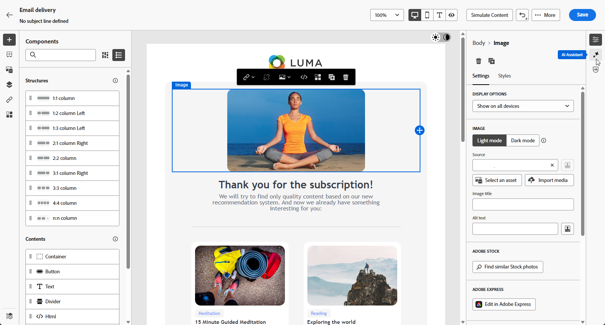

# 使用AI助手生成电子邮件 {#generative-content}

>[!IMPORTANT]
>
>在开始使用此功能之前，请阅读相关的[护栏和限制](generative-gs.md#generative-guardrails)。
>&#x200B;> 
>
>在Adobe Campaign Web中使用AI助手之前，必须同意[用户协议](https://www.adobe.com/cn/legal/licenses-terms/adobe-dx-gen-ai-user-guidelines.html){target="_blank"}。 有关更多信息，请与您的 Adobe 代表联系。

创建并个性化电子邮件后，在Adobe Campaign Web中使用AI助手增强内容。

Adobe Campaign Web中的AI助手通过生成整封电子邮件、有针对性的文本内容和图像来与受众引起共鸣，从而帮助优化投放的影响。 这改进了您的电子邮件促销活动，以实现更好的参与。

在电子邮件营销活动中，使用AI助手生成完整电子邮件、文本或图像。 浏览以下选项卡，了解如何在Adobe Campaign Web中使用AI助手。

>[!BEGINTABS]

>[!TAB 生成完整电子邮件]

在以下示例中，利用Adobe Campaign Web中的AI助手来优化现有电子邮件，为特殊事件自定义现有电子邮件。

1. 创建和配置电子邮件投放后，单击&#x200B;**[!UICONTROL 编辑内容]**。

   有关配置电子邮件投放的详细信息，请参阅[此页面](../email/create-email-content.md)。

1. 根据需要个性化您的布局，并访问&#x200B;**[!UICONTROL AI助手]**&#x200B;菜单。

   {zoomable="yes"}

1. 为AI助手启用&#x200B;**[!UICONTROL 使用原始内容]**&#x200B;选项，以根据所选内容对新内容进行个性化设置。

1. 通过描述您要在&#x200B;**[!UICONTROL 提示]**&#x200B;字段中生成的内容，微调内容。

   如果您在编写提示时需要帮助，请访问&#x200B;**[!UICONTROL 提示库]**，该库提供了多种提示想法以改进投放。

   {zoomable="yes"}

1. 切换&#x200B;**[!UICONTROL 主题行]**&#x200B;或&#x200B;**[!UICONTROL 预编译标头]**&#x200B;以将其包含在变量生成中。

1. 使用&#x200B;**[!UICONTROL 文本设置]**&#x200B;选项定制提示：

   * **[!UICONTROL 通信策略]**：为生成的文本选择最合适的通信样式。
   * **[!UICONTROL 音调]**：确保您的电子邮件音调可与您的受众引起共鸣。 无论您想听起信息性、娱乐性还是说服力，AI Assistant都会相应地调整消息。

   {zoomable="yes"}

1. 选择您的&#x200B;**[!UICONTROL 图像设置]**：

   * **[!UICONTROL 内容类型]**：对可视元素的性质进行分类，区分不同的可视表示形式，如照片、图形或艺术品。
   * **[!UICONTROL 视觉强度]**：通过调整图像的强度来控制其影响。 较低的设置(2)产生更柔和的外观，而较高的设置(10)使图像更生动。
   * **[!UICONTROL 颜色和色调]**：调整颜色的总体外观以及传达的气氛或气氛。
   * **[!UICONTROL 光源]**：修改图像中的光源，以调整其大气形状并突出显示特定元素。
   * **[!UICONTROL 合成]**：在图像的框架中排列元素。

1. 从&#x200B;**[!UICONTROL 品牌资产]**&#x200B;菜单中，单击&#x200B;**[!UICONTROL 上传品牌资产]**&#x200B;以添加为AI助手提供其他上下文的任何品牌资产，或选择以前上传的品牌资产。

   以前上传的文件在&#x200B;**[!UICONTROL 已上传的品牌资产]**&#x200B;下拉菜单中可用。 切换要包含在生成中的资产。

   {zoomable="yes"}

1. 提示就绪后，单击&#x200B;**[!UICONTROL 生成]**。

1. 浏览生成的&#x200B;**[!UICONTROL 变体]**，然后单击&#x200B;**[!UICONTROL 预览]**&#x200B;查看所选变体的全屏版本，或单击&#x200B;**[!UICONTROL 应用]**&#x200B;替换当前内容。

1. 单击百分比图标可查看您的&#x200B;**[!UICONTROL 品牌一致性得分]**&#x200B;并识别与您的品牌的所有不一致性。

   了解有关[品牌一致性分数](../content/brands-score.md)的更多信息。

   {zoomable="yes"}

1. 导航到&#x200B;**[!UICONTROL 预览]**&#x200B;窗口中的&#x200B;**[!UICONTROL 优化]**&#x200B;选项以访问其他自定义功能：

   * **[!UICONTROL 改写]**： AI Assistant以不同的方式改写您的消息，使您的写作保持新鲜，并吸引各种受众。
   * **[!UICONTROL 使用更简单的语言]**：简化您的语言，确保更广大的受众能够清晰地访问这些内容。

   您还可以更改文本的&#x200B;**[!UICONTROL 音调]**&#x200B;和&#x200B;**[!UICONTROL 通信策略]**。

   {zoomable="yes"}

1. 打开&#x200B;**[!UICONTROL 品牌一致性]**&#x200B;选项卡，查看内容如何与[品牌指南](../content/brands.md)保持一致。

1. 找到相应的内容后，单击&#x200B;**[!UICONTROL 选择]**。

1. 插入个性化字段，以根据用户档案数据自定义电子邮件内容。 然后，单击&#x200B;**[!UICONTROL 模拟内容]**&#x200B;按钮以控制渲染并检查测试用户档案的个性化设置。 [了解详情](../preview-test/preview-content.md)

在定义内容、受众和计划时，准备电子邮件投放。 [了解详情](../monitor/prepare-send.md)

>[!TAB 纯文本生成]

在以下示例中，利用AI Assistant增强即将举行的活动的电子邮件邀请的内容。

1. 创建和配置电子邮件投放后，单击&#x200B;**[!UICONTROL 编辑内容]**。

   有关配置电子邮件投放的详细信息，请参阅[此页面](../email/create-email-content.md)。

1. 选择&#x200B;**[!UICONTROL 文本组件]**&#x200B;以定位特定内容，并访问&#x200B;**[!UICONTROL AI助手]**&#x200B;菜单。

   {zoomable="yes"}

1. 为AI助手启用&#x200B;**[!UICONTROL 使用原始内容]**&#x200B;选项，以根据所选内容对新内容进行个性化设置。

1. 通过描述您要在&#x200B;**[!UICONTROL 提示]**&#x200B;字段中生成的内容，微调内容。

   如果您在编写提示时需要帮助，请访问&#x200B;**[!UICONTROL 提示库]**，该库提供了多种提示想法以改进投放。

   {zoomable="yes"}

1. 使用&#x200B;**[!UICONTROL 文本设置]**&#x200B;选项定制提示：

   * **[!UICONTROL 通信策略]**：为生成的文本选择最合适的通信样式。
   * **[!UICONTROL 音调]**：确保您的电子邮件音调可与您的受众引起共鸣。 无论您想听起信息性、娱乐性还是说服力，AI Assistant都会相应地调整消息。
   * **文本长度**：使用滑块选择所需文本长度。

   {zoomable="yes"}

1. 从&#x200B;**[!UICONTROL 品牌资产]**&#x200B;菜单中，单击&#x200B;**[!UICONTROL 上传品牌资产]**&#x200B;以添加为AI助手提供其他上下文的任何品牌资产，或选择以前上传的品牌资产。

   以前上传的文件在&#x200B;**[!UICONTROL 已上传的品牌资产]**&#x200B;下拉菜单中可用。 切换要包含在生成中的资产。

1. 提示就绪后，单击&#x200B;**[!UICONTROL 生成]**。

1. 浏览生成的&#x200B;**[!UICONTROL 变体]**，然后单击&#x200B;**[!UICONTROL 预览]**&#x200B;查看所选变体的全屏版本，或单击&#x200B;**[!UICONTROL 应用]**&#x200B;替换当前内容。

1. 单击百分比图标可查看您的&#x200B;**[!UICONTROL 品牌一致性得分]**&#x200B;并识别与您的品牌的所有不一致性。

   了解有关[品牌一致性分数](../content/brands-score.md)的更多信息。

   {zoomable="yes"}

1. 导航到&#x200B;**[!UICONTROL 预览]**&#x200B;窗口中的&#x200B;**[!UICONTROL 优化]**&#x200B;选项以访问其他自定义功能：

   * **[!UICONTROL 用作引用内容]**：所选变量用作用于生成其他结果的引用内容。
   * **[!UICONTROL 详述]**：展开特定主题，提供更多详细信息，以便更好地了解和参与。
   * **[!UICONTROL 摘要]**：将关键点浓缩为清晰、简洁的摘要，以吸引注意并鼓励进一步阅读。
   * **[!UICONTROL 重述]**：以不同的方式重述您的消息，使您的写作保持新鲜，吸引各种受众。
   * **[!UICONTROL 使用更简单的语言]**：简化您的语言，确保更广大的受众能够清晰地访问这些内容。

   您还可以更改文本的&#x200B;**[!UICONTROL 音调]**&#x200B;和&#x200B;**[!UICONTROL 通信策略]**。

   {zoomable="yes"}

1. 打开&#x200B;**[!UICONTROL 品牌一致性]**&#x200B;选项卡，查看内容如何与[品牌指南](../content/brands.md)保持一致。

1. 找到相应的内容后，单击&#x200B;**[!UICONTROL 选择]**。

1. 插入个性化字段，以根据用户档案数据自定义电子邮件内容。 然后，单击&#x200B;**[!UICONTROL 模拟内容]**&#x200B;按钮以控制渲染并检查测试用户档案的个性化设置。 [了解详情](../preview-test/preview-content.md)

在定义内容、受众和计划时，准备电子邮件投放。 [了解详情](../monitor/prepare-send.md)

>[!TAB 图像生成]

在下面的示例中，了解如何利用AI Assistant优化和改进资源，确保获得对用户更友好的体验。

1. 创建和配置电子邮件投放后，单击&#x200B;**[!UICONTROL 编辑内容]**。

   有关配置电子邮件投放的详细信息，请参阅[此页面](../email/create-email-content.md)。

1. 填写投放的&#x200B;**[!UICONTROL 基本详细信息]**。 完成后，单击&#x200B;**[!UICONTROL 编辑电子邮件内容]**。

1. 选择要使用AI助手更改的资源。

1. 从右侧菜单中选择&#x200B;**[!UICONTROL AI助手]**。

   {zoomable="yes"}

1. 为AI助手启用&#x200B;**[!UICONTROL 引用样式]**&#x200B;选项，以便根据所选内容对新内容进行个性化设置。

1. 通过描述您要在&#x200B;**[!UICONTROL 提示]**&#x200B;字段中生成的内容，微调内容。

   如果您在编写提示时需要帮助，请访问&#x200B;**[!UICONTROL 提示库]**，该库提供了多种提示想法以改进投放。

   {zoomable="yes"}

1. 使用&#x200B;**[!UICONTROL 图像设置]**&#x200B;选项定制提示：

   * **[!UICONTROL 宽高比]**：确定资源的宽度和高度。 从通用比率（如16:9、4:3、3:2或1:1）中选择，或输入自定义大小。
   * **[!UICONTROL 内容类型]**：对可视元素的性质进行分类，区分不同的可视表示形式，如照片、图形或艺术品。
   * **[!UICONTROL 视觉强度]**：通过调整图像的强度来控制其影响。 较低的设置(2)产生更柔和的外观，而较高的设置(10)使图像更生动。
   * **[!UICONTROL 颜色和色调]**：调整颜色的总体外观以及传达的气氛或气氛。
   * **[!UICONTROL 光源]**：修改图像中的光源，以调整其大气形状并突出显示特定元素。
   * **[!UICONTROL 合成]**：在图像的框架中排列元素。

   {zoomable="yes"}

1. 从&#x200B;**[!UICONTROL 品牌资产]**&#x200B;菜单中，单击&#x200B;**[!UICONTROL 上传品牌资产]**&#x200B;以添加为AI助手提供其他上下文的任何品牌资产，或选择以前上传的品牌资产。

   以前上传的文件在&#x200B;**[!UICONTROL 已上传的品牌资产]**&#x200B;下拉菜单中可用。 切换要包含在生成中的资产。

1. 如果对提示配置满意，请单击&#x200B;**[!UICONTROL 生成]**。

1. 浏览生成的&#x200B;**[!UICONTROL 变体]**，然后单击&#x200B;**[!UICONTROL 预览]**&#x200B;查看所选变体的全屏版本，或单击&#x200B;**[!UICONTROL 应用]**&#x200B;替换当前内容。

1. 单击百分比图标可查看您的&#x200B;**[!UICONTROL 品牌一致性得分]**&#x200B;并识别与您的品牌的所有不一致性。

   了解有关[品牌一致性分数](../content/brands-score.md)的更多信息。

   {zoomable="yes"}

1. 如果要查看与此变体相关的图像，请选择&#x200B;**[!UICONTROL 生成类似项]**。

1. 打开&#x200B;**[!UICONTROL 品牌一致性]**&#x200B;选项卡，查看内容如何与[品牌指南](../content/brands.md)保持一致。

1. 找到相应的内容后，单击&#x200B;**[!UICONTROL 选择]**。

1. 定义消息内容后，单击&#x200B;**[!UICONTROL 模拟内容]**&#x200B;按钮以控制渲染并使用测试用户档案检查个性化设置。 [了解详情](../preview-test/preview-content.md)

1. 在定义内容、受众和计划时，准备电子邮件投放。 [了解详情](../monitor/prepare-send.md)

>[!ENDTABS]

## 操作说明视频 {#video}

了解如何使用AI Assistant生成完整的电子邮件内容、文本和图像。

>[!VIDEO](https://video.tv.adobe.com/v/3428984)