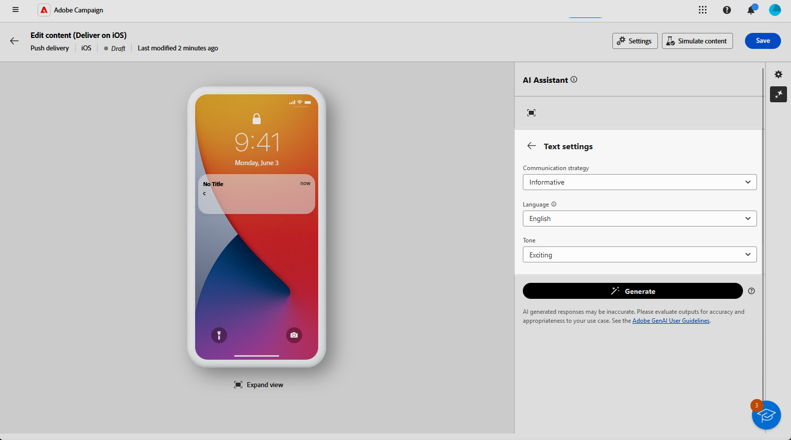

# 使用AI助手生成推送通知 {#generative-push}

>[!BEGINSHADEBOX]

**目录**

* [AI助手入门](generative-gs.md)
* [使用AI助手生成电子邮件](generative-content.md)
* [使用AI助手生成短信](generative-sms.md)
* **[使用AI助手生成推送通知](generative-push.md)**

>[!ENDSHADEBOX]

创建并个性化电子邮件后，使用由创作AI提供支持的Campaign中的AI助手将您的内容提升到新的水平。

AI Assistant可以通过建议更可能引起受众共鸣的不同内容来帮助您优化投放的影响。

>[!NOTE]
>
>在开始使用此功能之前，请阅读相关内容 [护栏和限制](generative-gs.md#guardrails-and-limitations).

1. 创建和配置推送通知投放后，单击 **[!UICONTROL 编辑内容]**.

   有关如何配置推送投放的更多信息，请参阅 [此页面](../push/create-push.md).

1. 填写 **[!UICONTROL 基本详细信息]** 用于您的投放。 完成后，单击 **[!UICONTROL 编辑内容]**.

1. 根据需要个性化您的推送通知。 [了解详情](../push/content-push.md)

1. 访问 **[!UICONTROL 显示AI助手]** 菜单。

   {zoomable=&quot;yes&quot;}

1. 通过描述您要在 **[!UICONTROL 提示]** 字段。

   如果您在制作提示时需要帮助，请访问 **[!UICONTROL 提示库]** 其中提供了多种旨在改进交付的即时想法。

   {zoomable=&quot;yes&quot;}

1. 启用 **[!UICONTROL 使用当前上下文增强]** AI助手选项，用于根据投放、投放名称和所选受众来个性化新内容。

   >[!IMPORTANT]
   >
   > 您的提示必须始终通过上传品牌资产或启用 **[!UICONTROL 增强当前内容]** 选项。

   {zoomable=&quot;yes&quot;}

1. 选择 **[!UICONTROL 上传品牌资产]** 添加任何品牌资产，其中包含可为AI助手提供其他上下文的内容。

1. 选择要生成的字段： **[!UICONTROL 标题]**， **[!UICONTROL 子标题]** 或 **[!UICONTROL 消息]**.

1. 选择 **[!UICONTROL 沟通策略]** 最符合你的需要。 这将影响生成的文本的色调和样式。

1. 选择 **[!UICONTROL 语言]** 和 **[!UICONTROL 色调]** 您希望生成的文本包含。 这将确保文本适合您的受众和用途。

   {zoomable=&quot;yes&quot;}

1. 提示就绪后，单击 **[!UICONTROL 生成]**.

1. 浏览生成的页面 **[!UICONTROL 变体]** 并单击 **[!UICONTROL 应用]** 找到相应的内容后。

   单击 **[!UICONTROL 预览]** 以查看所选变体的全屏版本。

   {zoomable=&quot;yes&quot;}

1. 插入个性化字段，以根据用户档案数据自定义电子邮件内容。 [详细了解内容个性化](../personalization/personalize.md)

   {zoomable=&quot;yes&quot;}

1. 定义消息内容后，单击 **[!UICONTROL 模拟内容]** 按钮来控制渲染，并使用测试用户档案检查个性化设置。 [了解详情](../preview-test/preview-content.md)

   {zoomable=&quot;yes&quot;}

1. 定义内容、受众和计划后，便可以准备电子邮件投放。 [了解详情](../monitor/prepare-send.md)
