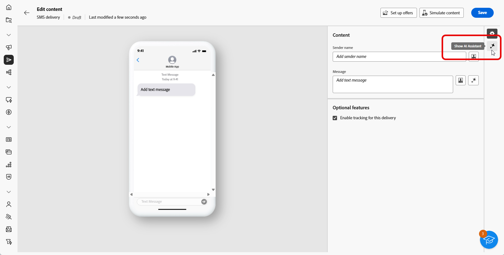
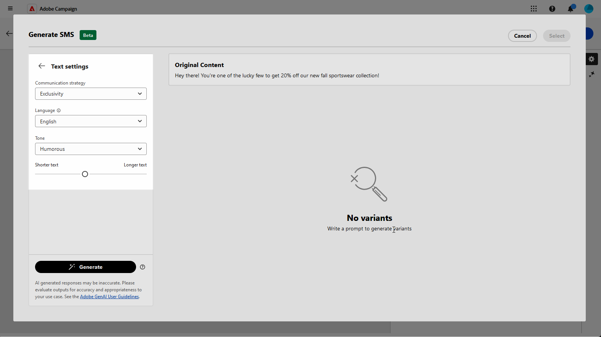

# 使用Adobe Campaign Web中的AI助手生成短信 — 内容加速器 {#generative-sms}

>[!IMPORTANT]
>
>在开始使用此功能之前，请阅读相关的[护栏和限制](generative-gs.md#generative-guardrails)。
> 
>
>您必须同意[用户协议](https://www.adobe.com/legal/licenses-terms/adobe-dx-gen-ai-user-guidelines.html)，然后才能使用Adobe Campaign Web中的AI助手进行内容加速。 有关更多信息，请与您的 Adobe 代表联系。

一旦您根据受众定制和个性化短信消息后，借助Adobe Campaign Web中的AI助手（借助创新的AI技术实现Campaign中的内容加速），将您的通信提升到新的水平。

这款方便易用的工具提供了智能建议，可优化您的内容，确保您的消息有效地引起共鸣并最大限度地提高参与度。

>[!BEGINTABS]

>[!TAB 完整短信生成]

1. 创建和配置短信投放后，单击&#x200B;**[!UICONTROL 编辑内容]**。

   有关如何配置短信投放的详细信息，请参阅[此页面](../sms/create-sms.md)。

1. 填写投放的&#x200B;**[!UICONTROL 基本详细信息]**。 完成后，单击&#x200B;**[!UICONTROL 编辑内容]**。

1. 访问&#x200B;**[!UICONTROL 显示AI助手]**&#x200B;菜单。

   {zoomable="yes"}

1. 通过描述要在&#x200B;**[!UICONTROL 提示]**&#x200B;字段中生成的内容，优化内容。

   如果您在制作提示时寻求帮助，请访问&#x200B;**[!UICONTROL 提示库]**，该库提供各种提示想法以改进投放。

   {zoomable="yes"}

1. 使用&#x200B;**[!UICONTROL 文本设置]**&#x200B;选项定制提示：

   * **[!UICONTROL 通信策略]**：为生成的文本选择最合适的通信样式。
   * **[!UICONTROL 音调]**：您电子邮件的音调应该引起您的听众的共鸣。 无论您是要提供信息、好玩还是具有说服力，AI Assistant都可以相应地调整消息。
   * **文本长度**：使用滑块选择所需文本长度。

   {zoomable="yes"}

1. 从&#x200B;**[!UICONTROL 品牌资产]**&#x200B;菜单中，单击&#x200B;**[!UICONTROL 上传品牌资产]**&#x200B;以添加任何品牌资产，这些品牌资产包含可为AI助手提供其他上下文的内容或选择以前上传的内容。

   以前上传的文件在&#x200B;**[!UICONTROL 已上传的品牌资产]**&#x200B;下拉菜单中可用。 只需切换您想要包含到层代中的资产。

1. 提示就绪后，单击&#x200B;**[!UICONTROL 生成]**。

1. 浏览生成的&#x200B;**[!UICONTROL 变体]**&#x200B;并单击&#x200B;**[!UICONTROL 预览]**&#x200B;以查看所选变体的全屏版本。

   {zoomable="yes"}

1. 导航到&#x200B;**[!UICONTROL 预览]**&#x200B;窗口中的&#x200B;**[!UICONTROL 优化]**&#x200B;选项以访问其他自定义功能并微调您的首选项变量：

   * **[!UICONTROL 用作引用内容]**：所选变量将用作用于生成其他结果的引用内容。

   * **[!UICONTROL 使用更简单的语言]**：AI助手可帮助您编写所有人都能理解的清晰、简洁的消息。

   * **[!UICONTROL 改写]**： AI Assistant将改写您的消息，以使其他受众的作品能够持续收藏。

   您还可以更改文本的&#x200B;**[!UICONTROL 音调]**&#x200B;和&#x200B;**[!UICONTROL 通信策略]**。

   {zoomable="yes"}

1. 找到相应的内容后，单击&#x200B;**[!UICONTROL 选择]**。

1. 插入个性化字段，以根据用户档案数据自定义短信内容。 [详细了解内容个性化](../personalization/personalize.md)

   {zoomable="yes"}

1. 定义消息内容后，单击&#x200B;**[!UICONTROL 模拟内容]**&#x200B;按钮以控制渲染，并使用测试用户档案检查个性化设置。 [了解详情](../preview-test/preview-content.md)

   {zoomable="yes"}

定义内容、受众和计划后，便可以准备短信投放。 [了解详情](../monitor/prepare-send.md)

>[!TAB 纯文本生成]

1. 创建和配置短信投放后，单击&#x200B;**[!UICONTROL 编辑内容]**。

   有关如何配置短信投放的详细信息，请参阅[此页面](../sms/create-sms.md)。

1. 填写投放的&#x200B;**[!UICONTROL 基本详细信息]**。 完成后，单击&#x200B;**[!UICONTROL 编辑内容]**。

1. 根据需要个性化短信消息。 [了解详情](../sms/content-sms.md)

1. 访问&#x200B;**[!UICONTROL 消息]**&#x200B;字段旁边的&#x200B;**[!UICONTROL AI助手]**&#x200B;菜单。

   {zoomable="yes"}

1. 为内容加速的AI助手启用&#x200B;**[!UICONTROL 使用引用内容]**&#x200B;选项，以根据所选内容对新内容进行个性化设置。

1. 通过描述要在&#x200B;**[!UICONTROL 提示]**&#x200B;字段中生成的内容，优化内容。

   如果您在制作提示时寻求帮助，请访问&#x200B;**[!UICONTROL 提示库]**，该库提供了多种提示想法来改进促销活动。

   {zoomable="yes"}

1. 使用&#x200B;**[!UICONTROL 文本设置]**&#x200B;选项定制提示：

   * **[!UICONTROL 通信策略]**：为生成的文本选择所需的通信方法。
   * **[!UICONTROL 语言]**：选择变体内容的语言。
   * **[!UICONTROL 色调]**：确保文本适合您的受众和用途。
   * **[!UICONTROL 长度]**：使用范围滑块选择内容的长度。

   {zoomable="yes"}

1. 从&#x200B;**[!UICONTROL 品牌资产]**&#x200B;菜单中，单击&#x200B;**[!UICONTROL 上传品牌资产]**&#x200B;以添加任何品牌资产，这些品牌资产包含可为AI助手提供其他上下文的内容或选择以前上传的内容。

   以前上传的文件在&#x200B;**[!UICONTROL 已上传的品牌资产]**&#x200B;下拉菜单中可用。 只需切换您想要包含到层代中的资产。

1. 提示就绪后，单击&#x200B;**[!UICONTROL 生成]**。

1. 浏览生成的&#x200B;**[!UICONTROL 变体]**&#x200B;并单击&#x200B;**[!UICONTROL 预览]**&#x200B;以查看所选变体的全屏版本。

1. 导航到&#x200B;**[!UICONTROL 预览]**&#x200B;窗口中的&#x200B;**[!UICONTROL 优化]**&#x200B;选项以访问其他自定义功能并微调您的首选项变量：

   * **[!UICONTROL 用作引用内容]**：所选变量将用作用于生成其他结果的引用内容。

   * **[!UICONTROL 重述]**：AI助手可以通过不同的方式重述您的消息，使您的写作保持新鲜，并吸引各种受众。

   * **[!UICONTROL 使用更简单的语言]**：利用AI Assistant简化您的语言，确保更广大的受众拥有清晰易懂的语言。

   您还可以更改文本的&#x200B;**[!UICONTROL 音调]**&#x200B;和&#x200B;**[!UICONTROL 通信策略]**。

   {zoomable="yes"}

1. 找到相应的内容后，单击&#x200B;**[!UICONTROL 选择]**。

1. 插入个性化字段，以根据用户档案数据自定义短信内容。 [详细了解内容个性化](../personalization/personalize.md)

1. 定义消息内容后，单击&#x200B;**[!UICONTROL 模拟内容]**&#x200B;按钮以控制渲染，并使用测试用户档案检查个性化设置。 [了解详情](../preview-test/preview-content.md)

   {zoomable="yes"}

定义内容、受众和计划后，便可以准备短信投放。 [了解详情](../monitor/prepare-send.md)

>[!ENDTABS]
