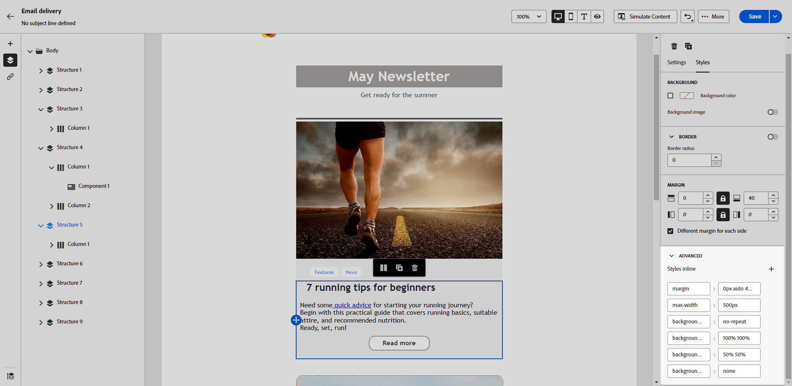

# 添加内联样式属性 {#adding-inline-styling-attributes}

在电子邮件设计器界面中，当您选择一个元素并在右侧窗格中显示其设置时，可以自定义该特定元素的内联属性及其值。

1. 直接在内容中或使用左侧窗格中的&#x200B;**[!UICONTROL 导航树]**&#x200B;来选择组件。

1. 从&#x200B;**[!UICONTROL 样式]**&#x200B;选项卡中，单击&#x200B;**[!UICONTROL 高级]**&#x200B;下拉列表。

   {zoomable=&quot;yes&quot;}

1. 修改现有属性的值。

1. 可以使用 **+** 按钮添加新属性。可以添加任何符合 CSS 的属性和值。

   {zoomable=&quot;yes&quot;}

样式将应用于所选元素。

>[!NOTE]
>
>如果子元素不具有定义的特定样式属性，则继承父元素的样式。

