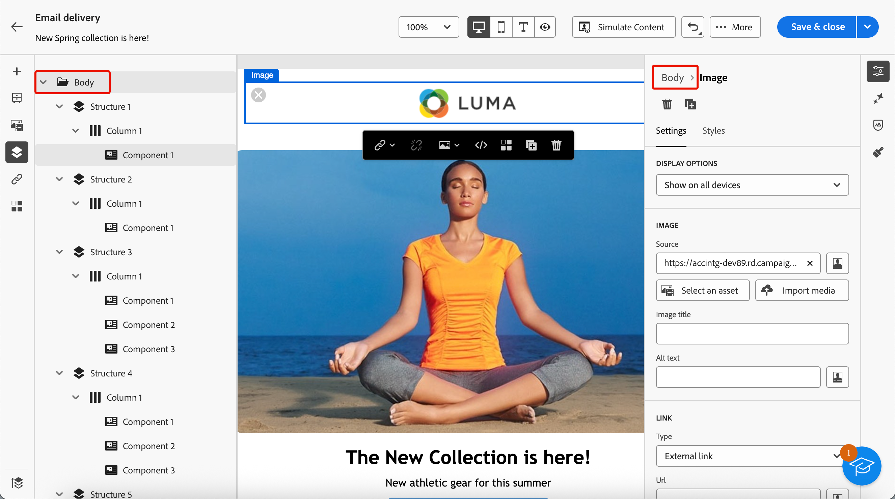
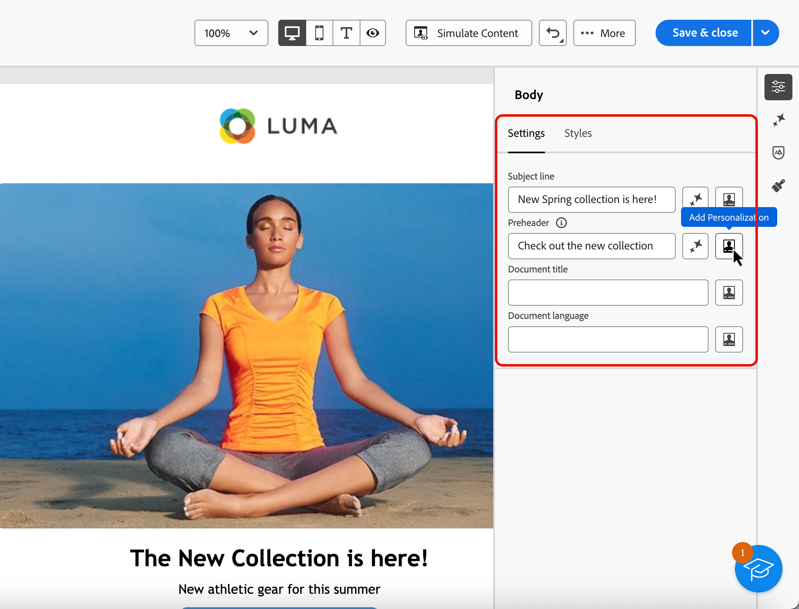

# 将元数据添加到您的电子邮件内容 {#email-metadata}

>[!CONTEXTUALHELP]
>id="ac_edition_preheader"
>title="定义邮件引文"
>abstract="邮件引文是一段简短的摘要文本，当您从电子邮件客户端查看电子邮件时，将在主题行之后显示这段内容。在许多情况下，它提供电子邮件的简短摘要，并且一般只有一句话的长度。"

在设计电子邮件时，为了提高可读性和可访问性，您可以为内容定义其他元属性。 [!DNL Journey Optimizer] [电子邮件Designer](get-started-email-designer.md)允许您指定以下元素：

* **[!UICONTROL 预编译标头]**：预编译标头是在查看电子邮件客户端中的电子邮件时遵循主题行的简短摘要文本。 在许多情况下，它提供电子邮件的简短摘要，并且一般只有一句话的长度。

  >[!NOTE]
  >
  >并非所有电子邮件客户端都支持邮件引文。如果不支持邮件引文，则它不会显示。

* **[!UICONTROL 文档标题]**：此字段对应于`<title>`元素，提供有关电子邮件内容的描述性信息，通常在鼠标悬停时显示为工具提示。 它通过提供额外的上下文来帮助残障用户，并且还有助于搜索引擎更好地了解您的内容。

* **[!UICONTROL 文档语言]**：为确保无障碍性，您可以指定屏幕阅读器将文本和图像转换为语音或盲文的语言 — 适用于视觉障碍或学习障碍人士。 此设置对应于`<html>`元素中的`lang`属性。

要配置这些设置，请执行以下步骤。

1. 从[电子邮件Designer](create-email-content.md)，添加至少一个&#x200B;**[!UICONTROL 结构组件]**&#x200B;以开始设计电子邮件。

1. 从左侧的&#x200B;**[!UICONTROL 导航树]**&#x200B;或右窗格顶部单击&#x200B;**[!UICONTROL 正文]**。

   {width="90%"}

1. 从&#x200B;**[!UICONTROL 设置]**&#x200B;选项卡中，在&#x200B;**[!UICONTROL 预标题]**、**[!UICONTROL 文档标题]**&#x200B;和/或&#x200B;**[!UICONTROL 文档语言]**&#x200B;字段中键入一些文本。

1. 您还可以单击每个字段旁边的个性化图标以根据配置文件属性、受众、上下文属性等自定义您的内容。 [了解有关个性化的更多信息](../personalization/gs-personalization.md)

   {width="70%"}

1. 单击&#x200B;**[!UICONTROL 保存]**&#x200B;以确认更改。