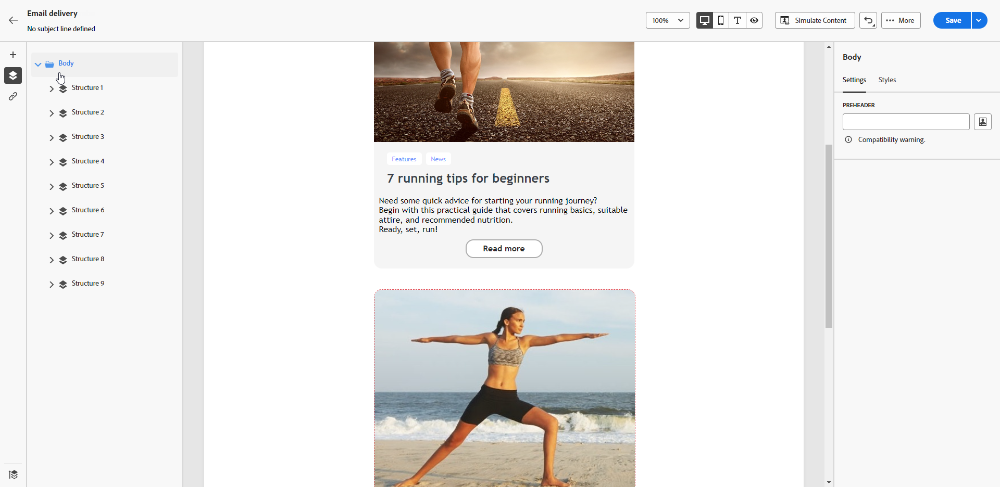

# 向电子邮件中添加邮件引文 {#preheader}

>[!CONTEXTUALHELP]
>id="ac_edition_preheader"
>title="添加邮件引文"
>abstract="邮件引文是一段简短的摘要文本，当您从电子邮件客户端查看电子邮件时，将在主题行之后显示这段内容。在许多情况下，它提供电子邮件的简短摘要，并且一般只有一句话的长度。"

邮件引文是一种简短文本，在查看来自任何主要电子邮件客户端的电子邮件时位于主题行之后。

在许多情况下，它提供内容的简短摘要，通常为一个句子长。

>[!NOTE]
>
>并非所有电子邮件客户端都支持邮件引文。如果不支持邮件引文，则它不会显示。

要定义电子邮件标头，请执行以下步骤。

1. 从 [电子邮件设计工具](create-email-content.md)，至少添加一个 **[!UICONTROL 结构]** 组件以开始设计电子邮件。

1. 单击左侧窗格中的&#x200B;**[!UICONTROL 导航树]**&#x200B;图标并选择&#x200B;**[!UICONTROL 正文]**。

   

1. 从 **[!UICONTROL 设置]** 选项卡，为您的预告输入一些文本。

1. 要进一步对其进行个性化，请单击 **[!UICONTROL 添加个性化]** 左侧图标 **[!UICONTROL 预编译标头]** 字段。

   

1. 从 **[!UICONTROL 编辑个性化]** 窗口，您可以添加 [个性化字段](../personalization/personalize.md)， [内容块](../personalization/content-blocks.md) 和 [条件内容](../personalization/conditions.md) 使用左侧的专用条目。

   

1. 单击&#x200B;**[!UICONTROL 确认]**。

现已为您的电子邮件配置邮件引文。
