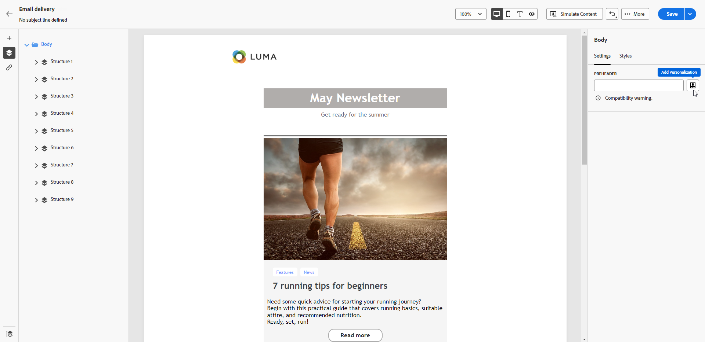

# 向电子邮件中添加邮件引文 {#preheader}

>[!CONTEXTUALHELP]
>id="ac_edition_preheader"
>title="添加邮件引文"
>abstract="邮件引文是一段简短的摘要文本，当您从电子邮件客户端查看电子邮件时，将在主题行之后显示这段内容。在许多情况下，它提供电子邮件的简短摘要，并且一般只有一句话的长度。"

邮件引文是一种简短文本，在查看来自任何主要电子邮件客户端的电子邮件时位于主题行之后。

在许多情况下，它提供内容的简短摘要，通常为一个句子长。

>[!NOTE]
>
>并非所有电子邮件客户端都支持邮件引文。如果不支持邮件引文，则它不会显示。

要定义电子邮件标头，请执行以下步骤。

1. 从[电子邮件Designer](create-email-content.md)中，添加至少一个&#x200B;**[!UICONTROL 结构]**&#x200B;组件以开始设计电子邮件。

1. 从左窗格中单击&#x200B;**[!UICONTROL 导航树]**&#x200B;图标，然后选择&#x200B;**[!UICONTROL 正文]**。

   {zoomable="yes"}

1. 在&#x200B;**[!UICONTROL 设置]**&#x200B;选项卡中，为预告页眉输入一些文本。

1. 要进一步对其进行个性化，请单击&#x200B;**[!UICONTROL 预标题]**&#x200B;字段左侧的&#x200B;**[!UICONTROL 添加个性化]**&#x200B;图标。

   Designer {zoomable="yes"}

1. 在&#x200B;**[!UICONTROL 编辑Personalization]**&#x200B;窗口中，使用左侧的专用条目添加[个性化字段](../personalization/personalize.md)、[表达式片段](../content/use-expression-fragments.md)和[条件内容](../personalization/conditions.md)。

   {zoomable="yes"}

1. 单击&#x200B;**[!UICONTROL 确认]**。

现已为您的电子邮件配置邮件引文。