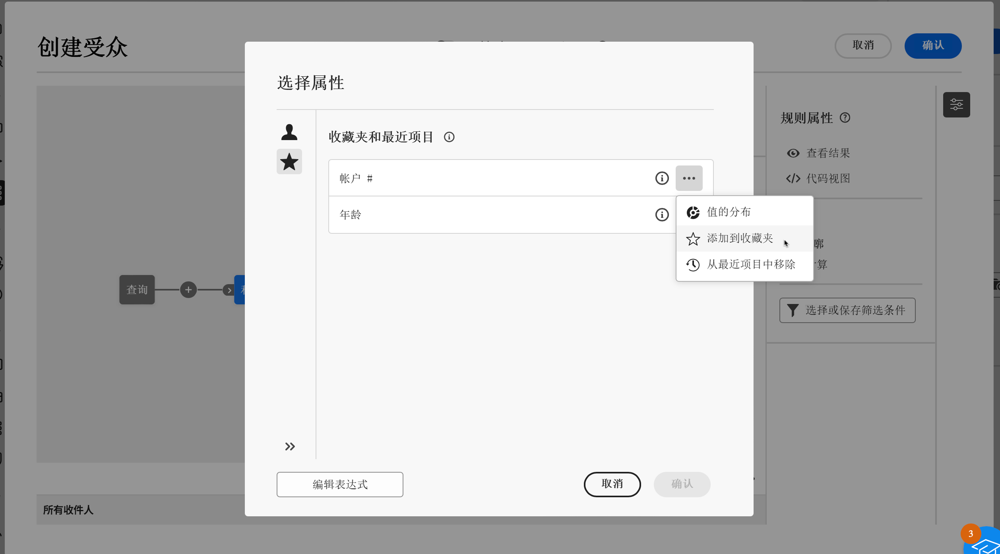

# 选择属性并将其添加到收藏夹 {#folders}

通过 Campaign Web 用户界面，用户可以根据执行的操作在各个位置从数据库选择属性。例如，可以在定义直邮投放或要提取的文件的输出列时选择属性。类似地，使用查询建模器创建规则、过滤器或建立受众时可以选择属性。

为了快速重新使用经常使用的属性，请将它们添加到收藏夹。这可以确保它们在未来的任务中易于访问。除了收藏夹，用户可以查看和使用最近选择的属性。

该界面还提供了一个值分布工具，以便您直观地看到表内属性值的分布。此工具有助于识别值的范围和频率，确保创建查询或表达式时的数据一致性。

## 收藏和最近属性 {#favorites}

>[!CONTEXTUALHELP]
>id="acw_attribute_picker_favorites_recents"
>title="收藏夹和最近项目"
>abstract="属性选取器中的&#x200B;**[!UICONTROL 收藏和最近]**&#x200B;菜单提供已添加到收藏夹的属性的清晰视图，以及最近使用的属性列表。首先显示收藏的属性，然后显示最近使用的属性，这样可以轻松找到需要的属性。"

属性选取器中的 **[!UICONTROL 收藏和最近]**&#x200B;菜单提供已添加到收藏夹的那些属性的清晰视图，以及最近使用的属性列表。首先显示收藏的属性，然后显示最近使用的属性，这样可以轻松找到所需的属性。

要将属性添加到收藏夹，请单击展开按钮，然后选择&#x200B;**[!UICONTROL 添加到收藏夹]**。该属性将会被自动添加到收藏夹列表中。要从收藏夹中移除属性，请再次选择星形图标。

用户最多可以收藏 20 个属性。收藏和最近使用的属性与组织内的每位用户关联，确保在不同设备间也能访问，从而提供跨设备的一致体验。

## 确定表中值的分布 {#distribution}

点击属性旁边的展开按钮后，会显示&#x200B;**值分布**&#x200B;按钮，用户可通过该按钮分析表中该属性的值分布情况。此功能对于理解可用的值、其数量和百分比十分有用。它还有助于避免在构建查询或创建表达式时出现大小写或拼写不一致等问题。

如果某些属性有大量值，该工具仅显示前二十个值。在这种情况下，会出现一个&#x200B;**[!UICONTROL 部分加载]**&#x200B;通知来表示有此限制。应用高级过滤器来优化所显示的结果并关注特定值或数据子集。可以在[这里](../get-started/work-with-folders.md#filter-the-values)找到有关使用过滤器的详细指南。

有关在不同情况下使用值分布工具的更多信息，请参阅以下部分：

* [文件夹中的值分布](../get-started/work-with-folders.md##distribution-values-folder)
* [查询中的值分布](../query/build-query.md#distribution-values-query)