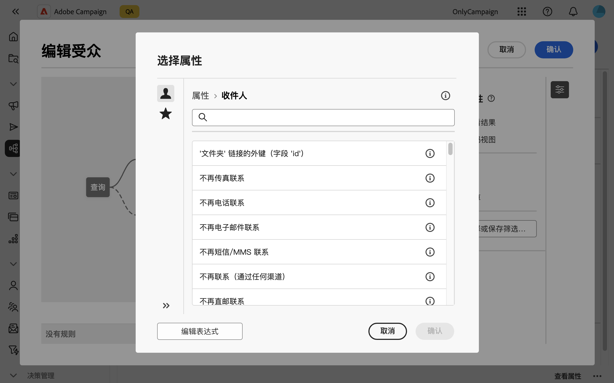
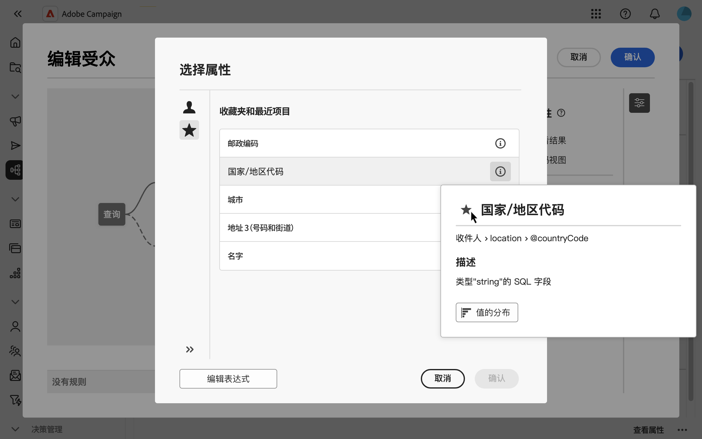
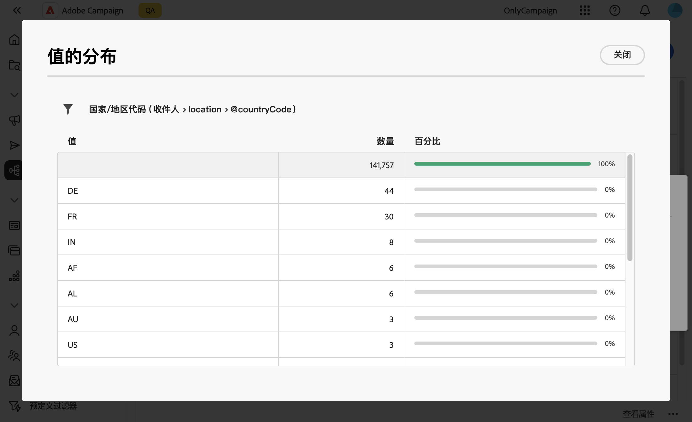

# 选择属性并将其添加到收藏夹 {#folders}

Campaign Web用户界面允许您根据要执行的操作，从数据库的各个位置选择属性。 例如，在为直邮投放或要提取的文件定义输出列时，您可以选择属性。 同样，在使用查询建模器创建规则、过滤器或构建受众时，可以选择属性。

要快速重用经常使用的属性，可以将它们添加到收藏夹。 这可以确保它们在未来的任务中易于访问。除了收藏夹，您还可以查看和使用最近选择的属性。

该界面还提供了值分布工具，该工具允许您可视化表中属性值的分布。 此工具可以帮助您识别值的范围和频率，确保在创建查询或表达式时数据的一致性。

## 收藏夹和最近属性 {#favorites}

>[!CONTEXTUALHELP]
>id="acw_attribute_picker_favorites_recents"
>title="收藏夹和最近项目"
>abstract="属性选取器中的&#x200B;**[!UICONTROL 收藏夹和最近访问]**&#x200B;菜单提供了已添加到收藏夹的属性的组织视图，以及最近使用属性的列表。 收藏属性首先显示，然后是最近使用的属性，这样可以轻松找到所需的属性。"

属性选取器中的&#x200B;**[!UICONTROL 收藏夹和最近访问]**&#x200B;菜单提供了已添加到收藏夹的属性的组织视图，以及最近使用属性的列表。 收藏属性首先显示，然后是最近使用的属性，这样可以轻松找到所需的属性。

要将属性添加到收藏夹，请将鼠标悬停在其信息按钮上，然后选择星形图标。 该属性随后将自动添加到收藏夹列表中。 如果您不再希望将某个属性保留为收藏夹，则可以通过再次选择星形图标来删除该属性。

您最多可以添加20个属性收藏夹。 收藏属性和最近属性与组织内的每个用户相关联。 这意味着可以从不同的计算机访问它们，从而确保跨设备无缝体验。

## 标识表中值的分布 {#distribution}

属性信息窗格中提供的&#x200B;**值分布**&#x200B;按钮允许您分析表中该属性的值分布。 此功能尤其有助于了解可用值、其计数和百分比。 此外，在构建查询或创建表达式时，它还有助于避免出现大小写不一致或拼写不一致的问题。

对于具有大量值的属性，该工具仅显示前20个。 在这种情况下，将显示一个&#x200B;**[!UICONTROL 部分加载]**&#x200B;通知来指示此限制。 您可以应用高级过滤器来优化显示的结果，并重点关注特定值或数据子集。 有关使用过滤器的详细指南可在[此处](../get-started/work-with-folders.md#filter-the-values)找到。

有关在不同上下文中使用值分布工具的更多信息，请参阅以下章节：

- [文件夹中的值分布](../get-started/work-with-folders.md##distribution-values-folder)
- [查询中的值分布](../query/build-query.md#distribution-values-query)
