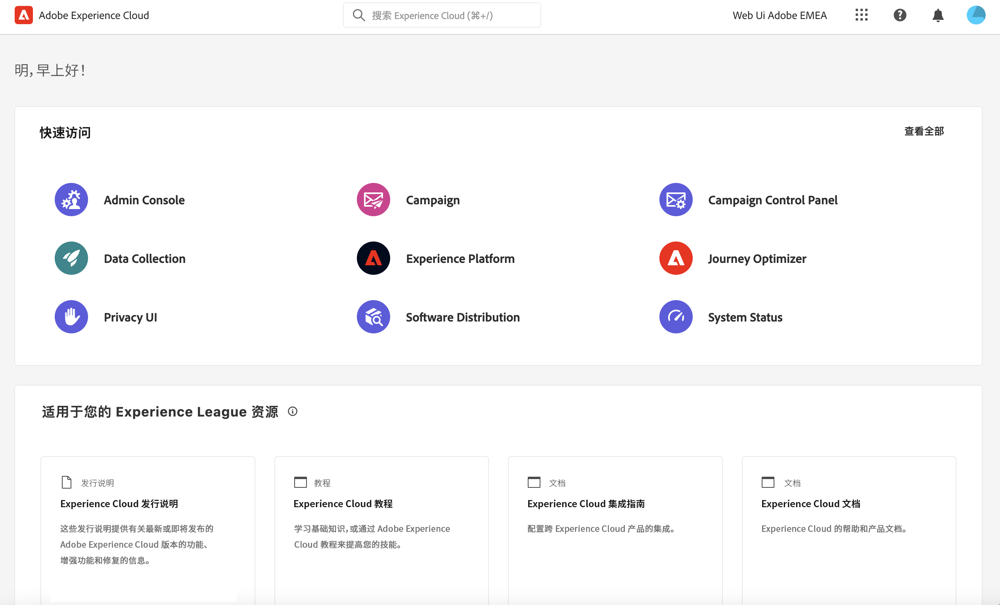

# 连接到 Adobe Campaign {#connect-to-campaign}

Experience Cloud 是 Adobe 的数字营销应用程序、产品和服务的集成系列。通过其直观的界面，您可以快速访问云应用程序、产品功能和服务。了解如何连接到 Adobe Experience Cloud 并在此页面中访问 Adobe Campaign Web 界面。

## 登录到 Adobe Experience Cloud {#sign-in-to-exc}

仅可使用单点登录 (SSO) 连接到 Campaign。通常，Experience Cloud 管理员会授予对应用程序和服务的访问权限。按照邀请您加入 Experience Cloud 的电子邮件中的步骤操作。

要登录到 Adobe Experience Cloud，请遵循以下基本步骤：

1. 浏览到 [Adobe Experience Cloud](https://experience.adobe.com/){target="_blank"}。

1. 使用您的 Adobe ID 或 Enterprise ID 登录。请参阅[此文章](https://helpx.adobe.com/cn/enterprise/using/identity.html){target="_blank"}以了解有关 Adobe 身份类型的更多信息。

   登录到 Experience Cloud 后，您可以快速访问所有解决方案和应用程序。

   {zoomable=&quot;yes&quot;}

1. 验证您是否属于正确的组织。

   {zoomable=&quot;yes&quot;}{width="50%" align="left"}

   请参阅[此文章](https://experienceleague.adobe.com/docs/core-services/interface/administration/organizations.html?lang=zh-Hans){target="_blank"}以了解有关 Adobe Experience Cloud 中的组织的更多信息。

## 访问 Adobe Campaign {#access-to-campaign}

要访问您的 Campaign 环境，请从 Adobe Experience Cloud 主页的&#x200B;**快速访问**&#x200B;部分选择 **Campaign**。

如果您已连接到另一个 Adobe Experience Cloud 解决方案，还可以从屏幕右上角的解决方案切换器浏览到您的 Campaign 环境。

{zoomable=&quot;yes&quot;}

如果您有权访问多个环境（包括 Campaign 控制面板），请点击正确实例的&#x200B;**启动**&#x200B;按钮。

{zoomable=&quot;yes&quot;}

您现已连接到 Campaign。在[此页面](user-interface.md)中了解如何开始使用用户界面。

## Adobe Experience Cloud 顶部导航 {#top-bar}

浏览界面的顶部栏可：

* 分享有关 Campaign Web 用户界面的反馈
* 在组织之间切换
* 在 Adobe Experience Cloud 解决方案和应用程序之间切换
* 搜索关于 [Adobe Experience League](https://experienceleague.adobe.com/docs/?lang=zh-Hans){target="_blank"} 的帮助
* 检查您的产品通知
* 编辑您的 Adobe 配置文件和管理设置，如[更新您的常用语言](#language-pref)或[切换到浅色/深色主题](#dark-theme)

{zoomable=&quot;yes&quot;}{width="50%" align="left"}

## 支持的浏览器 {#browsers}

Adobe Campaign Web 所采用的设计使其能够在最新版本的 Google Chrome、Safari 和 Microsoft Edge 中以最佳状态运行。您可能无法在较旧版本或其他浏览器上使用某些功能。

## 语言偏好设置 {#language-pref}

Adobe Campaign Web 目前提供以下语言版本：

* 英语（美国）- EN-US
* 法语 - FR
* 德语 - DE
* 意大利语 - IT
* 西班牙语 - ES
* 葡萄牙语（巴西）- PTBR
* 日语 - JP
* 朝鲜语 - KR
* 简体中文 - CHS
* 繁体中文 - CHT

在您的用户配置文件中指定的首选语言决定您的 Campaign Web 默认语言。它与 Campaign 服务器和客户端控制台的语言无关。

要更改您的语言，请执行以下操作：

1. 单击右上角的配置文件图标，然后选择&#x200B;**偏好设置**。
1. 然后单击电子邮件地址下方显示的语言链接。
1. 选择您的首选语言并单击&#x200B;**保存**。如果您使用的组件未本地化为您的首选语言，可以选择第二语言。

<!--
>[!CAUTION]
>
>If you plan to use [AI-powered contextual help](using-ai.md) capabilities, you must set your prefered language to English. Other languages are not supported.
>
-->

## 深色和浅色主题 {#dark-theme}

Adobe Campaign 有浅色和深色主题可用。默认情况下，以浅色主题启用用户界面。要切换到深色主题，请单击您的配置文件图标，然后使用&#x200B;**深色主题**&#x200B;切换开关启用/禁用它。

在[此部分](https://experienceleague.adobe.com/docs/core-services/interface/experience-cloud.html?lang=zh-Hans#preferences){target="_blank"}中详述用户配置文件设置和帐户首选项。

请参阅[此文档](https://experienceleague.adobe.com/docs/core-services/interface/experience-cloud.html?lang=zh-Hans){target="_blank"}以了解有关 Experience Cloud 中央界面组件的更多信息。
