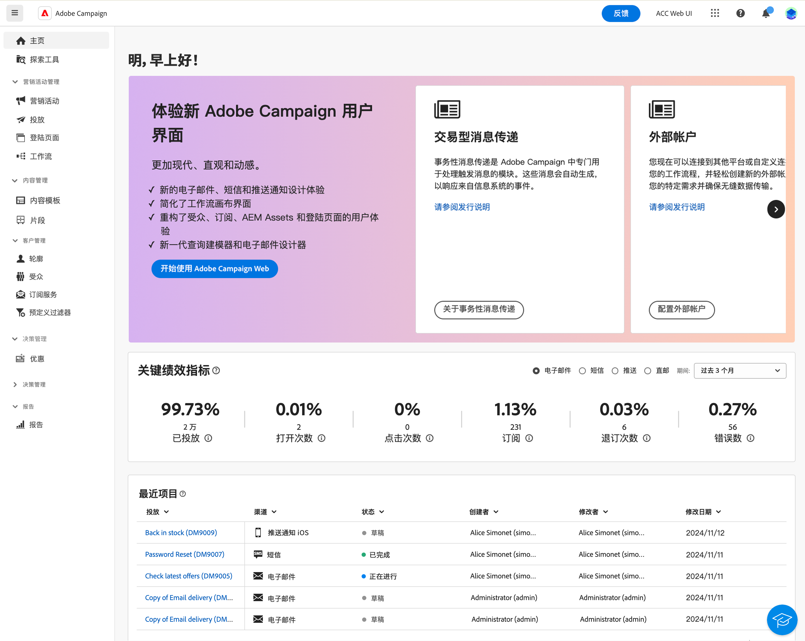

# 开始使用 Campaign v8 Web {#get-started}

>[!CONTEXTUALHELP]
>id="acw_homepage_welcome_learnmore"
>title="入门"
>abstract="新的 Campaign v8 Web 界面提供了集成、直观和一致的用户体验。"

>[!CONTEXTUALHELP]
>id="acw_homepage_learning_learnmore"
>title="入门"
>abstract="新的 Campaign v8 Web 界面提供了集成、直观和一致的用户体验。"

>[!CONTEXTUALHELP]
>id="acw_homepage_learnmore"
>title="入门"
>abstract="新的 Campaign v8 Web 界面提供了集成、直观和一致的用户体验。"

Adobe Campaign 提供了一个跨渠道客户体验设计平台，以及用于进行可视化活动编排、实时互动管理和跨渠道执行的环境。

Adobe Campaign v8是新一代营销活动工具，专为各种营销渠道（如电子邮件、推送通知、短信和直邮）构建。 它提供了强大的 ETL 和数据管理功能，以帮助制定和策划完美的营销活动。它的编排引擎提供丰富的多接触点营销计划，核心重点放在基于批处理驱动的历程。它还配有一个可扩展的实时消息服务器，使营销团队能够根据任何IT系统的包含所有内容的有效负载发送预定义的消息以进行通信，例如密码重置、订单确认、电子收据等。

使用 Campaign 可以：

* 通过可访问的单一客户视图&#x200B;**推动**&#x200B;个性化和参与
* 将电子邮件、移动设备、线上和线下渠道&#x200B;**整合**&#x200B;到客户历程中
* **自动**&#x200B;投放有意义、及时的消息和优惠

最初只能通过功能丰富的[客户端控制台](#ac-client)使用 Campaign，而它现在提供一个新的 Web 用户界面 (UI)，该界面提高了可用性、可访问性并采用新设计以显著改善您的用户体验。此新的现代 UI 简化了营销活动的设计和投放，并实现了与其他 Adobe 解决方案（包括 Adobe Experience Platform）的一致性。

此新的 UI 首先满足了&#x200B;**业务从业者**&#x200B;的需求 – 所有典型的管理任务在第一个版本中都不可用，将在后续版本中解决此问题。请注意，并非客户端控制台中可用的所有功能或选项现在都能在新 UI 中使用。新的用例、选项和功能将在未来版本中提供。

作为管理员或专家用户，如果您需要访问Campaign v8功能（Web UI中不提供），则可以连接到 [客户端控制台](#ac-client).

>[!NOTE]
>
>Campaign v8 Web 目前为有限发布版 (LA)。仅限少量 LA 客户访问。请注意，产品界面、功能和使用流程可能会发生更改，恕不另行通知。

在[此页面](connect-to-campaign.md)中了解如何连接到 Adobe Campaign Web 界面。

## 关于 Campaign 客户端控制台 {#ac-client}

Campaign 客户端控制台是系统上安装的基于浏览器的应用程序。它通过 Web 服务 API 连接到您的 Campaign 应用程序服务器。

Campaign 数据存储在应用程序服务器中。可从客户端控制台和 Web UI 获得此数据。例如，如果您使用客户端控制台创建投放模板，则它在 Web UI 中也可用。如果您在 Web UI 中创建电子邮件投放，则也可从客户端控制台访问此投放。

一些对象只能在客户端控制台中进行创建和管理。它们在 Campaign Web UI 中可见并可使用，但不能从该环境中创建和修改。可以从探索工具视图（可从左侧导航中访问）中使用所有 Campaign 对象和组件。

有关如何将Campaign v8与其客户端控制台结合使用的更多信息，请参阅 [Campaign v8（客户端控制台）文档](https://experienceleague.adobe.com/docs/campaign/campaign-v8/campaign-home.html?lang=zh-Hans){target="_blank"}.
