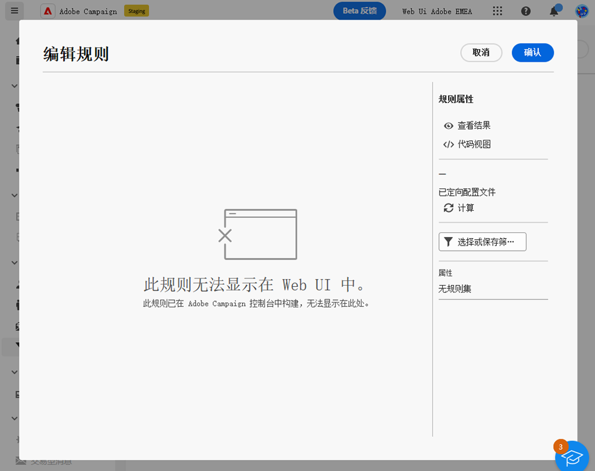

# 护栏和限制 {#guardrails-limitations}

在Campaign Web UI中使用在Campaign客户端控制台中创建或修改的组件时，以下列出的护栏和限制适用。

## 工作流 {#wf-guardrails-limitations}

可以在控制台和Web UI中访问同一工作流。 但是，请注意，某些限制适用。

**活动版本**

* 在Web UI中访问控制台工作流时，只能修改兼容的活动。

**画布版本**

* 如果控制台工作流具有多个启动节点/分支或浮动活动，则需要添加启动活动和分支，以将启动节点连接到主节点。 您还需要删除浮动活动。

**活动定位**

* 仅当添加或删除了活动时（并非始终如此），才会重新计算节点的位置（因此将修改活动的初始位置）。

**未公开选项**

* 不兼容的选项不会显示在Web UI中。

**循环**

* 包含循环的工作流不会显示在Web UI中。 将显示一条错误消息。

**协调与扩充**

在Campaign客户端控制台中， **扩充** 活动可以执行协调和扩充。 在Campaign Web UI中，协调功能尚不可用。 如果您在控制台活动中设置了协调，则在Web UI中，它将显示为不兼容的活动。

* 如果 **扩充** 控制台中的活动仅执行扩充，即 **扩充** 活动会显示在Web中。
* 如果 **扩充** 控制台中的活动仅执行协调，会显示不兼容的活动。

## 预定义过滤器 {#filters-guardrails-limitations}

选择投放的受众或在工作流中构建受众时，某些预定义过滤器不可用。 此时会显示特定的错误消息。 您仍可以使用查询并查看：筛选条件和结果，但无法在规则生成器中查看确切的查询，也无法编辑筛选条件。

