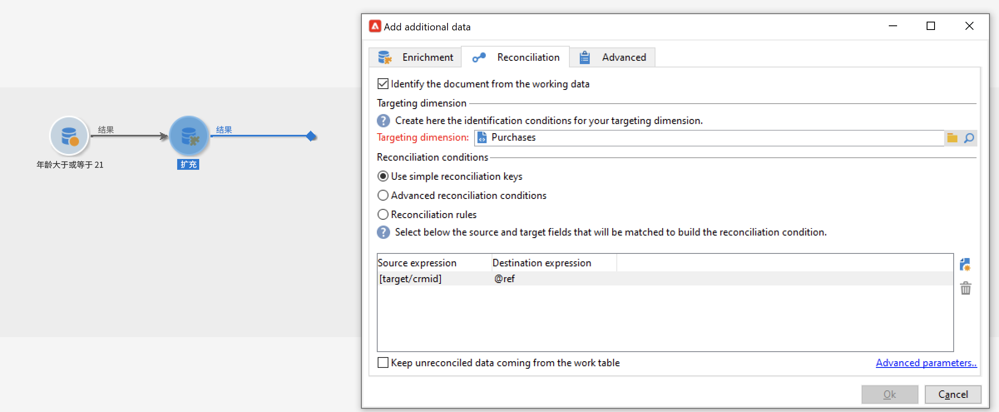
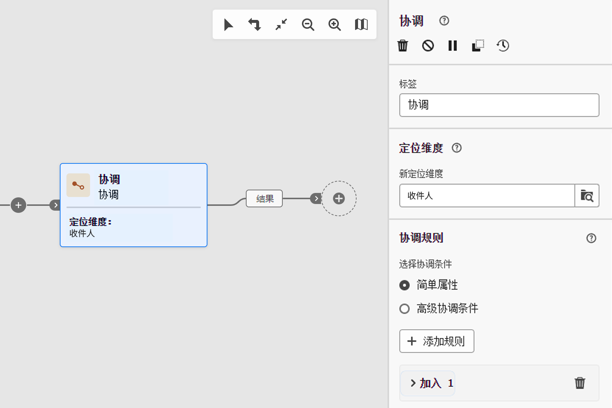

# 护栏和限制 {#guardrails-limitations}

在Campaign Web用户界面中使用在Campaign客户端控制台中创建或修改的工作流时，以下列出的护栏和限制适用。

请注意，虽然本页列出了在控制台和Web用户界面中使用工作流时的主要注意事项，但并未涵盖两个界面之间的所有潜在不兼容性。

## 工作流活动 {#wkf-activities}

Campaign Web中尚不支持的工作流活动是只读的，会显示为不兼容的活动。 仍可执行工作流、发送消息、检查日志等。在Campaign Web和客户端控制台中可用的工作流活动均可编辑。

Campaign Web用户界面中尚不支持的工作流活动是只读的，并且显示为不兼容的活动。 仍可执行工作流、发送消息、检查日志等。在Campaign Web用户界面和Campaign客户端控制台中可用的工作流活动均可编辑。

| 控制台 | Web |
| --- | --- |
| {zoomable=&quot;yes&quot;}{width="800px" align="left" zoomable="yes"} | {zoomable=&quot;yes&quot;}{width="800px" align="left" zoomable="yes"} |

当 **查询** 或 **扩充** 在控制台中使用附加数据配置活动，扩充数据在Campaign Web中会被考虑并传递到叫客过渡中，但无法编辑。

| 控制台 | Web |
| --- | --- |
| {zoomable=&quot;yes&quot;}{width="800px" align="left" zoomable="yes"} | {zoomable=&quot;yes&quot;}{width="800px" align="left" zoomable="yes"} |

在控制台中，**扩充**&#x200B;活动可执行协调和扩充。如果您在客户端控制台中定义了 **扩充** 活动，将显示为 **调解** 活动。

| 控制台 | Web |
| --- | --- |
| {zoomable=&quot;yes&quot;}{width="800px" align="left" zoomable="yes"} | {zoomable=&quot;yes&quot;}{width="800px" align="left" zoomable="yes"} |

## 工作流画布 {#wkf-canvas}

在Campaign Web用户界面中创建新工作流时，画布仅支持一个入口点。 但是，如果您在控制台中创建了一个具有多个入口点的工作流，则可以在Campaign Web用户界面中打开并编辑该工作流。

| 控制台 | Web |
| --- | --- |
| {zoomable=&quot;yes&quot;}{width="800px" align="left" zoomable="yes"} | {zoomable=&quot;yes&quot;}{width="800px" align="left" zoomable="yes"} |

每次添加或删除活动时都会刷新节点的定位。如果在控制台中创建工作流，并使用Campaign Web用户界面修改它，然后在控制台中重新打开它，您可能会注意到一些细微的定位缺陷。 这种情况不影响工作流的过程和任务。

| 初始工作流 | 定位更改 |
| --- | --- |
| {zoomable=&quot;yes&quot;}{width="800px" align="left" zoomable="yes"} | {zoomable=&quot;yes&quot;}{width="800px" align="left" zoomable="yes"} |
