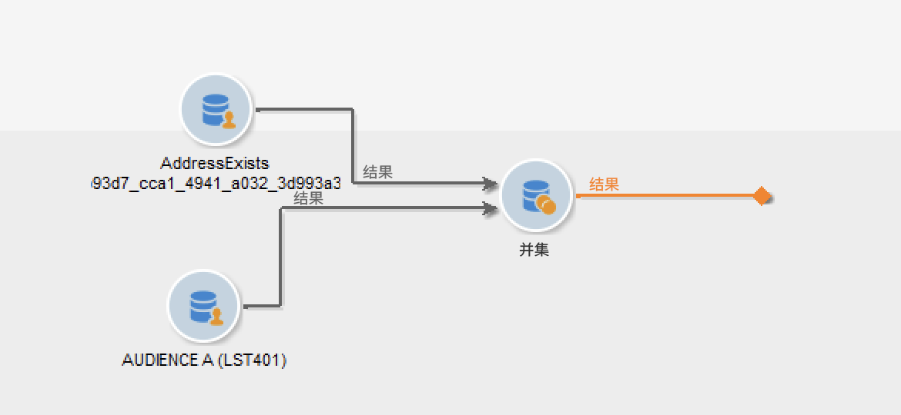

# 护栏和限制 {#guardrails-limitations}

在Campaign Web UI中使用在Campaign客户端控制台中创建或修改的组件时，以下列出的护栏和限制适用。

## 工作流 {#wf-guardrails-limitations}

### 活动

Web UI中尚不支持的工作流活动是只读的，并且显示为不兼容的活动。 您仍然可以执行工作流、发送消息、检查日志等。 在Web UI和客户端控制台中可用的工作流活动均可编辑。

| 控制台 | Web UI |
| --- | --- |
| {width="800px" align="left" zoomable="yes"} | {width="800px" align="left" zoomable="yes"} |

不会显示Web UI中尚不支持的工作流活动设置。 但是，在执行工作流时，这些设置适用。

| 控制台 | Web UI |
| --- | --- |
| {width="800px" align="left" zoomable="yes"} | {width="800px" align="left" zoomable="yes"} |

在控制台中， **扩充** 活动可以执行协调和扩充。 在Web UI中，协调功能尚不可用。 如果您在控制台中定义了 **扩充** 活动，则在Web UI中显示为不兼容的只读活动。

| 控制台 | Web UI |
| --- | --- |
| {width="800px" align="left" zoomable="yes"} | {width="800px" align="left" zoomable="yes"} |

### 画布

在Web UI中创建新工作流时，画布仅支持一个入口点。 但是，如果您在控制台中创建了一个具有多个入口点的工作流，则可以在Web UI中打开并编辑它。

| 控制台 | Web UI |
| --- | --- |
| {width="800px" align="left" zoomable="yes"} | {width="800px" align="left" zoomable="yes"} |

在Web UI中，循环尚不可用。 如果您使用控制台创建了包含循环的工作流，则无法从Web UI访问它。 将显示一条错误消息。

| 控制台 | Web UI |
| --- | --- |
| {width="800px" align="left" zoomable="yes"} | {width="800px" align="left" zoomable="yes"} |

每次添加或删除活动时，都会刷新节点的定位。 如果在控制台中创建工作流，使用Web UI修改它，然后在控制台中重新打开它，您可能会注意到一些细微的定位不完善。 这对工作流的流程和任务没有影响。

| 初始工作流 | 位置更改 |
| --- | --- |
| {width="800px" align="left" zoomable="yes"} | {width="800px" align="left" zoomable="yes"} |

## 预定义过滤器 {#filters-guardrails-limitations}

在选择投放的受众或在工作流中构建受众时，某些预定义过滤器在该版本产品的用户界面中不可用。

此时会显示特定的错误消息。

{width="70%" align="left"}

即使您无法在规则生成器中查看查询的图形表示形式，也无法编辑过滤器，您仍可以使用它，并在 **属性** 部分。

{width="70%" align="left"}

您还可以访问SQL查询以检查确切的设置。 要执行此操作，请单击 **代码视图** 按钮。

{width="70%" align="left"}

单击 **计算** 按钮以检查有多少项符合筛选条件。

{width="70%" align="left"}

使用 **查看结果** 按钮以显示这些项目。

{width="70%" align="left"}

请注意，如果在Web界面中构建过滤器，并在控制台中使用不支持的属性对其进行修改，则在Web界面中无法再使用该图形表示。 无论如何，您仍可以使用过滤器。

下面列出了不支持的属性。

### 不支持的数据类型 {#unsupported-data-type}

在Web界面中显示过滤器或规则时，不支持客户端控制台中可用的以下数据类型：

* 日期时间
* 时间
* 时间跨度
* 多次
* 浮点数

### 不支持的筛选功能 {#unsupported-filtering-capabilities}

在客户端控制台中使用复杂的表达式和函数构建过滤器时，无法在Web界面中对其进行编辑。

此外，不支持以下运算符：

* 数值类型
   * 包含在
   * no in

* 字符串类型
   * 大于
   * 小于
   * 大于或等于
   * 小于或等于
   * 点赞
   * 不相似

* 日期类型
   * 在或晚于
   * 在或早于
   * 不等于
   * 为空
   * 不为空
   * 包含在
   * 不在
   * 最近

* 1-N链接
   * COUNT， SUM， AVG， MIN， MAX