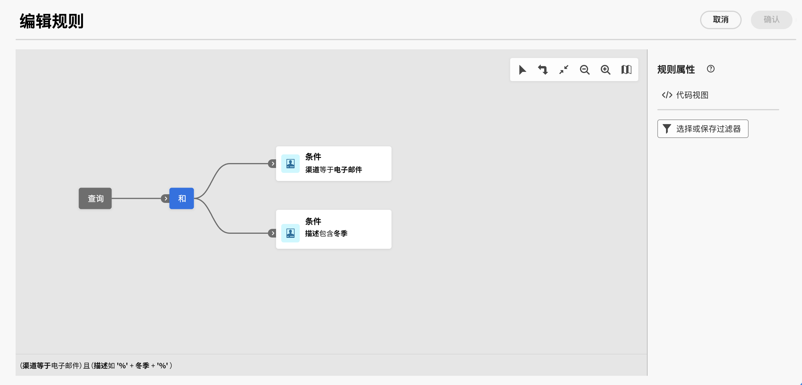

# 浏览、搜索和筛选列表 {#list-screens}

左侧导航菜单中的大多数链接都会显示对象列表，例如 **投放** 或 **营销活动**. 其中一些列表屏幕为只读。 您可以自定义列表显示并筛选这些列表，如下所述。

要删除过滤器，请单击 **全部清除** 按钮。

## 自定义列表屏幕 {#custom-lists}

列表将以列的形式显示。可以更改列配置来显示其他信息。要执行此操作，请单击 **为自定义布局配置列** 图标图标。

{width="70%" align="left"}

在 **配置列** 屏幕、添加或删除列，以及更改列的显示顺序。

例如，对于这些设置：

{width="70%" align="left"}

该列表显示以下列：

{width="70%" align="left"}

使用 **显示高级属性** 切换以查看当前列表的所有属性。 [了解详情](#adv-attributes)

## 排序数据 {#sort-lists}

您还可以通过单击任意列标题对列表中的项目进行排序。 将显示一个箭头（向上或向下），指示列表已按该列排序。

对于数值列或日期列， **向上** 箭头指示列表按升序排序，而 **向下** 箭头表示降序。 对于字符串或字母数字列，值将按字母顺序列出。

## 内置过滤器 {#list-built-in-filters}

要更快地查找项目，可以使用搜索栏，或根据上下文条件筛选列表。

{width="70%" align="left"}

例如，您可以根据投放的状态、渠道、联系日期或文件夹筛选投放。 您还可以隐藏测试。

## 自定义筛选条件{#list-custom-filters}

要根据数据创建自定义筛选条件，请浏览到筛选条件的底部，然后单击 **添加规则** 按钮。

拖放属性以在 **高级过滤器** 屏幕。

{width="70%" align="left"}

使用 **显示高级属性** 切换以查看当前列表的所有属性。 [了解详情](#adv-attributes)

## 使用高级属性 {#adv-attributes}

>[!CONTEXTUALHELP]
>id="acw_attributepicker_advancedfields"
>title="显示高级属性"
>abstract="默认情况下，属性列表中只显示最常见的属性。 使用此切换开关可使用高级属性构建过滤器。"

默认情况下，只有最常见的属性会显示在属性列表和过滤器配置屏幕中。 设置为的属性 `advanced` 数据架构中的属性会在配置屏幕中隐藏。

使用 **显示高级属性** 切换以查看当前列表的所有可用属性。
