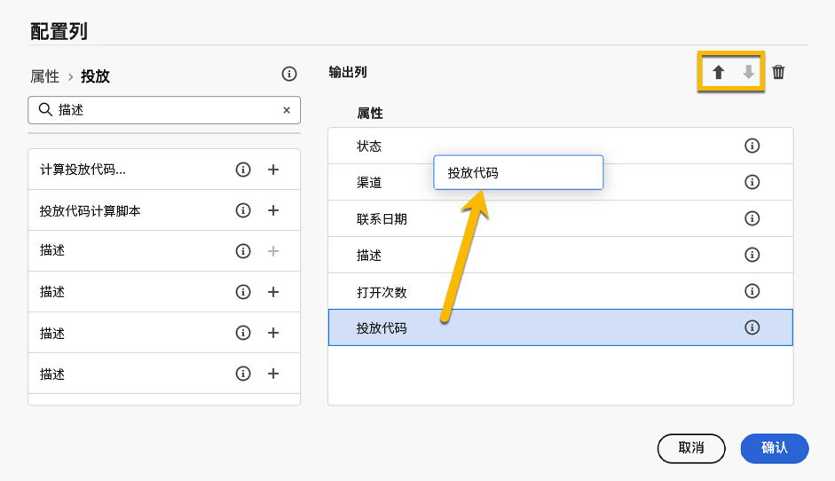

# 浏览和过滤列表 {#list-screens}

左侧导航菜单中的大多数链接会显示对象列表，例如&#x200B;**投放**&#x200B;或&#x200B;**营销活动**&#x200B;的列表。其中一些列表屏幕为只读状态。您可以自定义列表显示并过滤这些列表，具体如下所述。

## 自定义列表屏幕 {#custom-lists}

列表将以列的形式显示。可以更改列配置来显示其他信息。为此，请单击列表右上角的&#x200B;**为自定义版面配置列**&#x200B;图标。

{zoomable="yes"}{width="70%" align="left"}

在&#x200B;**配置列**&#x200B;屏幕中，添加或删除列，并更改它们的显示顺序。

您可以通过 **拖放**&#x200B;或使用 **上下箭头** 更改列表的顺序，如下所示：

{zoomable="yes"}{width="70%" align="left"}

例如，对于这些设置：

{zoomable="yes"}{width="70%" align="left" zoomable="yes"}

该列表显示以下列：

{zoomable="yes"}{width="70%" align="left"}

## 对数据排序 {#sort-lists}

您可以单击任意列标题来对列表中的项目进行排序。将显示一个箭头（向上或向下），指示列表已按该列排序。

对于数字或日期列，**向上**&#x200B;箭头表示列表按升序排序，**向下**&#x200B;箭头表示列表按降序排序。对于字符串或字母数字列，值将按字母顺序列出。

## 过滤器 {#list-built-in-filters}

要更快地找到项目，可使用搜索栏或内置过滤器和自定义过滤器根据上下文条件调整列表。

{zoomable="yes"}{width="70%" align="left"}

可在[此部分](../query/filter.md)中找到有关如何使用过滤器和创建您自己的自定义过滤器的详细信息。

<!--
## Use advanced attributes {#adv-attributes}

>[!CONTEXTUALHELP]
>id="acw_attributepicker_advancedfields"
>title="Display advanced attributes"
>abstract="Only the most common attributes are displayed by default in the attribute list. Activate the **Display advanced attributes** toggle to see all available attributes for the current list in the left palette of the rule builder, such as nodes, groupings, 1-1 links, 1-N links."

>[!CONTEXTUALHELP]
>id="acw_rulebuilder_advancedfields"
>title="Rule builder advanced fields"
>abstract="Only the most common attributes are displayed by default in the attribute list. Activate the **Display advanced attributes** toggle to see all available attributes for the current list in the left palette of the rule builder, such as nodes, groupings, 1-1 links, 1-N links."

>[!CONTEXTUALHELP]
>id="acw_rulebuilder_properties_advanced"
>title="Rule builder advanced attributes"
>abstract="Only the most common attributes are displayed by default in the attribute list. Activate the **Display advanced attributes** toggle to see all available attributes for the current list in the left palette of the rule builder, such as nodes, groupings, 1-1 links, 1-N links."

Only the most common attributes are displayed by default in the attribute list and filter configuration screens. Attributes set as `advanced` attributes in the data schema are hidden from the configuration screens.

Activate the **Display advanced attributes** toggle to see all available attributes for the current list in the left palette of the rule builder, such as nodes, groupings, 1-1 links, 1-N links. The attribute list updates instantly.

[The screenshot shows the Display advanced attributes toggle used to reveal hidden attributes in the rule builder palette.](assets/adv-toggle.png){zoomable="yes"}{width="70%" align="left" zoomable="yes"}
-->