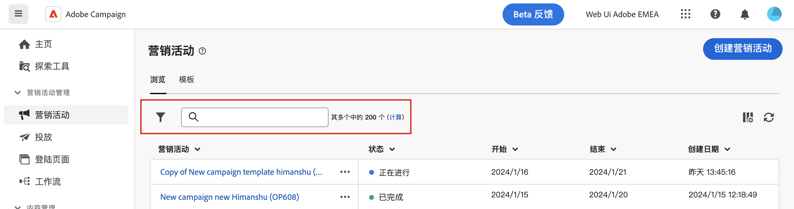

# 浏览和筛选列表 {#list-screens}

左侧导航菜单中的大多数链接显示对象列表，例如&#x200B;**投放**&#x200B;或&#x200B;**营销活动**&#x200B;的列表。其中一些列表屏幕为只读状态。您可以自定义列表显示，并过滤这些列表，如下详述。

## 自定义列表屏幕 {#custom-lists}

列表将以列的形式显示。可以更改列配置来显示其他信息。为此，请单击列表右上角的&#x200B;**为自定义版面配置列**&#x200B;图标。

{width="70%" align="left" zoomable="yes"}

在&#x200B;**配置列**&#x200B;屏幕中，添加或删除列，并更改它们的显示顺序。

例如，对于这些设置：

{width="70%" align="left" zoomable="yes"}

该列表显示以下列：

{width="70%" align="left" zoomable="yes"}

## 对数据排序 {#sort-lists}

您也可以单击任意列标题来对列表中的项目进行排序。将显示一个箭头（向上或向下），指示列表已按该列排序。

对于数字或日期列，**向上**&#x200B;箭头表示列表按升序排序，**向下**&#x200B;箭头表示列表按降序排序。对于字符串或字母数字列，值将按字母顺序列出。

## 筛选器 {#list-built-in-filters}

要更快地查找项目，您可以使用搜索栏或内置和自定义过滤器，根据上下文条件调整列表。

{width="70%" align="left" zoomable="yes"}

有关如何使用过滤器以及创建您自己的自定义过滤器的详细信息，请参阅 [本节](../query/filter.md).

<!--
## Use advanced attributes {#adv-attributes}

>[!CONTEXTUALHELP]
>id="acw_attributepicker_advancedfields"
>title="Display advanced attributes"
>abstract="Only the most common attributes are displayed by default in the attribute list. Activate the **Display advanced attributes** toggle to see all available attributes for the current list in the left palette of the rule builder, such as nodes, groupings, 1-1 links, 1-N links."

>[!CONTEXTUALHELP]
>id="acw_rulebuilder_advancedfields"
>title="Rule builder advanced fields"
>abstract="Only the most common attributes are displayed by default in the attribute list. Activate the **Display advanced attributes** toggle to see all available attributes for the current list in the left palette of the rule builder, such as nodes, groupings, 1-1 links, 1-N links."

>[!CONTEXTUALHELP]
>id="acw_rulebuilder_properties_advanced"
>title="Rule builder advanced attributes"
>abstract="Only the most common attributes are displayed by default in the attribute list. Activate the **Display advanced attributes** toggle to see all available attributes for the current list in the left palette of the rule builder, such as nodes, groupings, 1-1 links, 1-N links."

Only most common attributes are displayed by default in the attribute list and filter configuration screens. Attributes which were set as `advanced` attributes in the data schema are hidden from the configuration screens. 

Activate the **Display advanced attributes** toggle to see all available attributes for the current list in the left palette of the rule builder, such as nodes, groupings, 1-1 links, 1-N links. The attribute list is updated instantly.

{width="70%" align="left" zoomable="yes"}
-->