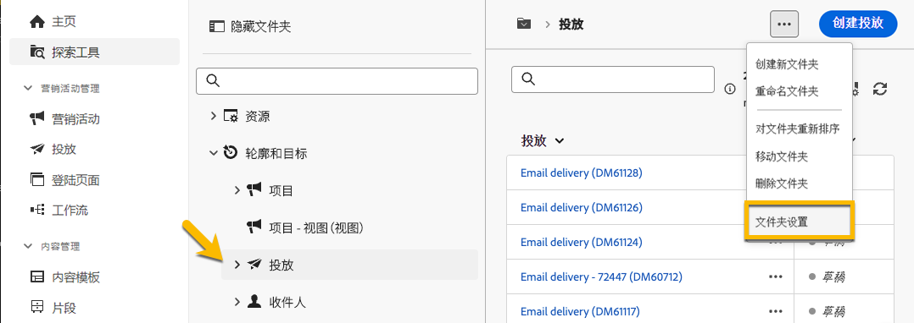
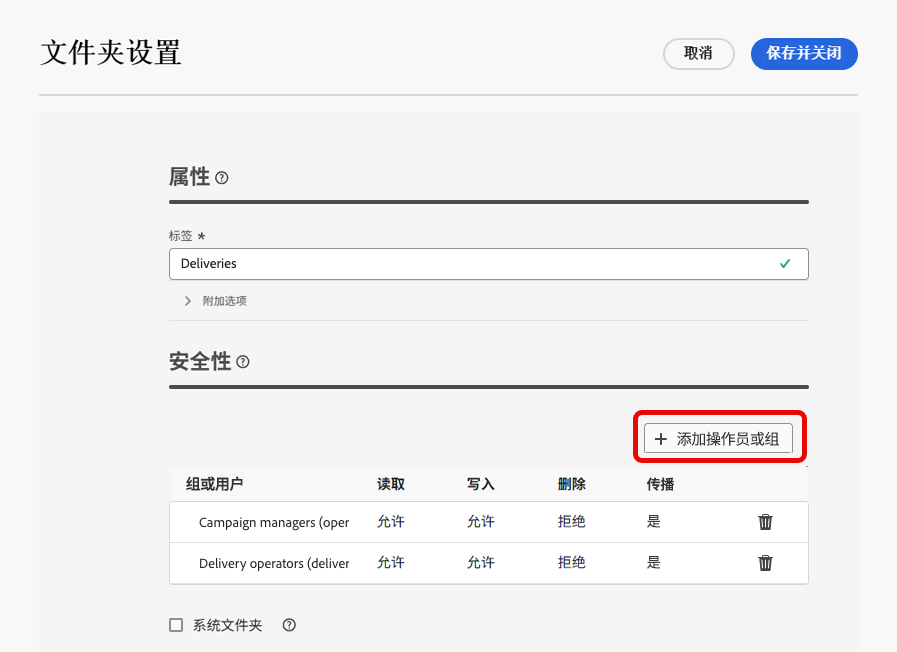
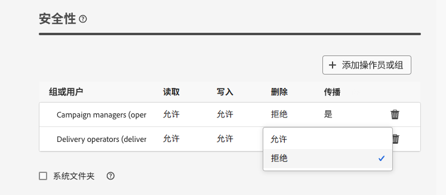

<?xml version="1.0" encoding="UTF-8"?>
<xliff xmlns="urn:oasis:names:tc:xliff:document:1.2" xmlns:okp="okapi-framework:xliff-extensions" xmlns:its="http://www.w3.org/2005/11/its" xmlns:itsxlf="http://www.w3.org/ns/its-xliff/" version="1.2" its:version="2.0">
<file original="help/v8/get-started/permissions.md.mdsc" source-language="en-US" target-language="en-XX" datatype="x-text/markdown">
<body>
<trans-unit id="tu10" xml:space="preserve">
<source xml:lang="en-US">https://experienceleague.adobe.com/en/docs/campaign/campaign-v8/admin/permissions/gs-permissions</source>
<target xml:lang="en-XX">https://experienceleague.adobe.com/zh-hans/docs/campaign/campaign-v8/admin/permissions/gs-permissions</target>
</trans-unit>
<trans-unit id="tu26" xml:space="preserve">
<source xml:lang="en-US">https://experienceleague.adobe.com/docs/campaign/campaign-v8/permissions/manage-permissions.html#use-named-rights</source>
<target xml:lang="en-XX">https://experienceleague.adobe.com/zh-hans/docs/campaign/campaign-v8/permissions/manage-permissions#use-named-rights</target>
</trans-unit>
<trans-unit id="tu1" restype="x-YAML_METADATA_HEADER_VALUE" xml:space="preserve">
<source xml:lang="en-US">Permission management in Campaign Web user interface</source>
<target xml:lang="en-XX">Campaign Web 用户界面中的权限管理</target>
</trans-unit>
<trans-unit id="tu2" restype="x-YAML_METADATA_HEADER_VALUE" xml:space="preserve">
<source xml:lang="en-US">Learn more about permissions in Campaign Web user interface</source>
<target xml:lang="en-XX">详细了解 Campaign Web 用户界面中的权限</target>
</trans-unit>
<trans-unit id="tu3" xml:space="preserve">
<source xml:lang="en-US">Permissions</source>
<target xml:lang="en-XX">权限</target>
</trans-unit>
<trans-unit id="tu4" xml:space="preserve">
<source xml:lang="en-US">Each user in Adobe Campaign has specific permissions and restrictions in the application. The user can belong to an operators group and inherit the group's permissions.</source>
<target xml:lang="en-XX">Adobe Campaign 中的每个用户在应用程序内都有具体的权限和限制。 用户可以属于一个操作员组，并继承该组的权限。</target>
</trans-unit>
<trans-unit id="tu5" xml:space="preserve">
<source xml:lang="en-US">Based on their permissions, an operator can:</source>
<target xml:lang="en-XX">根据其权限，操作员可以：</target>
</trans-unit>
<trans-unit id="tu6" xml:space="preserve">
<source xml:lang="en-US">Access certain capabilities</source>
<target xml:lang="en-XX">访问特定功能</target>
</trans-unit>
<trans-unit id="tu7" xml:space="preserve">
<source xml:lang="en-US">Access certain data</source>
<target xml:lang="en-XX">访问特定数据</target>
</trans-unit>
<trans-unit id="tu8" xml:space="preserve">
<source xml:lang="en-US">Access certain actions (create, modify, delete)</source>
<target xml:lang="en-XX">访问某些操作（创建、修改、删除）</target>
</trans-unit>
<trans-unit id="tu9" xml:space="preserve">
<source xml:lang="en-US">A detailed procedure for setting up permissions in Adobe Campaign is available in <ph id="1" ctype="x-LINK">[</ph>Adobe Campaign v8 (console) documentation<ph id="2" ctype="x-LINK">[#$tu10]{target="_blank"}</ph>.</source>
<target xml:lang="en-XX">有关在 Adobe Campaign 中设置权限的详细流程，请参阅 <ph id="1" ctype="x-LINK">[</ph>Adobe Campaign v8（控制台）文档<ph id="2" ctype="x-LINK">[#$tu10]{target="_blank"}</ph>。</target>
</trans-unit>
<trans-unit id="tu11" xml:space="preserve">
<source xml:lang="en-US">Permissions on folders</source>
<target xml:lang="en-XX">文件夹权限</target>
</trans-unit>
<trans-unit id="tu12" xml:space="preserve">
<source xml:lang="en-US">Based on your rights, you can view and manage permissions on folders in the <ph id="1" ctype="x-STRONG_EMPHASIS">**[!UICONTROL </ph>Folder settings<ph id="3" ctype="x-LINK_REF">]**</ph>.</source>
<target xml:lang="en-XX">根据您的权限，您可以在<ph id="1" ctype="x-STRONG_EMPHASIS">**[!UICONTROL </ph>文件夹设置<ph id="3" ctype="x-LINK_REF">]**</ph>中查看和管理文件夹权限。</target>
</trans-unit>
<trans-unit id="tu13" xml:space="preserve">
<source xml:lang="en-US">Below is an example of a delivery folder:</source>
<target xml:lang="en-XX">以下是投放文件夹的一个示例：</target>
</trans-unit>
<trans-unit id="tu14" xml:space="preserve">
<source xml:lang="en-US"><ph id="1" ctype="x-IMAGE">{zoomable="yes"}</ph></source>
<target xml:lang="en-XX"><ph id="1" ctype="x-IMAGE">{zoomable="yes"}</ph></target>
</trans-unit>
<trans-unit id="tu15" xml:space="preserve">
<source xml:lang="en-US">In the <ph id="1" ctype="x-STRONG_EMPHASIS">**[!UICONTROL </ph>Security<ph id="3" ctype="x-LINK_REF">]**</ph> section of the <ph id="5" ctype="x-STRONG_EMPHASIS">**[!UICONTROL </ph>Folder settings<ph id="7" ctype="x-LINK_REF">]**</ph>, you can view and manage (add or delete) operators or groups who can access the folder.</source>
<target xml:lang="en-XX">在<ph id="1" ctype="x-STRONG_EMPHASIS">**[!UICONTROL </ph>文件夹设置<ph id="3" ctype="x-LINK_REF">]**</ph>的<ph id="5" ctype="x-STRONG_EMPHASIS">**[!UICONTROL </ph>安全<ph id="7" ctype="x-LINK_REF">]**</ph>部分中，您可以查看和管理（添加或删除）可以访问该文件夹的操作员或群组。</target>
</trans-unit>
<trans-unit id="tu16" xml:space="preserve">
<source xml:lang="en-US"><ph id="1" ctype="x-IMAGE">{zoomable="yes"}</ph></source>
<target xml:lang="en-XX"><ph id="1" ctype="x-IMAGE">{zoomable="yes"}</ph></target>
</trans-unit>
<trans-unit id="tu17" xml:space="preserve">
<source xml:lang="en-US">You can directly click on the permissions and change them to either <ph id="1" ctype="x-STRONG_EMPHASIS">**[!UICONTROL </ph>Allowed<ph id="3" ctype="x-LINK_REF">]**</ph> or <ph id="5" ctype="x-STRONG_EMPHASIS">**[!UICONTROL </ph>Denied<ph id="7" ctype="x-LINK_REF">]**</ph>.</source>
<target xml:lang="en-XX">您可以直接点击权限并将其更改为<ph id="1" ctype="x-STRONG_EMPHASIS">**[!UICONTROL </ph>允许<ph id="3" ctype="x-LINK_REF">]**</ph>或<ph id="5" ctype="x-STRONG_EMPHASIS">**[!UICONTROL </ph>拒绝<ph id="7" ctype="x-LINK_REF">]**</ph>。</target>
</trans-unit>
<trans-unit id="tu18" xml:space="preserve">
<source xml:lang="en-US"><ph id="1" ctype="x-IMAGE">{zoomable="yes"}</ph></source>
<target xml:lang="en-XX"><ph id="1" ctype="x-IMAGE">{zoomable="yes"}</ph></target>
</trans-unit>
<trans-unit id="tu19" xml:space="preserve">
<source xml:lang="en-US"><ph id="1" ctype="x-regxph" equiv-text="[!NOTE">[!NOTE]</ph></source>
<target xml:lang="en-XX"><ph id="1" ctype="x-regxph" equiv-text="[!NOTE">[!NOTE]</ph></target>
</trans-unit>
<trans-unit id="tu20" xml:space="preserve">
<source xml:lang="en-US">You should not be able to create an object for which you do not have at least one folder with writing rights.</source>
<target xml:lang="en-XX">如果您对某个对象没有至少一个文件夹的写入权限，就无法创建该对象。</target>
</trans-unit>
<trans-unit id="tu21" xml:space="preserve">
<source xml:lang="en-US">You do not need to be an admin to create fragments, but you must have writing rights on at least one "Content visual fragment" folder. Otherwise, you won't be able to create a visual fragment.</source>
<target xml:lang="en-XX">您不需要成为管理员即可创建片段，但您必须对至少一个“内容可视片段”文件夹拥有写入权限。 否则，您将无法创建可视片段。</target>
</trans-unit>
<trans-unit id="tu22" xml:space="preserve">
<source xml:lang="en-US">If the <ph id="1" ctype="x-STRONG_EMPHASIS">**[!UICONTROL </ph>Propagate<ph id="3" ctype="x-LINK_REF">]**</ph> option is enabled, all permissions defined for a folder apply to all its sub-folders. These permissions can be overridden for each sub-folder.</source>
<target xml:lang="en-XX">如果启用了<ph id="1" ctype="x-STRONG_EMPHASIS">**[!UICONTROL </ph>传播<ph id="3" ctype="x-LINK_REF">]**</ph>选项，则为某个文件夹定义的所有权限都将应用于该文件夹的所有子文件夹。 每个子文件夹的这些权限都可以被覆盖。</target>
</trans-unit>
<trans-unit id="tu23" xml:space="preserve">
<source xml:lang="en-US">If the <ph id="1" ctype="x-STRONG_EMPHASIS">**[!UICONTROL </ph>System folder<ph id="3" ctype="x-LINK_REF">]**</ph> option is selected, access is allowed to all operators, regardless of their permissions.</source>
<target xml:lang="en-XX">如果选中<ph id="1" ctype="x-STRONG_EMPHASIS">**[!UICONTROL </ph>系统文件夹<ph id="3" ctype="x-LINK_REF">]**</ph>选项，则允许所有操作员访问，无论其权限如何。</target>
</trans-unit>
<trans-unit id="tu24" xml:space="preserve">
<source xml:lang="en-US">See this <ph id="1" ctype="x-LINK">[</ph>section<ph id="2" ctype="x-LINK">](work-with-folders.md#folder-access-rights)</ph> to learn how these rights affect the actions available to you on a folder.</source>
<target xml:lang="en-XX">请参阅此<ph id="1" ctype="x-LINK">[</ph>部分<ph id="2" ctype="x-LINK">](work-with-folders.md#folder-access-rights)</ph>，了解这些权限如何影响您在文件夹上可执行的操作。</target>
</trans-unit>
<trans-unit id="tu25" xml:space="preserve">
<source xml:lang="en-US">Named rights also determine which folder actions are available to an operator. Refer to the <ph id="1" ctype="x-LINK">[</ph>Campaign v8 documentation<ph id="2" ctype="x-LINK">[#$tu26]{target="_blank"}</ph>.</source>
<target xml:lang="en-XX">已命名权限还确定了操作员可执行的文件夹操作。请参阅 <ph id="1" ctype="x-LINK">[</ph>Campaign v8 文档<ph id="2" ctype="x-LINK">[#$tu26]{target="_blank"}</ph>。</target>
</trans-unit>
<trans-unit id="tu27" xml:space="preserve">
<source xml:lang="en-US">All permissions in the Campaign Web user interface synchronize with Campaign Client Console permissions.</source>
<target xml:lang="en-XX">Campaign Web 用户界面中的所有权限都与 Campaign 客户端控制台权限同步。</target>
</trans-unit>
</body>
</file>
</xliff>