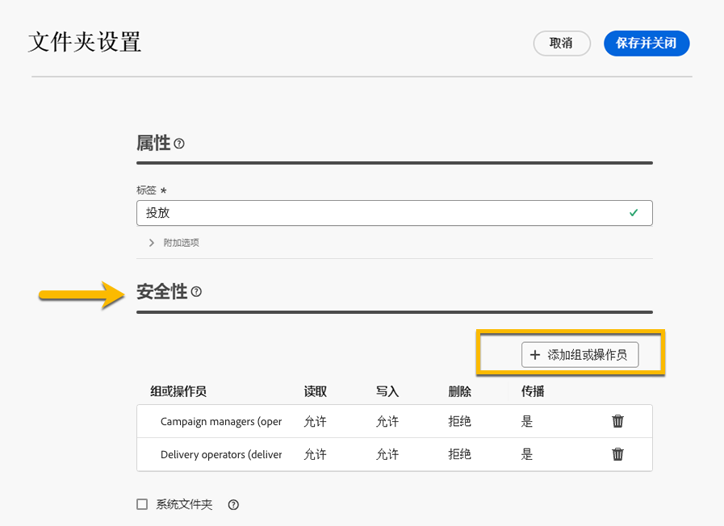

# 权限 {#permissions}

Adobe Campaign 中的每个用户在应用程序内都有自己的权限和限制。用户可以成为操作员组的一部分并继承该组的权限。

根据其权限，操作员可以：

* 访问特定功能
* 访问特定数据
* Access 对某些操作（创建、修改、删除）

有关在 Adobe Campaign 中设置权限的详细步骤，请参阅 [Adobe Campaign v8（控制台）文档](https://experienceleague.adobe.com/zh-hans/docs/campaign/campaign-v8/admin/permissions/gs-permissions){target="_blank"}。

## 文件夹权限 {#folder-permissions}

根据您的权限，您可以在 **[!UICONTROL 文件夹设置]**&#x200B;中查看和管理文件夹的权限。

以下是交付文件夹的一个示例：

{zoomable="yes"}

在 **[!UICONTROL 文件夹设置]** 的 **[!UICONTROL 安全]**&#x200B;部分中，您可以查看和管理（添加或删除）可以访问该文件夹的操作员或群组。

{zoomable="yes"}

您可以直接点击权限并将其更改为 **[!UICONTROL 允许]** 或 **[!UICONTROL 拒绝]**。

{zoomable="yes"}

如果启用了&#x200B;**[!UICONTROL 传播]**&#x200B;选项，则为某个文件夹定义的所有权限都将应用于该文件夹的所有子文件夹。可以为每个子文件夹重载这些权限。

如果选中&#x200B;**[!UICONTROL 系统文件夹]**&#x200B;选项，则允许所有操作员访问，无论其权限如何。

您还可以 [在 Adobe Campaign 控制台中管理文件夹的权限](https://experienceleague.adobe.com/zh-hans/docs/campaign/campaign-v8/admin/permissions/folder-permissions){target="_blank"}。

Campaign Web 用户界面中的所有权限都与 Campaign 客户端控制台权限同步。
