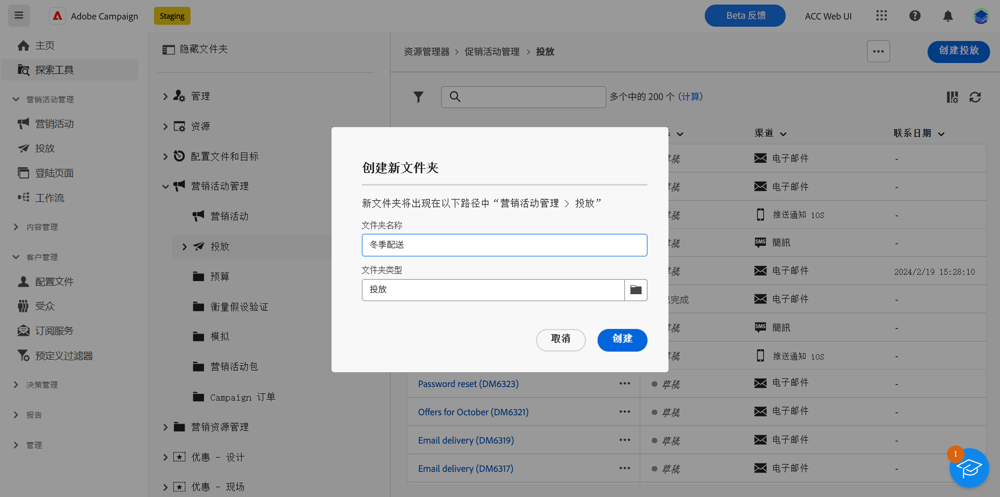

# 访问和权限 {#access-and-permissions}

>[!CONTEXTUALHELP]
>id="acw_explorer_permissions_create"
>title="需要权限"
>abstract="您的管理员必须先授予您权限，然后您才能创建此对象。"

>[!CONTEXTUALHELP]
>id="acw_audiences_read_only"
>title="此受众为只读"
>abstract="您无权编辑此受众。如果需要，请联系您的管理员以准许您访问。"

>[!CONTEXTUALHELP]
>id="acw_subscription_services_read_only"
>title="此服务为只读"
>abstract="您无权编辑此服务。如果需要，请联系您的管理员以向您授予访问权限。"

>[!CONTEXTUALHELP]
>id="acw_campaign_read_only"
>title="此活动为只读"
>abstract="您无权编辑此活动。如果需要，请联系您的管理员以向您授予访问权限。"

>[!CONTEXTUALHELP]
>id="acw_deliveries_read_only"
>title="此投放为只读"
>abstract="您无权编辑此投放。如果需要，请联系您的管理员以向您授予访问权限。"

>[!CONTEXTUALHELP]
>id="acw_wf_read_only"
>title="此工作流为只读"
>abstract="您无权编辑此工作流。如果需要，请联系您的管理员以向您授予访问权限。"

>[!CONTEXTUALHELP]
>id="acw_wf_read_only_canvas"
>title="此工作流为只读"
>abstract="由于画布不受支持或不兼容，您无法编辑此工作流程。"

访问控制可限制从主列表访问对象和数据（如投放、收件人或工作流）。这些限制在&#x200B;**资源管理器**&#x200B;导航树中也适用。此外，您需要权限才能从用户界面创建、删除、重复和编辑对象。

在 Campaign 客户端控制台中管理访问控制。Campaign Web 中的所有权限都与 Campaign 客户端控制台权限同步。仅 Campaign 管理员能够定义和修改用户权限。可在 [Campaign v8（客户端控制台）文档](https://experienceleague.adobe.com/docs/campaign/campaign-v8/admin/permissions/gs-permissions.html?lang=zh-Hans){target="_blank"}中详细了解用户权限。

在浏览 Campaign Web 用户界面时，可以根据您的权限访问数据、对象和功能。例如，如果您无权访问某个文件夹，则您看不到它。您的权限还影响对象和数据管理。没有特定文件夹的写入权限，即无法在该文件夹中创建某个投放，即使您可在用户界面中看到它也是如此。

## 查看权限 {#view-permissions}

可以从&#x200B;**资源管理器**&#x200B;中浏览每个文件夹的权限。在客户端控制台中设置这些权限，并使用这些权限整理和控制对 Campaign 数据的访问。

要查看文件夹的权限，请执行以下步骤：

1. 从&#x200B;**资源管理器**&#x200B;左侧导航菜单中，选择一个文件夹。
1. 单击右上角的三个点，然后选择&#x200B;**文件夹权限**。

   {zoomable=&quot;yes&quot;}{width="70%" align="left" zoomable="yes"}

1. 在屏幕中查看详细信息，如下所示：

   {zoomable=&quot;yes&quot;}{width="70%" align="left" zoomable="yes"}

   组或操作员可具有对存储在所选文件夹中的数据的读取、写入和/或删除权限。

   如果启用了&#x200B;**传播**&#x200B;选项，则为某个文件夹定义的所有权限都将应用于该文件夹的所有子文件夹。可以为每个子文件夹重载这些权限。

   如果启用了&#x200B;**系统文件夹**&#x200B;选项，则允许所有操作员访问，无论其权限如何。

可在 [Campaign v8（客户端控制台）文档](https://experienceleague.adobe.com/docs/campaign/campaign-v8/admin/permissions/folder-permissions.html?lang=zh-Hans){target="_blank"}中详细了解文件夹权限。

## 使用文件夹 {#folders}

可以创建、重命名、重新排序和移动文件夹以整理组件和数据。还可以从同一菜单中删除文件夹。

>[!CAUTION]
>
>在删除某个文件夹时，还将删除存储在该文件夹中的所有数据。

要创建文件夹，请执行以下步骤：

1. 从&#x200B;**资源管理器**&#x200B;左侧导航菜单中，选择一个文件夹。
1. 单击右上角的三个点，然后选择&#x200B;**新建子文件夹**。
1. 输入文件夹的名称并保存。

   {zoomable=&quot;yes&quot;}{width="70%" align="left" zoomable="yes"}

   该文件夹将添加为当前文件夹的子文件夹。浏览到该新文件夹以直接在其中创建组件。还可从任何文件夹创建组件，然后从属性的&#x200B;**其他选项**&#x200B;部分将该组件保存在该新文件夹中，如下为投放所示：

   {zoomable=&quot;yes&quot;}{width="70%" align="left" zoomable="yes"}
