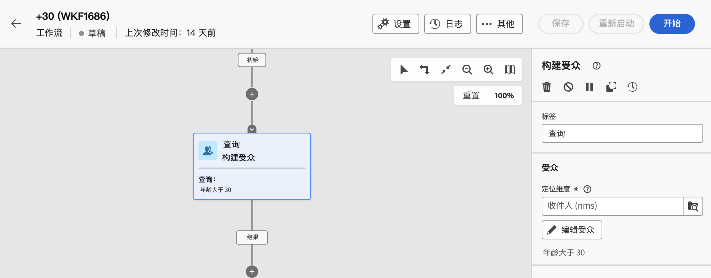

# 使用预定义过滤器 {#predefined-filters}

>[!CONTEXTUALHELP]
>id="acw_homepage_learning_card4"
>title="预定义过滤器管理"
>abstract="Campaign Web用户界面提供了用户友好的界面，可轻松管理和自定义预定义过滤器，以满足您的特定需求。 创建一次并保存以供将来使用。"

>[!CONTEXTUALHELP]
>id="acw_predefined-filters-dashboard"
>title="预定义过滤器"
>abstract="Campaign Web用户界面提供了用户友好的界面，可轻松管理和自定义预定义过滤器，以满足您的特定需求。 创建一次并保存以供将来使用。"

预定义过滤器是创建和保存以供将来使用的自定义过滤器。 在使用查询建模器进行筛选操作期间，它们用作快捷方式。 例如，在筛选数据列表或创建投放的受众时，可以使用它们。

您可以使用现有的内置过滤器访问数据的特定子集，或创建自己的预定义过滤器并保存它们。

{zoomable="yes"}

## 创建预定义过滤器 {#create-predefined-filter}

>[!CONTEXTUALHELP]
>id="acw_predefined-filters-creation"
>title="创建预定义过滤器"
>abstract="输入预定义过滤器的标签，然后选择它应用于的表。打开其他选项以添加描述，并将此过滤器设置为收藏。然后使用“创建规则”按钮来定义过滤条件。"

>[!CONTEXTUALHELP]
>id="acw_predefined-filters-rules"
>title="创建预定义的过滤规则"
>abstract="要定义您的自定义过滤器的过滤条件，请单击“创建规则”按钮。"

### 从查询建模器创建过滤器 {#create-from-rule-builder}

保存来自[查询建模器](../query/query-modeler-overview.md)的自定义筛选条件，以便将来使用。 执行以下步骤：

1. 打开查询建模器并定义您的过滤条件。在下面的示例中，对住在马德里并订阅了新闻通讯的收件人进行了过滤。
1. 单击&#x200B;**选择或保存过滤器**&#x200B;按钮，然后选择&#x200B;**另存为过滤器**。

   {zoomable="yes"}

1. 选择&#x200B;**创建新过滤器**，然后输入该过滤器的名称和说明。

   {zoomable="yes"}

   如果需要，可将过滤器保存为收藏项目。可在[此部分](#fav-filter)中了解详情。

1. 单击&#x200B;**确认**&#x200B;以保存您的更改。

现在可在&#x200B;**预定义过滤器**&#x200B;列表中找到您的自定义过滤器，并且所有 Campaign 用户均可访问您的自定义过滤器。

### 从过滤器列表创建过滤器 {#create-filter-from-list}

从左侧菜单中的&#x200B;**预定义过滤器**&#x200B;条目创建过滤器。 执行以下步骤：

1. 在左侧菜单中浏览到&#x200B;**预定义过滤器**&#x200B;条目。
1. 单击&#x200B;**创建过滤器**&#x200B;按钮。
1. 输入过滤器名称，然后从&#x200B;**文档类型**&#x200B;字段中选择它适用于的架构。默认架构为 `Recipients(nms)`。

1. 定义过滤器的规则。 例如，年龄超过 30 岁的轮廓。

   超过30](assets/filter-30+.png){zoomable="yes"}的用户档案的{zoomable="yes"}

该过滤器即被添加到预定义过滤器列表。如果需要，可将过滤器保存为收藏项目。可在[此部分](#fav-filter)中了解详情。

## 将过滤器保存为收藏项目 {#fav-filter}

创建预定义过滤器时，启用&#x200B;**另存为收藏夹**&#x200B;选项以在收藏夹中查看此预定义过滤器。

将过滤器保存为收藏项目后，所有用户均可在过滤器创建列表的&#x200B;**收藏过滤器**&#x200B;部分中找到该过滤器，如下所示：

{zoomable="yes"}{width="30%" align="left"}

## 使用预定义过滤器 {#use-predefined-filter}

在定义规则属性时有预定义过滤器可用。要访问预定义过滤器，请在查询建模器的下拉列表中选择&#x200B;**选择自定义过滤器**&#x200B;选项。

访问当前上下文可用的预定义过滤器的完整列表，并在下拉列表的&#x200B;**收藏过滤器**&#x200B;部分中使用快捷键。 可在[此部分](#fav-filter)中详细了解收藏。

例如，要从预定义过滤器生成受众，请执行以下这些步骤：

1. 浏览到左侧菜单中的&#x200B;**受众**&#x200B;条目，然后单击受众列表左上角的&#x200B;**创建受众**&#x200B;按钮。
1. 输入受众名称，然后单击&#x200B;**创建受众**&#x200B;按钮。
1. 选择&#x200B;**查询**&#x200B;活动，然后从右侧窗格中单击&#x200B;**创建受众**&#x200B;按钮。

   {zoomable="yes"}

1. 从&#x200B;**选择或保存过滤器**&#x200B;按钮中选择&#x200B;**选择自定义过滤器**&#x200B;选项。

   {zoomable="yes"}

1. 浏览到用于创建受众的预定义过滤器，选择它并确认。

   {zoomable="yes"}

1. 检查此过滤器的规则属性并确认。

   该过滤器现在用作&#x200B;**查询**&#x200B;活动中的查询。

   {zoomable="yes"}

1. 保存您的更改并单击&#x200B;**开始**&#x200B;按钮以生成受众并使其在受众列表中可用。

## 管理预定义过滤器 {#manage-predefined-filter}

所有预定义过滤器都集中在左侧导航菜单的专用条目中。

{zoomable="yes"}

从此列表中，您可以创建新过滤器（如上所述），并执行以下列出的操作：

* 编辑现有筛选器，并更改其规则和属性。
* 复制预定义过滤器。
* 删除预定义过滤器。

您还可以在构建受众时添加预定义过滤器作为收藏夹，以便快速访问。 可在[此部分](#fav-filter)中了解详情。

<!--
## Built-in predefined filters {#ootb-predefined-filter}

Campaign comes with a set of predefined filters, built from the client console. These filters can be used to define your audiences, and rules. They must not be modified.
-->