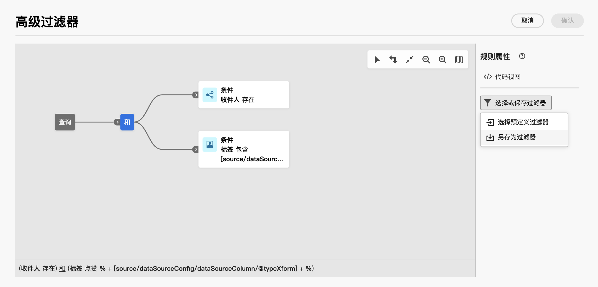

# 使用预定义过滤器 {#predefined-filters}

>[!CONTEXTUALHELP]
>id="acw_homepage_card4"
>title="预定义过滤器管理"
>abstract="Campaign Web 现在提供一个方便用户使用的界面，以供轻松地管理和自定义预定义过滤器以满足您的特定需求。创建一次并保存以供将来使用。"

>[!CONTEXTUALHELP]
>id="acw_predefined-filters-dashboard"
>title="预定义过滤器"
>abstract="Campaign Web 现在提供一个方便用户使用的界面，以供轻松地管理和自定义预定义过滤器以满足您的特定需求。创建一次并保存以供将来使用。"

预定义过滤器是创建并保存以供将来使用的自定义过滤器。在使用查询建模器进行任何过滤操作期间，例如，在过滤数据列表或创建投放的受众时，可以将此类变量用作快捷键。

可使用现有的内置过滤器访问数据的特定子集，也可创建自己的预定义过滤器并保存它们。

>[!IMPORTANT]
>
>在产品的该版本中，当生成规则、选择投放的受众或在工作流中生成受众时，在用户界面中找不到某些预定义过滤器。但仍可使用这些它们。[了解详情](guardrails.md#predefined-filters-filters-guardrails-limitations)

## 创建预定义过滤器 {#create-predefined-filter}

>[!CONTEXTUALHELP]
>id="acw_predefined-filters-creation"
>title="创建预定义过滤器"
>abstract="输入预定义过滤器的标签，然后选择它应用于的表。打开其他选项以添加描述，并将此过滤器设置为收藏。然后使用“创建规则”按钮来定义过滤条件。"

>[!CONTEXTUALHELP]
>id="acw_predefined-filters-rules"
>title="创建预定义的过滤规则"
>abstract="要定义您的自定义过滤器的过滤条件，请单击“创建规则”按钮。"

### 从查询建模器创建过滤器 {#create-from-rule-builder}

您可以从以下位置保存自定义筛选条件： [查询建模器](../query/query-modeler-overview.md) 以备将来使用。 执行以下步骤：

1. 打开查询建模器并定义筛选条件。 在下面的示例中，筛选生活在马德里并订阅了新闻通讯的收件人。
1. 单击&#x200B;**选择或保存过滤器**&#x200B;按钮，然后选择&#x200B;**另存为过滤器**。

   

1. 选择&#x200B;**创建新过滤器**，然后输入该过滤器的名称和说明。

   

   如果需要，可将过滤器保存为收藏项目。可在[此部分](#fav-filter)中了解详情。

1. 单击&#x200B;**确认**&#x200B;以保存您的更改。

现在可在&#x200B;**预定义过滤器**&#x200B;列表中找到您的自定义过滤器，并且所有 Campaign 用户均可访问您的自定义过滤器。

### 从过滤器列表创建过滤器 {#create-filter-from-list}

可从左侧菜单中的&#x200B;**预定义过滤器**&#x200B;条目创建过滤器。要执行此操作，请按照以下步骤进行：

1. 浏览左侧菜单中的&#x200B;**预定义过滤器**&#x200B;条目。
1. 单击&#x200B;**创建过滤器**&#x200B;按钮。
1. 输入过滤器名称，然后从&#x200B;**文档类型**&#x200B;字段中选择它适用于的架构。默认架构为 `Recipients(nms)`。

1. 定义过滤器的规则。 例如，年龄超过 30 岁的个人资料。

   

1. 保存您的更改。

   

该过滤器将添加到预定义过滤器列表。 如果需要，可将过滤器保存为收藏项目。可在[此部分](#fav-filter)中了解详情。

## 将过滤器保存为收藏项目 {#fav-filter}

创建预定义过滤器时，如果要在收藏夹中看到此预定义过滤器，可启用&#x200B;**保存为收藏项目**。

将过滤器保存为收藏项目后，所有用户均可在过滤器创建列表的&#x200B;**收藏过滤器**&#x200B;部分中找到该过滤器，如下所示：

{width="30%" align="left"}

## 使用预定义过滤器 {#use-predefined-filter}

在定义规则属性时有预定义过滤器可用。要访问预定义过滤器，请选择 **选择自定义筛选条件** 选项。

随后即可访问对当前上下文可用的预定义过滤器的完整列表。

还可使用可在下拉菜单的&#x200B;**收藏筛选器**&#x200B;部分中找到的过滤器快捷方式。可在[此部分](#fav-filter)中详细了解收藏。

例如，要从预定义过滤器生成受众，请执行以下这些步骤：

1. 浏览左侧菜单中的&#x200B;**受众**&#x200B;条目。
1. 单击&#x200B;**创建受众**&#x200B;按钮。
1. 输入受众名称，然后单击&#x200B;**创建受众**&#x200B;按钮。
1. 选择&#x200B;**查询**&#x200B;活动，然后从右侧窗格中单击&#x200B;**创建受众**&#x200B;按钮。

   

1. 从&#x200B;**选择或保存过滤器按钮**&#x200B;中选择&#x200B;**选择自定义过滤器**&#x200B;选项。

   

1. 浏览到用于创建受众的预定义过滤器，选择它并确认。

   

1. 检查此过滤器的规则属性并确认。

   该过滤器现在用作&#x200B;**查询**&#x200B;活动中的查询。

   

1. 保存您的更改并单击&#x200B;**开始**&#x200B;按钮以生成受众并使其在受众列表中可用。

## 管理预定义过滤器 {#manage-predefined-filter}

预定义过滤器全都集中在左侧导航菜单的专用条目中。

可从此列表创建新过滤器（如上所述）以及：

* 编辑现有过滤器以及更改其规则和属性
* 复制预定义过滤器
* 删除预定义过滤器

您可以添加预定义过滤器作为收藏，以便在构建受众时快速访问。 可在[此小节](#fav-filter)中了解详情。

<!--
## Built-in predefined filters {#ootb-predefined-filter}

Campaign comes with a set of predefined filters, built from the client console. These filters can be used to define your audiences, and rules. They must not be modified.
-->
