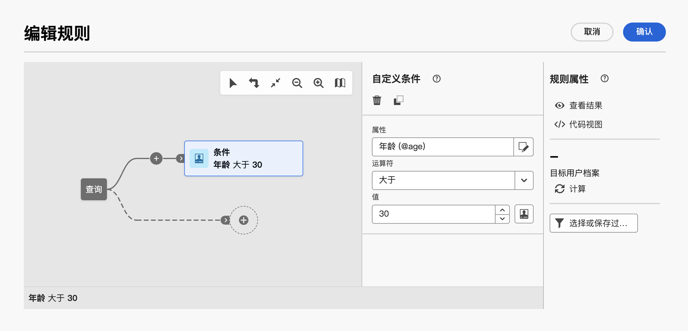

# 使用预定义过滤器 {#predefined-filters}

>[!CONTEXTUALHELP]
>id="acw_homepage_card3"
>title="预定义过滤器管理"
>abstract="Campaign Web 现已为您提供一个用户友好的界面，以便您轻松管理和自定义预定义过滤器，从而满足您的特定需求。创建一次并保存以供将来使用。"

>[!CONTEXTUALHELP]
>id="acw_predefined-filters-dashboard"
>title="预定义过滤器"
>abstract="Campaign Web 现已为您提供一个用户友好的界面，以便您轻松管理和自定义预定义过滤器，从而满足您的特定需求。创建一次并保存以供将来使用。"

预定义过滤器 是创建和保存以供将来使用的自定义过滤器。 在使用规则生成器的任何过滤操作期间，例如，在过滤数据列表或创建投放的受众时，可以将它们用作快捷键。

您可以使用现有的内置过滤器访问数据的特定子集，或创建自己的预定义过滤器并保存它们。

## 创建预定义过滤器 {#create-predefined-filter}

>[!CONTEXTUALHELP]
>id="acw_predefined-filters-creation"
>title="创建预定义过滤器"
>abstract="输入预定义过滤器的标签，然后选择它应用于的表。打开其他选项以添加描述，并将此过滤器设置为收藏。然后使用“创建规则”按钮来定义过滤条件。"

>[!CONTEXTUALHELP]
>id="acw_predefined-filters-rules"
>title="创建预定义过滤器规则"
>abstract="要定义自定义筛选器的筛选条件，请单击“创建规则”按钮。"

### 从规则生成器创建过滤器 {#create-from-rule-builder}

您可以从规则生成器中保存自定义筛选条件，以便将来使用。 执行以下步骤：

1. 打开规则生成器并定义筛选条件。 在下面的示例中，您将筛选住在马德里的收件人。
1. 单击 **选择或保存筛选器** 按钮，然后选择 **另存为筛选器**.

   

1. 选择 **创建新筛选器**，并输入该过滤器的名称和描述。

   

   如果需要，可将过滤器另存为收藏夹。 在[此章节](#fav-filter)中了解更多信息。

1. 单击 **确认** 以保存更改。

您的自定义筛选器现在在以下位置提供： **预定义过滤器** 列表并可由所有Campaign用户访问。

### 从过滤器列表创建过滤器 {#create-filter-from-list}

您可以从中创建过滤器 **预定义过滤器** 条目。 要执行此操作，请执行以下步骤：

1. 浏览 **预定义过滤器** 条目。
1. 单击 **创建过滤器** 按钮。
1. 输入过滤器名称，并从 **文档类型** 字段中，选择它应用于的架构。 默认架构为 `Recipients(nms)`.

   如果需要，可将过滤器另存为收藏夹。 在[此章节](#fav-filter)中了解更多信息。

1. 定义过滤器的规则。 例如，30岁以上的用户档案。

   

1. 保存您的更改。该过滤器将添加到预定义过滤器列表。

## 将筛选器另存为收藏 {#fav-filter}

创建预定义过滤器时，您可以启用 **另存为收藏** 选项。

将过滤器另存为收藏后，该过滤器将适用于 **收藏过滤器** 过滤器创建列表的部分，如下所示：

{width="70%" align="left"}

## 使用预定义过滤器 {#use-predefined-filter}

定义规则属性时，可以使用预定义过滤器。 要访问预定义过滤器，请选择 **选择自定义筛选条件** 选项。

然后，您可以访问当前上下文可用的预定义过滤器的完整列表。

您还可以使用中提供的筛选器快捷键 **收藏过滤器** 部分。 有关收藏夹的详细信息，请参阅 [本节](#fav-filter).

例如，要从预定义过滤器构建受众，请执行以下步骤：

1. 浏览 **受众** 条目。
1. 单击 **创建受众** 按钮。
1. 输入受众名称，然后单击 **创建受众** 按钮。
1. 选择 **查询** 活动，然后从右侧窗格中，单击 **创建受众** 按钮。

   

1. 从 **选择或保存筛选器按钮**，选择 **选择自定义筛选条件** 选项。

   

1. 浏览到用于创建受众的预定义过滤器，选择该过滤器，然后进行确认。

   

1. 检查此筛选器的规则属性并确认。

   

   该过滤器现在用作中的查询 **查询** 活动。

   

1. 保存更改并单击 **开始** 按钮来构建受众并使其在受众列表中可用。

## 管理预定义过滤器 {#manage-predefined-filter}

预定义过滤器都分组在左侧导航菜单的专用条目中。

从该列表中，您可以创建新过滤器（如上所述），并且：

* 编辑现有筛选器，并更改其规则和属性
* 复制预定义过滤器
* 删除预定义过滤器

您可以在构建规则时将预定义过滤器添加为收藏，以便快速访问。 在[此章节](#fav-filter)中了解更多信息。

## 内置预定义过滤器 {#ootb-predefined-filter}

Campaign附带一组预定义过滤器，这些过滤器从客户端控制台构建。 这些过滤器可用于定义受众和规则。 不得更改它们。
