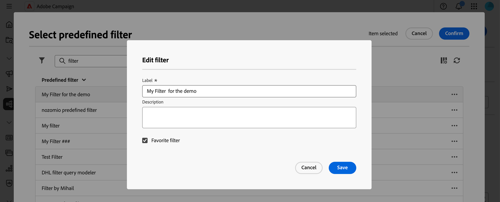

# 使用预定义过滤器 {#predefined-filters}

>[!CONTEXTUALHELP]
>id="acw_homepage_learning_card4"
>title="预定义过滤器管理"
>abstract="Campaign Web 用户界面提供了一个用户友好的界面，使您能够轻松管理和定制预定义的过滤器，以满足您的特定需求。创建一次并保存，以供将来使用。"

>[!CONTEXTUALHELP]
>id="acw_predefined-filters-dashboard"
>title="预定义过滤器"
>abstract="Campaign Web 用户界面提供了一个用户友好的界面，使您能够轻松管理和定制预定义的过滤器，以满足您的特定需求。创建一次并保存，以供将来使用。"

>[!CONTEXTUALHELP]
>id="acw_delivery_alerting_filter"
>title="创建提醒条件"
>abstract="您可以从客户管理 > 预定义过滤器菜单创建自己的投放过滤器。"

>[!CONTEXTUALHELP]
>id="acw_predefined-filters-select"
>title="保存筛选条件"
>abstract="选择现有的预定义过滤器。 预定义过滤器是用户创建并保存的自定义过滤器，以供将来使用。它们可在使用查询建模器进行过滤操作时充当快捷方式。例如，它们可以在过滤数据列表或创建投放的受众时使用。"

预定义过滤器是用户创建并保存的自定义过滤器，以供将来使用。它们可在使用查询建模器进行过滤操作时充当快捷方式。例如，它们可以在过滤数据列表或创建投放的受众时使用。

可使用现有的内置过滤器访问数据的特定子集，也可创建自己的预定义过滤器并保存它们。

{zoomable="yes"}

## 创建预定义过滤器 {#create-predefined-filter}

>[!CONTEXTUALHELP]
>id="acw_predefined-filters-creation"
>title="创建预定义过滤器"
>abstract="输入预定义过滤器的标签，然后选择它应用于的表。打开其他选项以添加描述，并将此过滤器设置为收藏。然后使用“创建规则”按钮来定义筛选条件。"

>[!CONTEXTUALHELP]
>id="acw_predefined-filters-rules"
>title="创建预定义的过滤规则"
>abstract="要定义您的自定义过滤器的筛选条件，请单击“创建规则”按钮。"

>[!CONTEXTUALHELP]
>id="acw_predefined-filters-save"
>title="保存筛选条件"
>abstract="利用此屏幕，可将规则另存为预定义过滤器。 您可以创建新的预定义过滤器，也可以覆盖现有过滤器。 要将筛选器另存为收藏，请打开&#x200B;**[!UICONTROL 收藏的筛选器]**&#x200B;选项。 您还可以启用&#x200B;**[!UICONTROL 共享筛选器]**&#x200B;选项以使其他用户可访问该筛选器。"

### 从查询建模器创建过滤器 {#create-from-rule-builder}

从[查询建模器](../query/query-modeler-overview.md)保存自定义过滤器，以供将来使用。执行以下步骤：

1. 打开查询建模器并定义您的过滤条件。在下面的示例中，过滤出了居住在马德里并订阅了新闻稿的收件人。
1. 单击&#x200B;**选择或保存过滤器**&#x200B;按钮，然后选择&#x200B;**另存为过滤器**。

   {zoomable="yes"}

1. 选择&#x200B;**创建新过滤器**，然后输入该过滤器的名称和说明。

   {zoomable="yes"}

   如果需要，可将过滤器保存为收藏项目。可在[此部分](#fav-filter)中了解详情。

1. 单击&#x200B;**确认**&#x200B;以保存您的更改。

现在可在&#x200B;**预定义过滤器**&#x200B;列表中找到您的自定义过滤器，并且所有 Campaign 用户均可访问您的自定义过滤器。

### 从过滤器列表创建过滤器 {#create-filter-from-list}

从左侧菜单的&#x200B;**预定义过滤器**&#x200B;条目中创建一个过滤器。执行以下步骤：

1. 浏览至左侧菜单中的&#x200B;**预定义过滤器**&#x200B;条目。
1. 单击&#x200B;**创建过滤器**&#x200B;按钮。
1. 输入过滤器名称，然后从&#x200B;**文档类型**&#x200B;字段中选择它适用于的架构。默认架构为 `Recipients(nms)`。

1. 定义过滤器的规则。例如，年龄超过 30 岁的轮廓。

   {zoomable="yes"}

1. 保存您的更改。

   {zoomable="yes"}

该过滤器即被添加到预定义过滤器列表。如果需要，可将过滤器保存为收藏项目。可在[此部分](#fav-filter)中了解详情。

## 将过滤器保存为收藏项目 {#fav-filter}

创建预定义过滤器时，启用&#x200B;**保存为收藏项目**&#x200B;选项，以在收藏夹中查看此预定义过滤器。

将过滤器保存为收藏项目后，所有用户均可在过滤器创建列表的&#x200B;**收藏过滤器**&#x200B;部分中找到该过滤器，如下所示：

{zoomable="yes"}

## 使用预定义过滤器 {#use-predefined-filter}

在定义规则属性时有预定义过滤器可用。要访问预定义过滤器，请选择查询建模器下拉列表中的&#x200B;**选择自定义过滤器**&#x200B;选项。

访问适用于当前上下文的预定义过滤器的完整列表，并使用下拉列表的&#x200B;**收藏过滤器**&#x200B;部分中提供的快捷方式。可在[此部分](#fav-filter)中详细了解收藏。

例如，要从预定义过滤器生成受众，请执行以下这些步骤：

1. 浏览到左侧菜单中的&#x200B;**受众**&#x200B;条目，然后单击受众列表左上角的&#x200B;**创建受众**&#x200B;按钮。
1. 输入受众名称，然后单击&#x200B;**创建受众**&#x200B;按钮。
1. 选择&#x200B;**查询**&#x200B;活动，然后从右侧窗格中单击&#x200B;**创建受众**&#x200B;按钮。

   {zoomable="yes"}

1. 从&#x200B;**选择或保存过滤器**&#x200B;按钮中选择&#x200B;**选择自定义过滤器**&#x200B;选项。

   {zoomable="yes"}

1. 浏览到用于创建受众的预定义过滤器，选择它并确认。

   {zoomable="yes"}

1. 检查此过滤器的规则属性并确认。

   该过滤器现在用作&#x200B;**查询**&#x200B;活动中的查询。

   {zoomable="yes"}

1. 保存您的更改并单击&#x200B;**开始**&#x200B;按钮以生成受众并使其在受众列表中可用。

## 管理预定义过滤器 {#manage-predefined-filter}

所有预定义过滤器都集中在左侧导航菜单的专用条目中。

{zoomable="yes"}

可从此列表创建新过滤器（如上所述），并执行以下列出的操作：

* 编辑现有过滤器，并更改其规则和属性。
* 复制预定义过滤器。
* 删除预定义过滤器。

您还可以直接从规则生成器编辑或删除预定义过滤器。在预定义过滤器选择窗口中，使用&#x200B;**更多操作**&#x200B;按钮。您可以删除或编辑过滤器。您可以更改标签、添加描述并将其添加到收藏夹。

{zoomable="yes"}

<!--
## Built-in predefined filters {#ootb-predefined-filter}

Campaign comes with a set of predefined filters, built from the client console. These filters can be used to define your audiences, and rules. They must not be modified.
-->