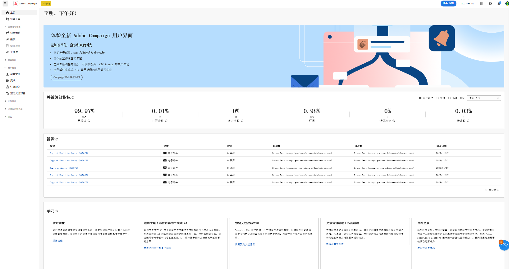
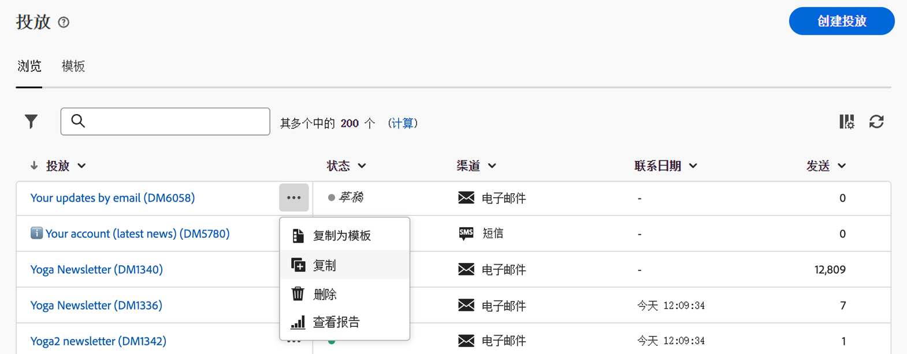
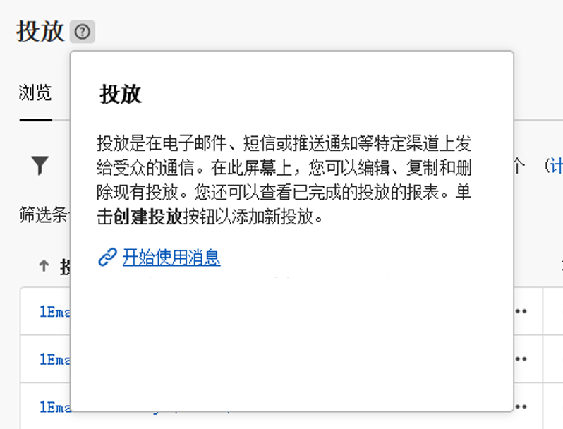

# 探索界面 {#user-interface}

>[!CONTEXTUALHELP]
>id="acw_homepage_learnmore"
>title="探索界面"
>abstract="新的 Campaign v8 Web 界面提供了集成、直观和一致的用户体验。"

新的 Campaign v8 Web 界面提供了直观的现代用户体验，可简化营销活动的设计和投放。此新界面与 Adobe Experience Platform 集成。

>[!NOTE]
>
>此文档经常更新以反映产品用户界面中的最新更改。但是，某些屏幕快照可能与用户界面略有不同。

## 左侧导航菜单 {#user-interface-left-nav}

浏览左侧链接以访问 Campaign v8 Web 功能。多个链接显示了可排序和筛选的对象的列表。您还可以配置列以显示所需的所有信息。请参阅此[章节](#list-screens)。除了电子邮件投放列表之外的所有列表屏幕均为只读。单击任意列表项以进行编辑/无法在 Alpha 中进行查看。在将来版本中，所有列表都是可编辑的。左侧导航菜单中显示的项目取决于您的用户权限。

### 主页 {#user-interface-home}

此屏幕包含用于快速访问主要 Campaign v8 Web 功能的关键链接和资源。

**最近项目**&#x200B;列表提供了最近创建和修改的投放的快捷方式。此列表显示了它们的渠道、状态、所有者、创建日期和修改日期。

从主页的&#x200B;**学习**&#x200B;部分访问 Campaign v8 Web 关键帮助页面。

### 资源管理器 {#user-interface-explorer}

>[!CONTEXTUALHELP]
>id="acw_explorer"
>title="资源管理器"
>abstract="**资源管理器**&#x200B;菜单使用与客户端控制台中的文件夹层次结构相同的文件夹层次结构显示所有 Campaign 组件和对象。浏览所有 Campaign v8 组件、文件夹和模式，并创建投放、工作流和营销活动。所有其他列表为只读状态。"

**资源管理器**&#x200B;菜单使用与客户端控制台中的文件夹层次结构相同的文件夹层次结构显示所有 Campaign 资源和对象。浏览所有 Campaign v8 组件、文件夹和模式，并创建投放、工作流和营销活动。所有其他列表为只读状态。

资源管理器中显示的项目取决于您的用户权限。

与任何列表屏幕中一样，您可以配置列来个性化显示以查看所需的所有信息。请参阅此[章节](#list-screens)。

有关 Campaign 资源管理器、文件夹层次结构和资源的更多信息，请参阅此 [Campaign v8（控制台）文档 ](https://experienceleague.adobe.com/docs/campaign/campaign-v8/new/campaign-ui.html#ac-explorer-ui){target="_blank"}。

### Campaign 管理 {#user-interface-campaign-management}

>[!CONTEXTUALHELP]
>id="acw_campaigns_list"
>title="营销活动"
>abstract="这是您的营销活动列表。其中可显示有用的信息，例如它们的开始/结束/最后修改日期，以及它们的状态。您可以按状态或开始/结束日期筛选列表。单击“创建营销活动”按钮以添加新的营销活动。选择营销活动以查看其内容、投放情况和详细信息。浏览到“模板”选项卡以查看和创建模板。"

在“营销活动管理”部分中，可访问市场营销活动、投放情况和工作流。

* **营销活动** - 这是您的营销活动和营销活动模板的列表。默认情况下，可查看每个营销活动的开始/结束/创建/上次修改日期、当前状态以及创建它的 Campaign 操作员的姓名。可按状态、开始/结束日期和文件夹筛选该列表，也可创建高级筛选器以定义您自己的筛选条件。可[在此部分中](../campaigns/gs-campaigns.md)详细了解营销活动。

* **投放** - 浏览您的投放列表。默认情况下，您可以查看它们的状态、最后修改日期以及关键 KPI。您可以按状态、联系日期或渠道筛选列表。单击电子邮件投放以打开其仪表板来获取投放详细信息的概述。其他渠道上的投放是只读的。可[在此部分中](../msg/gs-messages.md)详细了解投放。

  使用&#x200B;**更多操作**&#x200B;按钮删除或重复投放。

  {width="70%" align="left"}

* **工作流** - 可在此屏幕中访问工作流和工作流模板的完整列表。可检查其状态、上次/下次执行日期，并可创建新的工作流或新的工作流模板。可用与筛选其他对象相同的条件筛选该列表。此外，还可筛选属于或不属于营销活动的工作流。可[在此部分中](../workflows/gs-workflows.md)详细了解工作流。

### 客户管理 {#user-interface-customer-management}

>[!CONTEXTUALHELP]
>id="acw_recipients_list"
>title="收件人"
>abstract="访问您的收件人数据库。您可以查看有用的信息，例如他们的电子邮件地址、名字和姓氏。此列表为只读。"

>[!CONTEXTUALHELP]
>id="acw_audiences_list"
>title="受众"
>abstract="这是您的受众列表。您可以查看它们的类型、来源、创建/最后修改日期和标签。您可以按来源筛选列表。此列表为只读。"

>[!CONTEXTUALHELP]
>id="acw_subscriptions_list"
>title="订阅列表"
>abstract="浏览您的订阅列表。您可以查看它们的类型、模式和标签。此列表为只读。"

在“客户管理”部分中，您可以查看收件人、受众和订阅。这些列表为只读状态。

* **收件人** - 访问您的收件人数据库。默认情况下，您可以查看他们的电子邮件地址、名字和姓氏。请参阅 [Adobe Campaign v8（控制台）文档](https://experienceleague.adobe.com/docs/campaign/campaign-v8/audience/gs-audiences.html){target="_blank"}以详细了解收件人。
* **受众** - 这是您的受众列表。默认情况下，您可以查看它们的类型、来源、创建/最后修改日期和标签。您可以按来源筛选列表。请参阅 [Adobe Campaign v8（控制台）文档](https://experienceleague.adobe.com/docs/campaign/campaign-v8/audience/create-audiences/create-audiences.html){target="_blank"}以详细了解受众和列表。
* **订阅** - 浏览您的订阅列表。默认情况下，您可以查看它们的类型、模式和标签。请参阅 [Adobe Campaign v8（控制台）文档](https://experienceleague.adobe.com/docs/campaign/campaign-v8/campaigns/send/subscriptions.html){target="_blank"}，了解如何管理订阅和退订。

### 决策管理

>[!CONTEXTUALHELP]
>id="acw_offers_list"
>title="选件"
>abstract="浏览您的交互优惠列表。默认情况下，您可以查看它们的状态、开始/结束日期和环境。您可以按状态和开始/结束日期筛选列表。也会提供优惠模板。这些列表为只读状态。"

* **优惠** - 浏览您的交互优惠列表。默认情况下，您可以查看它们的状态、开始/结束日期和环境。您可以按状态和开始/结束日期筛选列表。也会提供优惠模板。这些列表为只读状态。

请参阅 [Adobe Campaign v8（控制台）文档](https://experienceleague.adobe.com/docs/campaign/campaign-v8/offers/interaction.html){target="_blank"}，了解如何创建管理选件。

## 顶部栏

利用界面的顶部栏，可以：

* 作为 Alpha 测试人员共享您的反馈
* 在组织和实例之间切换
* 在 Adobe Experience Cloud 应用程序之间切换
* 访问帮助页面、联系支持人员和共享反馈。您可以从搜索字段中搜索帮助文章和视频。

{width="50%" align="left"}
<!--
Org / Sub-org switcher to switch between instances. Only one for Alpha. Later: intermerdiate screen with Control Panel (beta). if v8 + ACS with one card per ACS instance. Maybe quickly explain the menu for Alpha?
-->

## 上下文帮助 {#contextual-help}

界面中提供了上下文帮助。当 `?` 图标可用时，单击该图标可显示帮助信息和相关文档链接。

{width="40%" align="left"}

<!--An on-boarding guide is also available to help you get started with Campaign v8 Web. Click the icon in the bottom right corner, choose one of the available step-by-step scenarios, and simply follow the instructions.

{width="70%" align="left"}-->

## 支持的浏览器 {#browsers}

Campaign v8 Web 旨在以最佳状态在最新版本的 Google Chrome、Safari 和 Microsoft Edge 中运行。您可能无法在较旧版本或其他浏览器上使用某些功能。

## 语言偏好设置 {#language-pref}

Campaign v8 Web 目前提供以下语言版本：

<table>
<tr>
<td>

英语（美国）- EN-US

法语 - FR

德语 - DE

意大利语 - IT

</td>
<td>

西班牙语 - ES

葡萄牙语（巴西）- PTBR

日语 - JP

</td>
<td>

朝鲜语 - KR

简体中文 - CHS

繁体中文 - CHT

</td>
</tr>
</table>

默认界面语言由您在用户配置文件中指定的首选语言决定。

要更改您的语言，请执行以下操作：

1. 单击右上角的配置文件图标，然后选择&#x200B;**偏好设置**。
1. 然后单击电子邮件地址下方显示的语言链接。
1. 选择您的首选语言并单击&#x200B;**保存**。如果您使用的组件未本地化为您的首选语言，可以选择第二语言。

## 了解详情 {#learn-more}

了解如何浏览、搜索和筛选您的Campaign环境中可用的列表 [本页内容](list-filters.md).

<!--
######## This part stores the contextualHelp definition for WebUI BETA ###########
######## These blocks should be dispatched in the appropriate pages when available ###########
######## PLEASE DO NOT DELETE ###########
REFER TO 
https://wiki.corp.adobe.com/pages/viewpage.action?spaceKey=neolane&title=v8+WebUI+Contextual+Help+%3CALPHA%3E-+Official+list
-->

>[!CONTEXTUALHELP]
>id="acw_targetdata_personalization_enrichmentdata"
>title="扩充数据"
>abstract="待定"

>[!CONTEXTUALHELP]
>id="acw_campaign_reporting_sending"
>title="报告发送"
>abstract="请查阅营销活动报告的发送标志。"

>[!CONTEXTUALHELP]
>id="acw_campaign_reporting_tracking"
>title="报告跟踪"
>abstract="请查阅营销活动报告的跟踪标志。"

>[!CONTEXTUALHELP]
>id="acw_campaign_reporting_deliveries_overview"
>title="报告概述"
>abstract="您的投放的关键指标。"

>[!CONTEXTUALHELP]
>id="acw_campaign_reporting_deliveries_target"
>title="报告目标统计数据"
>abstract="此部分根据受众显示特定指标。"

>[!CONTEXTUALHELP]
>id="acw_campaign_reporting_deliveries_selection"
>title="投放的汇总报告"
>abstract="选择至少两个投放以供显示汇总数据报告。"

>[!CONTEXTUALHELP]
>id="acw_orchestration_deduplication_fields"
>title="删除重复项字段"
>abstract="待定"

>[!CONTEXTUALHELP]
>id="acw_orchestration_deduplication_settings"
>title="删除重复项设置"
>abstract="待定"

>[!CONTEXTUALHELP]
>id="acw_orchestration_deduplication_complement"
>title="删除重复项补充"
>abstract="待定"

>[!CONTEXTUALHELP]
>id="acw_orchestration_dimension_complement"
>title="维度补充"
>abstract="待定"

>[!CONTEXTUALHELP]
>id="acw_push_permission_for_segment"
>title="需要权限"
>abstract="您的管理员必须先授予您权限，然后您才能创建区段。"

>[!CONTEXTUALHELP]
>id="acw_push_overview_edit"
>title="需要权限"
>abstract="您的管理员必须先授予您权限，然后您才能创建区段。"

>[!CONTEXTUALHELP]
>id="acw_keyindicators_delivered"
>title="已送达"
>abstract="已投放 KPI"

>[!CONTEXTUALHELP]
>id="acw_keyindicators_opens"
>title="打开次数"
>abstract="打开次数 KPI"

>[!CONTEXTUALHELP]
>id="acw_keyindicators_clicks"
>title="单击次数"
>abstract="点击次数 KPI"

>[!CONTEXTUALHELP]
>id="acw_keyindicators_unsubscriptions"
>title="退订次数"
>abstract="退订次数 KPI"

>[!CONTEXTUALHELP]
>id="acw_keyindicators_spam"
>title="垃圾邮件"
>abstract="垃圾邮件 KPI"

>[!CONTEXTUALHELP]
>id="acw_keyindicators_errors"
>title="错误数"
>abstract="错误数 KPI"

>[!CONTEXTUALHELP]
>id="acw_campaign_read_only"
>title="此活动为只读"
>abstract="您无权编辑此活动。如果需要，请联系您的管理员以向您授予访问权限。"

>[!CONTEXTUALHELP]
>id="acw_deliveries_read_only"
>title="此交付为只读"
>abstract="您无权编辑此交付。如果需要，请联系您的管理员以向您授予访问权限。"

>[!CONTEXTUALHELP]
>id="acw_subscription_services_read_only"
>title="此服务为只读"
>abstract="您无权编辑此服务。如果需要，请联系您的管理员以向您授予访问权限。"

<!-- Workflows-->

>[!CONTEXTUALHELP]
>id="acw_campaign_creation_workflow"
>title="工作流列表"
>abstract="对于您的营销活动可用的工作流的列表。使用“创建工作流”按钮在您的营销活动中添加工作流。"

>[!CONTEXTUALHELP]
>id="acw_orchestration_saveaudience_outbound"
>title="出站过渡以保存受众"
>abstract="待确认"

>[!CONTEXTUALHELP]
>id="acw_orchestration_saveaudience_activity"
>title="保存受众"
>abstract="使用此活动可保存工作流受众。"

>[!CONTEXTUALHELP]
>id="acw_wf_read_only"
>title="此工作流为只读"
>abstract="您无权编辑此工作流。如果需要，请联系您的管理员以向您授予访问权限。"

>[!CONTEXTUALHELP]
>id="acw_wf_read_only_canvas"
>title="此工作流为只读"
>abstract="由于画布不受支持或不兼容，您无法编辑此工作流程。"

<!-- delivery template settings-->

>[!CONTEXTUALHELP]
>id="acw_delivery_template_settings_tracking_validity"
>title="有效期"
>abstract="此选项定义在 URL 上激活跟踪的持续时间。"

>[!CONTEXTUALHELP]
>id="acw_delivery_template_settings_delivery_duration"
>title="投放持续时间"
>abstract="“投放持续时间”字段可让您输入全球投放重试次数的限制。这意味着，Adobe Campaign 从开始日期开始发送消息，然后对于仅返回错误的消息，将执行定期、可配置的重试，直至达到有效期限。"

>[!CONTEXTUALHELP]
>id="acw_delivery_template_settings_resources_validity"
>title="资源有效期限"
>abstract="“有效期限”字段用于已上传的资源，例如镜像页面或图像。这些资源在有限的时间内有效：一旦达到限制，资源将不再可用。"

>[!CONTEXTUALHELP]
>id="acw_delivery_template_settings_approval"
>title="审批方式"
>abstract="投放的每个步骤都需经过审批，以确保对各个流程进行全面的监测和控制。"

>[!CONTEXTUALHELP]
>id="acw_delivery_template_settings_retries"
>title="最大重试次数"
>abstract="如果消息因临时错误而失败，则会执行重试，直到投放持续时间结束。"

>[!CONTEXTUALHELP]
>id="acw_delivery_template_settings_recipient_importance"
>title="收件人的重要性"
>abstract="收件人的重要性是一个公式，用于确定在超出容量类型规则时保留的收件人。"

>[!CONTEXTUALHELP]
>id="acw_delivery_template_settings_delivery_weight"
>title="投放权重"
>abstract="利用投放权重，您可以确定压力管理框架内的优先级最高的投放。具有最高权重的消息优先。"

>[!CONTEXTUALHELP]
>id="acw_delivery_template_settings_typology"
>title="类型"
>abstract="使用类型，您可以控制、筛选和监测投放发送情况。"
