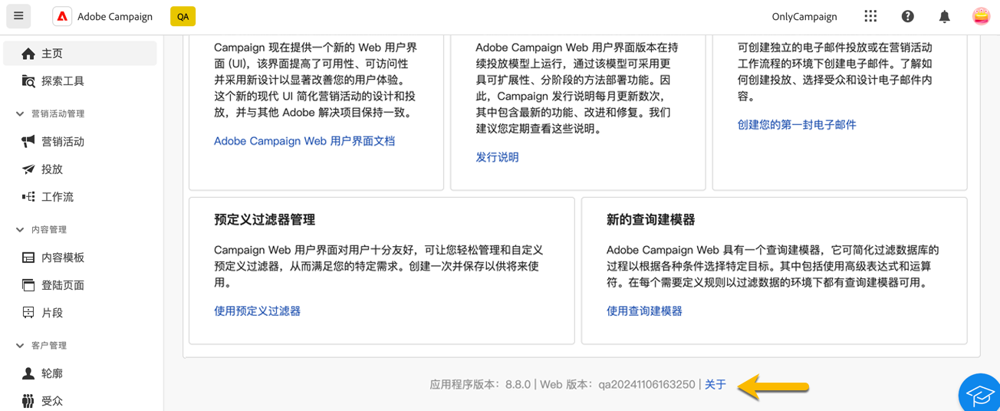
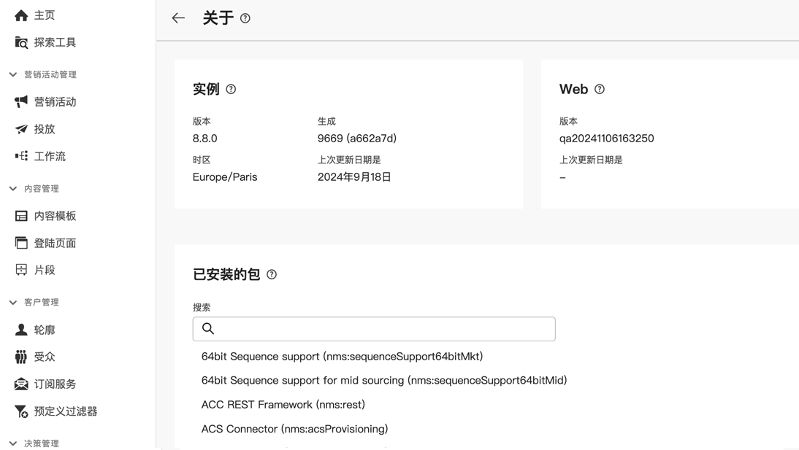

# 探索界面 {#user-interface}

新的Adobe Campaign Web界面提供了新颖、直观的用户体验，可简化营销活动的设计和交付。 此界面可与Adobe Experience Cloud应用程序和解决方案集成。

请参阅本文](connect-to-campaign.md)以了解如何连接到Adobe Campaign并探索Experience Cloud导航基础知识[。

>[!NOTE]
>
>本文档经常更新，以反映产品用户界面的最新更改。 但是，某些屏幕截图可能与用户界面略有不同。

## Campaign 主页 {#user-interface-home}

>[!CONTEXTUALHELP]
>id="acw_homepage_recent"
>title="最近项目"
>abstract="**最近项目**&#x200B;列表提供了最近创建和修改的投放的快捷方式。此列表显示了它们的渠道、状态、所有者、创建日期和修改日期。"

Campaign主页允许您快速轻松地浏览关键资源、指标和组件。

主页的上半部分显示有关产品中提供的最新更新和新功能的详细信息，以及指向发行说明和详细文档的链接。 使用向左箭头滚动功能卡。

{zoomable="yes"}

**关键绩效指标**&#x200B;部分允许您通过常用KPI检查平台的有效性。 可在[此页面](../reporting/kpis.md)中详细了解这些 KPI。

**最近**&#x200B;列表提供了最近创建和修改的投放的快捷方式。此列表显示其渠道、状态、所有者、创建和修改日期。 单击&#x200B;**显示更多**&#x200B;链接以加载其他投放。

此外，您可以从页面的&#x200B;**学习**&#x200B;部分访问Adobe Campaign Web密钥帮助页面。

### 关于链接 {#user-interface-about}

>[!CONTEXTUALHELP]
>id="acw_about"
>title="关于页面"
>abstract="“关于”页面提供有关您的Adobe Campaign实例的详细信息。"

>[!CONTEXTUALHELP]
>id="acw_about_instance"
>title="关于实例"
>abstract="“实例”部分提供有关控制台客户端的关键信息，包括版本和关联的内部版本号。"

>[!CONTEXTUALHELP]
>id="acw_about_web"
>title="关于 Web"
>abstract="Web 部分显示您的 Campaign Web 用户界面的版本，以及其最新更新日期（如果有）。"

>[!CONTEXTUALHELP]
>id="acw_about_packages"
>title="关于已安装的包"
>abstract="已安装的软件包部分列出了实例中存在的所有模块、功能和集成。"

在页面底部，**[!UICONTROL 关于]** 链接提供了有关 Adobe Campaign 实例的详细信息。这些详细信息处于只读模式。

{zoomable="yes"}

**实例**&#x200B;部分提供了有关控制台客户端的关键信息，包括&#x200B;**版本**&#x200B;和相关的&#x200B;**内部版本**&#x200B;号

* **版本**&#x200B;是指您所使用的正式发行版本。
*  **内部版本** 指的是该版本的特定开发周期。

版本号和内部版本号对于故障排除都至关重要，因为它们有助于确定环境中存在的功能和修复。

**Web**&#x200B;部分显示Campaign Web用户界面的版本以及上次更新日期（如果可用）。 这有助于跟踪对 Campaign Web 用户界面所做的更改或改进。

**已安装的包**&#x200B;部分列出了实例中存在的所有模块、功能和集成。 这些软件包扩展了Adobe Campaign的功能，支持专业任务，例如与其他Adobe解决方案集成或支持特定工作流。 鉴于程序包的数量很大，您可以在此部分中搜索以快速检查实例上是否安装了特定模块。

{zoomable="yes"}

## 左侧导航菜单 {#user-interface-left-nav}

浏览左侧链接以访问 Adobe Campaign Web 功能。多个链接显示可排序和过滤的对象列表。 您还可以配置列以显示所需的所有信息。请参阅此[部分](#list-screens)。某些列表屏幕为只读。左侧导航菜单和列表中显示的项目取决于您的用户权限。可在[此部分](permissions.md)中详细了解权限。

### 探索工具 {#user-interface-explorer}

>[!CONTEXTUALHELP]
>id="acw_explorer"
>title="探索工具"
>abstract="**探索工具**&#x200B;菜单使用与客户端控制台中的文件夹层次结构相同的文件夹层次结构显示所有 Campaign 组件和对象。浏览所有Campaign v8组件、文件夹和架构，检查相关权限，并从此菜单创建文件夹和子文件夹。"

**资源管理器**&#x200B;菜单按照与客户端控制台中相同的文件夹层次结构显示所有 Campaign 资源和对象。浏览所有Campaign v8组件、文件夹和架构，并创建投放、工作流和活动。

**资源管理器**&#x200B;中显示的项目取决于您的用户权限。如果您拥有适当的权限，您还可以添加文件夹和子文件夹。 可在[此部分](permissions.md)中详细了解权限。

可配置列以自定义显示，以便查看所需的所有信息。请参阅此[部分](#list-screens)。还可添加文件夹和子文件夹，如[此部分](permissions.md#folders)中所详述。

有关Campaign资源管理器、文件夹层次结构和资源的详细信息，请参阅此[Campaign v8 （控制台）文档](https://experienceleague.adobe.com/docs/campaign/campaign-v8/new/campaign-ui.html?lang=zh-hans#ac-explorer-ui){target="_blank"}。

### 营销活动管理 {#user-interface-campaign-management}

在&#x200B;**营销活动管理**&#x200B;部分中，您可以访问营销活动、投放和工作流。

* **营销活动** — 这是营销活动和营销活动模板的列表。 默认情况下，您可以查看每个营销活动的开始、结束、创建和上次修改日期、当前状态以及创建它的营销活动操作员的姓名。 可按状态、开始/结束日期和文件夹筛选该列表，也可创建高级筛选器以定义您自己的筛选条件。可[在此部分中](../campaigns/gs-campaigns.md)详细了解营销活动。

* **投放** - 浏览您的投放列表。默认情况下，您可以查看其状态、上次修改日期和关键KPI。 您可以按状态、联系日期或渠道筛选列表。单击电子邮件投放以打开其仪表板来获取投放详细信息的概述。其他渠道上的投放是只读的。可[在此部分中](../msg/gs-messages.md)详细了解投放。

  使用&#x200B;**更多操作**&#x200B;按钮删除或重复投放。

  {zoomable="yes"}{width="70%" align="left"} [屏幕快照显示“更多操作”按钮，其中包含删除或复制投放的选项。]

* **工作流** - 可在此屏幕中访问工作流和工作流模板的完整列表。可检查其状态、上次/下次执行日期，并可创建新的工作流或新的工作流模板。可用与筛选其他对象相同的条件筛选该列表。此外，您还可以筛选是否属于某个营销策划的工作流。 可[在此部分中](../workflows/gs-workflows.md)详细了解工作流。

### 内容管理 {#user-interface-content-management}

在&#x200B;**内容管理**&#x200B;部分中，您可以查看内容模板和片段。

* **内容模板** - 为了加快并改进设计流程，您可以创建独立的模板，从而轻松地在 [!DNL Adobe Campaign] 中重复使用自定义内容。此功能仅适用于电子邮件，它使以内容为导向的用户能够使用独立的模板，这样营销用户可以在自己的电子邮件营销活动中重复使用和调整模板。可在[此部分](../email/create-email-templates.md)中了解详情。

* **片段** - 是一个可重复使用的组件，可以在各种营销活动中的一个或多个投放中引用。当修改片段时，使用它的每个内容都会被更新。[了解如何使用片段](../content/fragments.md)。

此功能允许您预构建多个自定义内容块，营销用户可以使用这些内容块在改进的设计过程中快速组合电子邮件内容。

### 客户管理 {#user-interface-customer-management}

在&#x200B;**客户管理**&#x200B;部分中，您可以查看配置文件、受众和订阅。 这些列表为只读。

* **轮廓** - 创建和管理轮廓，并访问收件人数据库。默认情况下，您可以查看其电子邮件地址、名字和姓氏。 可在[此部分](../audience/about-recipients.md)中详细了解轮廓。
* **受众** - 这是您的受众列表。默认情况下，您可以查看它们的类型、来源、创建、上次修改日期和标签。 您可以按来源筛选列表。可在[此部分](../audience/about-recipients.md)中详细了解受众和列表。
* **订阅服务** — 浏览您的订阅列表。 默认情况下，您可以查看它们的类型、模式和标签。 请参阅 [Adobe Campaign v8（控制台）文档](https://experienceleague.adobe.com/docs/campaign/campaign-v8/campaigns/send/subscriptions.html?lang=zh-hans){target="_blank"}，了解如何管理订阅和退订。
* **预定义过滤器** — 预定义过滤器是创建和保存的自定义过滤器，可供将来使用。 在使用查询建模器的任何过滤操作期间（例如，在过滤数据列表或创建投放的受众时），它们可用作快捷键。 可在[此部分](predefined-filters.md)中了解详情。

### 决策管理 {#decision-management}

>[!CONTEXTUALHELP]
>id="acw_offers_list"
>title="产品建议"
>abstract="浏览在控制台中使用&#x200B;**交互**&#x200B;模块创建的产品建议和产品建议模板的列表。这些列表为只读。"
>additional-url="https://experienceleague.adobe.com/docs/campaign-web/v8/msg/offers.html?lang=zh-hans" text="将产品建议添加到投放"

在&#x200B;**决策管理**&#x200B;部分中，您可以查看优惠和优惠模板。 这些列表为只读。

* **选件** — 使用&#x200B;**交互**&#x200B;模块浏览在控制台中创建的选件和选件模板列表。 默认情况下，您可以查看其状态、开始/结束日期和环境。 您可以按状态和开始/结束日期筛选列表。还有产品建议模板可用。

可在[此部分](../msg/offers.md)中了解如何在电子邮件和短信中创建和发送产品建议。

### 报告 {#left-nav-reporting}

* **报告** - **报告**&#x200B;条目可提供 Campaign 环境中每个渠道的流量和参与量度的整体摘要。这些报告由各种小组件组成，每个小组件都提供您的营销活动或投放效果的一个独特视角。可在[此部分](../reporting/global-reports.md)中了解详情。

### 管理 {#left-nav-admin}

* **审核记录** - **审核记录**&#x200B;条目使用户能够完全了解对实例中的重要实体所做的所有修改，通常是对实例的顺利操作产生重大影响的修改。 [了解详情](../reporting/audit-trail.md)。

* **外部帐户** — 使用Web用户界面创建新的外部帐户，以满足您的特定需求并确保无缝的数据传输。 [了解详情](../administration/external-account.md)。

* **架构** - 自定义字段是通过 Adobe Campaign 控制台添加到现成架构的附加属性。[了解详情](../administration/custom-fields.md)。

* **投放提醒** - 投放提醒是一个提醒管理系统，利用该系统可让用户组自动接收包含其投放执行信息的电子邮件通知。[了解详情](../msg/delivery-alerting.md)。

## 了解详情 {#learn-more}

参阅[此页面](list-filters.md)，了解如何浏览、搜索和筛选 Campaign 环境中可用的列表。