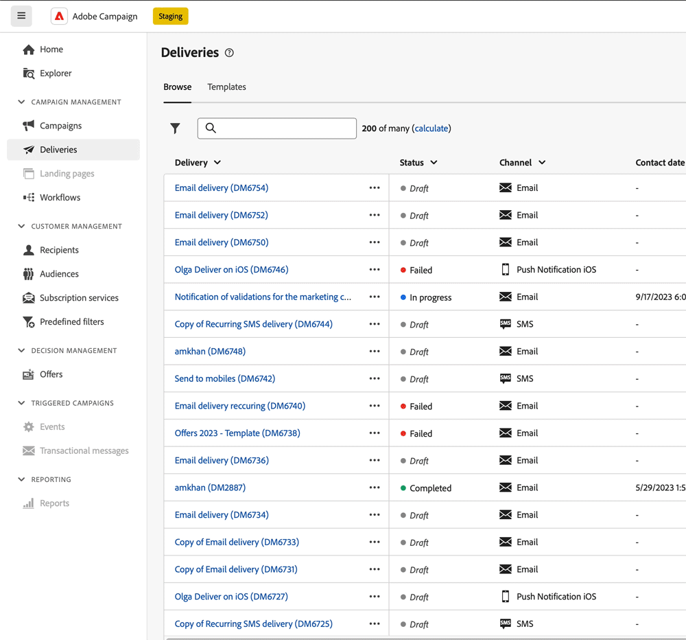

# 使用AI支持的知识助手 {#using-ai}

通过产品上下文帮助框中提供的AI支持的知识助手，根据产品文档和当前产品上下文快速获取AI生成的答案。

此 **具有Gen AI的知识助手** 嵌入在上下文帮助中的内容彻底改变了文档搜索和操作方法问题，您可以轻松地在庞大的文档存储库中筛选，即时查明您所需的精确信息。

通过 Campaign 生成式 AI 的各项功能，此助手改变您的体验，使检索信息和解决问题变得轻而易举。无论您是在复杂任务中寻求指导，还是浏览大量文档，AI支持的知识助手都是您的终极伙伴，可在每次交互中提供无与伦比的效率和准确性。

<!--
## Consent {#consent-ai}

Campaign knowledge assistant embeeded in the contextual help boxes uses AI. Your use of this capability constitutes consent that the information you provide in your session will be collected, used, disclosed, and retained by Adobe in accordance with the terms of Adobe's Customer Feedback Program. Please do not provide any personal information about yourself or other parties (including your name or contact information) in the knowledge assistant.

## Privacy {#privacy-ai}

Your data is encrypted and private following our standard data protection practices. Learn more about [Adobe Privacy Policies](https://www.adobe.com/privacy/policy.html){target="_blank"}.

The knowledge assistant AI capability does not use your data to train our models. We do not allow any partners or 3rd parties to use your data for training their models or any other purpose.

For information specific to Adobe AI policies in Experience Cloud apps and solutions, refer to [this page](https://business.adobe.com/products/sensei/adobe-sensei.html){target="_blank"}.
-->

## 答案 {#answers-ai}

Adobe Campaign AI支持的知识助手可提供帮助，但您应该验证事实。 它可能会输出不正确的信息、不准确或误导性的答案。 确保查看每个帮助框中链接的产品文档。

人工智能和机器学习模型会随着时间的推移而改进，以更好地处理特定用例。 Campaign AI支持的知识助手将在未来几个月继续得到改善。 我们强烈建议您使用??无论您何时阅读答案，都可??用按钮，以标记对我们的工程师的任何不当回应。

## 推荐  {#recommendations-ai}

在AI支持的知识助手中提问时，会考虑当前产品上下文（即您所在的屏幕）以及当前帮助框的内容。

因此，最佳实践是提出与用户界面上下文相关的问题。 例如，如果您需要了解如何在工作流中发送推送投放，请浏览至 **工作流** 左侧菜单项，并在该特定上下文中使用上下文帮助框。 要了解有关报告量度的更多信息，请浏览到活动或投放报告，然后从那里开始。

此外，为了充分利用AI支持的知识助手，在询问问题时，我们建议您：

* 尽可能精确和具体，避免模棱两可。 答案将更准确、更有用。
* 为帮助AI支持的知识助手查找正确信息，请添加尽可能多的有关您尝试学习的内容的详细信息。
* 重新措辞并优化您的问题以获得更好的答案。 如果答案不准确或不实用，请尝试不同的方法并添加上下文以获取更好的结果。
* 使用适当的用语和措辞，语调中立。
* 请对答案进行评级并提供反馈，以便我们的工程师能够从您的经验中学习并改进结果。

