<?xml version="1.0" encoding="UTF-8"?>
<xliff xmlns="urn:oasis:names:tc:xliff:document:1.2" xmlns:okp="okapi-framework:xliff-extensions" xmlns:its="http://www.w3.org/2005/11/its" xmlns:itsxlf="http://www.w3.org/ns/its-xliff/" version="1.2" its:version="2.0">
<file original="help/v8/get-started/work-with-folders.md.mdsc" source-language="en-US" target-language="en-XX" datatype="x-text/markdown">
<body>
<trans-unit id="tu22" xml:space="preserve">
<source xml:lang="en-US">https://experienceleague.adobe.com/docs/campaign/campaign-v8/permissions/manage-permissions.html#use-named-rights</source>
<target xml:lang="en-XX">https://experienceleague.adobe.com/zh-hans/docs/campaign/campaign-v8/permissions/manage-permissions#use-named-rights</target>
</trans-unit>
<trans-unit id="tu34" xml:space="preserve">
<source xml:lang="en-US">https://experienceleague.adobe.com/en/docs/campaign/campaign-v8/config/configuration/folders-and-views</source>
<target xml:lang="en-XX">https://experienceleague.adobe.com/zh-hans/docs/campaign/campaign-v8/config/configuration/folders-and-views</target>
</trans-unit>
<trans-unit id="tu1" restype="x-YAML_METADATA_HEADER_VALUE" xml:space="preserve">
<source xml:lang="en-US">Work with Folders</source>
<target xml:lang="en-XX">使用文件夹</target>
</trans-unit>
<trans-unit id="tu2" restype="x-YAML_METADATA_HEADER_VALUE" xml:space="preserve">
<source xml:lang="en-US">Learn how to manage a folder in Adobe Campaign</source>
<target xml:lang="en-XX">了解如何在 Adobe Campaign 中管理文件夹</target>
</trans-unit>
<trans-unit id="tu3" xml:space="preserve">
<source xml:lang="en-US">Work with folders</source>
<target xml:lang="en-XX">使用文件夹</target>
</trans-unit>
<trans-unit id="tu4" xml:space="preserve">
<source xml:lang="en-US">Folder properties</source>
<target xml:lang="en-XX">文件夹属性</target>
</trans-unit>
<trans-unit id="tu5" xml:space="preserve">
<source xml:lang="en-US">Folder properties</source>
<target xml:lang="en-XX">文件夹属性</target>
</trans-unit>
<trans-unit id="tu6" xml:space="preserve">
<source xml:lang="en-US">Folder security</source>
<target xml:lang="en-XX">文件夹安全性</target>
</trans-unit>
<trans-unit id="tu7" xml:space="preserve">
<source xml:lang="en-US">Folder security</source>
<target xml:lang="en-XX">文件夹安全性</target>
</trans-unit>
<trans-unit id="tu8" xml:space="preserve">
<source xml:lang="en-US">Folder schedule</source>
<target xml:lang="en-XX">文件夹计划</target>
</trans-unit>
<trans-unit id="tu9" xml:space="preserve">
<source xml:lang="en-US">Folder schedule</source>
<target xml:lang="en-XX">文件夹计划</target>
</trans-unit>
<trans-unit id="tu10" xml:space="preserve">
<source xml:lang="en-US">About folders</source>
<target xml:lang="en-XX">关于文件夹</target>
</trans-unit>
<trans-unit id="tu11" xml:space="preserve">
<source xml:lang="en-US">Folders are objects in Adobe Campaign that allow you to organize your components and data.</source>
<target xml:lang="en-XX">文件夹是 Adobe Campaign 中的对象，可用于组织组件和数据。</target>
</trans-unit>
<trans-unit id="tu12" xml:space="preserve">
<source xml:lang="en-US">You can create, rename, reorder, and move folders in the navigation tree. You can also delete them based on your rights.</source>
<target xml:lang="en-XX">您可以在导航树中创建、重命名、重新排序和移动文件夹。 您也可以根据您的权限删除它们。</target>
</trans-unit>
<trans-unit id="tu13" xml:space="preserve">
<source xml:lang="en-US"><ph id="1" ctype="x-IMAGE">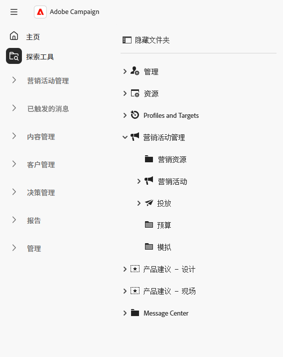{zoomable="yes"}</ph></source>
<target xml:lang="en-XX"><ph id="1" ctype="x-IMAGE">{zoomable="yes"}</ph></target>
</trans-unit>
<trans-unit id="tu14" xml:space="preserve">
<source xml:lang="en-US">You can set up a folder type. For example, a folder of deliveries. The folder icon changes according to its type.</source>
<target xml:lang="en-XX">您可以设置文件夹类型。 例如：一个投放文件夹。 文件夹图标会根据其类型而变化。</target>
</trans-unit>
<trans-unit id="tu15" xml:space="preserve">
<source xml:lang="en-US">Folder restrictions</source>
<target xml:lang="en-XX">文件夹限制</target>
</trans-unit>
<trans-unit id="tu16" xml:space="preserve">
<source xml:lang="en-US">The folders Objects created automatically and Technical workflows are restricted, and cannot be viewed on the left side panel.</source>
<target xml:lang="en-XX">左侧面板中的 “Objects created automatically” 文件夹与 “Technical workflows” 文件夹为受限内容，无法查看。</target>
</trans-unit>
<trans-unit id="tu17" xml:space="preserve">
<source xml:lang="en-US"><ph id="1" ctype="x-regxph" equiv-text="[!IMPORTANT">[!IMPORTANT]</ph></source>
<target xml:lang="en-XX"><ph id="1" ctype="x-regxph" equiv-text="[!IMPORTANT">[!IMPORTANT]</ph></target>
</trans-unit>
<trans-unit id="tu18" xml:space="preserve">
<source xml:lang="en-US">The folders <ph id="1" ctype="x-STRONG_EMPHASIS">**[!UICONTROL </ph>Objects created automatically<ph id="3" ctype="x-LINK_REF">]**</ph> and <ph id="5" ctype="x-STRONG_EMPHASIS">**[!UICONTROL </ph>Technical workflows<ph id="7" ctype="x-LINK_REF">]**</ph> are restricted, and cannot be viewed on the left side panel.</source>
<target xml:lang="en-XX">左侧面板中的<ph id="1" ctype="x-STRONG_EMPHASIS">**[!UICONTROL </ph>自动创建的对象<ph id="3" ctype="x-LINK_REF">]**</ph>文件夹与<ph id="5" ctype="x-STRONG_EMPHASIS">**[!UICONTROL </ph>技术工作流<ph id="7" ctype="x-LINK_REF">]**</ph>文件夹为受限内容，无法查看。</target>
</trans-unit>
<trans-unit id="tu19" xml:space="preserve">
<source xml:lang="en-US">The actions available to you on a folder depend on the rights you have been granted on it. The <ph id="1" ctype="x-STRONG_EMPHASIS">**[!UICONTROL </ph>Folder settings<ph id="3" ctype="x-LINK_REF">]**</ph> dialog may open in <ph id="5" ctype="x-STRONG_EMPHASIS">**</ph>read-only mode<ph id="6" ctype="x-STRONG_EMPHASIS">**</ph>, and some actions or sections may not be available, depending on your rights.</source>
<target xml:lang="en-XX">您在文件夹上可执行的操作取决于您在该文件夹上被授予的权限。<ph id="1" ctype="x-STRONG_EMPHASIS">**[!UICONTROL </ph>文件夹设置<ph id="3" ctype="x-LINK_REF">]**</ph>对话框可能会以<ph id="5" ctype="x-STRONG_EMPHASIS">**</ph>只读模式<ph id="6" ctype="x-STRONG_EMPHASIS">**</ph>打开，并且某些操作或部分可能不可用，具体取决于您的权限。</target>
</trans-unit>
<trans-unit id="tu20" xml:space="preserve">
<source xml:lang="en-US">Contact your administrator if you are missing rights on a folder. Refer to this <ph id="1" ctype="x-LINK">[</ph>section<ph id="2" ctype="x-LINK">](permissions.md#folder-permissions)</ph> to learn how folder permissions are managed.</source>
<target xml:lang="en-XX">如果缺少对文件夹的权限，请联系您的管理员。请参阅此<ph id="1" ctype="x-LINK">[</ph>部分<ph id="2" ctype="x-LINK">](permissions.md#folder-permissions)</ph>，了解如何管理文件夹权限。</target>
</trans-unit>
<trans-unit id="tu21" xml:space="preserve">
<source xml:lang="en-US">Named rights such as <ph id="1" ctype="x-STRONG_EMPHASIS">**[!UICONTROL </ph>Insert Folders<ph id="3" ctype="x-LINK_REF">]**</ph>, <ph id="5" ctype="x-STRONG_EMPHASIS">**[!UICONTROL </ph>Edit Folders<ph id="7" ctype="x-LINK_REF">]**</ph>, and <ph id="9" ctype="x-STRONG_EMPHASIS">**[!UICONTROL </ph>Delete Folder<ph id="11" ctype="x-LINK_REF">]**</ph> also determine which folder actions are available to an operator. Refer to the <ph id="13" ctype="x-LINK">[</ph>Campaign v8 documentation<ph id="14" ctype="x-LINK">[#$tu22]{target="_blank"}</ph>.</source>
<target xml:lang="en-XX">已命名权限（例如<ph id="1" ctype="x-STRONG_EMPHASIS">**[!UICONTROL </ph>插入文件夹<ph id="3" ctype="x-LINK_REF">]**</ph>、<ph id="5" ctype="x-STRONG_EMPHASIS">**[!UICONTROL </ph>编辑文件夹<ph id="7" ctype="x-LINK_REF">]**</ph>和<ph id="9" ctype="x-STRONG_EMPHASIS">**[!UICONTROL </ph>删除文件夹<ph id="11" ctype="x-LINK_REF">]**</ph>）也决定了操作员可以执行哪些文件夹操作。请参阅 <ph id="13" ctype="x-LINK">[</ph>Campaign v8 文档<ph id="14" ctype="x-LINK">[#$tu22]{target="_blank"}</ph>。</target>
</trans-unit>
<trans-unit id="tu23" xml:space="preserve">
<source xml:lang="en-US">Create a new folder</source>
<target xml:lang="en-XX">创建新文件夹</target>
</trans-unit>
<trans-unit id="tu24" xml:space="preserve">
<source xml:lang="en-US">To create a new folder in Adobe Campaign Web UI, follow these steps:</source>
<target xml:lang="en-XX">要在 Adobe Campaign Web UI 中创建新文件夹，请按照以下步骤操作：</target>
</trans-unit>
<trans-unit id="tu25" xml:space="preserve">
<source xml:lang="en-US">In <ph id="1" ctype="x-STRONG_EMPHASIS">**[!UICONTROL </ph>Explorer<ph id="3" ctype="x-LINK_REF">]**</ph>, go to the folder where you want to create your new folder. Under the <ph id="5" ctype="x-STRONG_EMPHASIS">**[!UICONTROL </ph>...<ph id="7" ctype="x-LINK_REF">]**</ph> menu, select <ph id="9" ctype="x-STRONG_EMPHASIS">**[!UICONTROL </ph>Create new folder<ph id="11" ctype="x-LINK_REF">]**</ph>.</source>
<target xml:lang="en-XX">在 <ph id="1" ctype="x-STRONG_EMPHASIS">**[!UICONTROL </ph>资源管理器<ph id="3" ctype="x-LINK_REF">]**</ph>中，转到您想要创建新文件夹的文件夹。 在 <ph id="5" ctype="x-STRONG_EMPHASIS">**[!UICONTROL </ph>...<ph id="7" ctype="x-LINK_REF">]**</ph> 菜单下，选择<ph id="9" ctype="x-STRONG_EMPHASIS">**[!UICONTROL </ph>创建新文件夹<ph id="11" ctype="x-LINK_REF">]**</ph>。</target>
</trans-unit>
<trans-unit id="tu26" xml:space="preserve">
<source xml:lang="en-US"><ph id="1" ctype="x-IMAGE">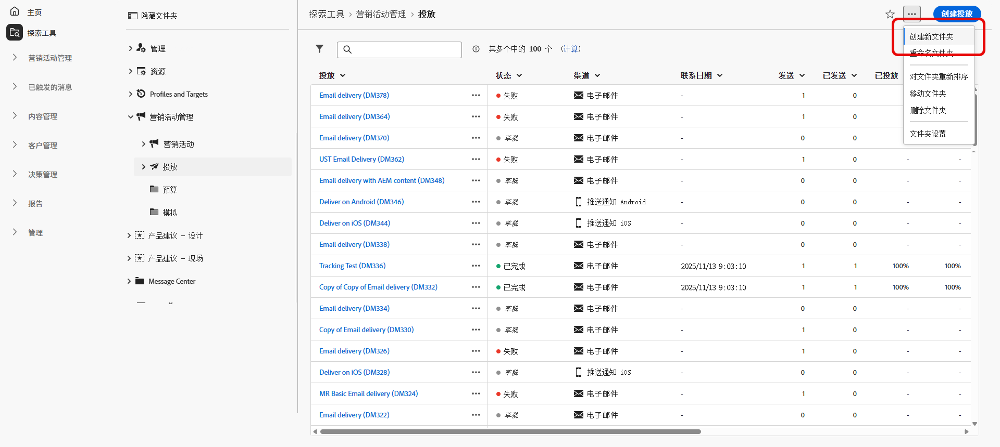{zoomable="yes"}</ph></source>
<target xml:lang="en-XX"><ph id="1" ctype="x-IMAGE">{zoomable="yes"}</ph></target>
</trans-unit>
<trans-unit id="tu27" xml:space="preserve">
<source xml:lang="en-US">When you create a new folder, the folder type defaults to the type of the parent folder. In this example, a folder is created in the <ph id="1" ctype="x-STRONG_EMPHASIS">**[!UICONTROL </ph>Deliveries<ph id="3" ctype="x-LINK_REF">]**</ph> folder.</source>
<target xml:lang="en-XX">当你创建一个新文件夹时，默认情况下，文件夹类型是父级文件夹的类型。 在该示例中，会在<ph id="1" ctype="x-STRONG_EMPHASIS">**[!UICONTROL </ph>投放<ph id="3" ctype="x-LINK_REF">]**</ph>文件夹中创建一个子文件夹。</target>
</trans-unit>
<trans-unit id="tu28" xml:space="preserve">
<source xml:lang="en-US"><ph id="1" ctype="x-IMAGE">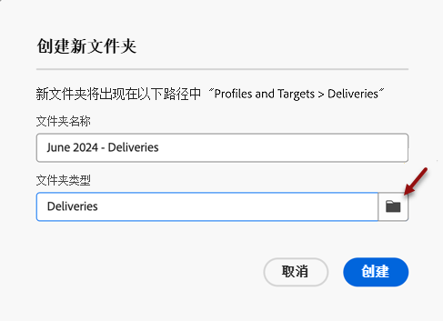{zoomable="yes"}</ph></source>
<target xml:lang="en-XX"><ph id="1" ctype="x-IMAGE">{zoomable="yes"}</ph></target>
</trans-unit>
<trans-unit id="tu29" xml:space="preserve">
<source xml:lang="en-US">Change the folder type by clicking on the folder type icon if needed, and select the desired type from the list presented, as shown below:</source>
<target xml:lang="en-XX">如果需要，可以通过单击文件夹类型的图标来更改文件夹的类型，然后在显示的列表中选择所需的类型，如下所示：</target>
</trans-unit>
<trans-unit id="tu30" xml:space="preserve">
<source xml:lang="en-US"><ph id="1" ctype="x-IMAGE">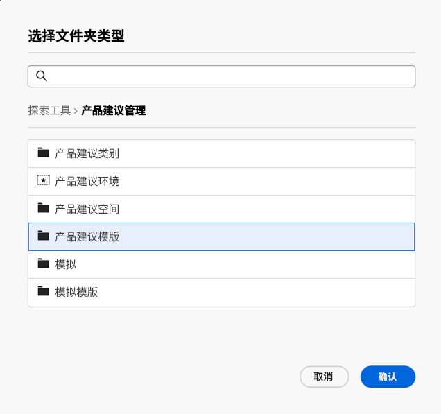{zoomable="yes"}</ph></source>
<target xml:lang="en-XX"><ph id="1" ctype="x-IMAGE">{zoomable="yes"}</ph></target>
</trans-unit>
<trans-unit id="tu31" xml:space="preserve">
<source xml:lang="en-US">Set up the folder type by clicking the <ph id="1" ctype="x-STRONG_EMPHASIS">**[!UICONTROL </ph>Confirm<ph id="3" ctype="x-LINK_REF">]**</ph> button.</source>
<target xml:lang="en-XX">单击<ph id="1" ctype="x-STRONG_EMPHASIS">**[!UICONTROL </ph>确认<ph id="3" ctype="x-LINK_REF">]**</ph>按钮设置文件夹类型。</target>
</trans-unit>
<trans-unit id="tu32" xml:space="preserve">
<source xml:lang="en-US">If you want to create a folder with no specific type, select the <ph id="1" ctype="x-STRONG_EMPHASIS">**[!UICONTROL </ph>Generic Folder<ph id="3" ctype="x-LINK_REF">]**</ph> type.</source>
<target xml:lang="en-XX">如果您想创建没有特定类型的文件夹，请选择<ph id="1" ctype="x-STRONG_EMPHASIS">**[!UICONTROL </ph>通用文件夹<ph id="3" ctype="x-LINK_REF">]**</ph>类型。</target>
</trans-unit>
<trans-unit id="tu33" xml:space="preserve">
<source xml:lang="en-US">You can also <ph id="1" ctype="x-LINK">[</ph>create and manage folders in Adobe Campaign console<ph id="2" ctype="x-LINK">[#$tu34]</ph>.</source>
<target xml:lang="en-XX">您还可以<ph id="1" ctype="x-LINK">[</ph>在 Adobe Campaign 控制台中创建和管理文件夹<ph id="2" ctype="x-LINK">[#$tu34]</ph>。</target>
</trans-unit>
<trans-unit id="tu35" xml:space="preserve">
<source xml:lang="en-US">Reorder folders</source>
<target xml:lang="en-XX">对文件夹重新排序</target>
</trans-unit>
<trans-unit id="tu36" xml:space="preserve">
<source xml:lang="en-US">You can reorder folders based on your needs. To do so, click on <ph id="1" ctype="x-STRONG_EMPHASIS">**[!UICONTROL </ph>Reorder folders<ph id="3" ctype="x-LINK_REF">]**</ph>, as shown below.</source>
<target xml:lang="en-XX">您可以根据需要重新排序文件夹。 为此，请点击<ph id="1" ctype="x-STRONG_EMPHASIS">**[!UICONTROL </ph>重新排序文件夹<ph id="3" ctype="x-LINK_REF">]**</ph>，如下所示。</target>
</trans-unit>
<trans-unit id="tu37" xml:space="preserve">
<source xml:lang="en-US">In this example, the <ph id="1" ctype="x-STRONG_EMPHASIS">**</ph>Deliveries<ph id="2" ctype="x-STRONG_EMPHASIS">**</ph> folder contains four subfolders.</source>
<target xml:lang="en-XX">在该示例中，<ph id="1" ctype="x-STRONG_EMPHASIS">**</ph>投放<ph id="2" ctype="x-STRONG_EMPHASIS">**</ph>文件夹包含四个子文件夹。</target>
</trans-unit>
<trans-unit id="tu38" xml:space="preserve">
<source xml:lang="en-US"><ph id="1" ctype="x-IMAGE">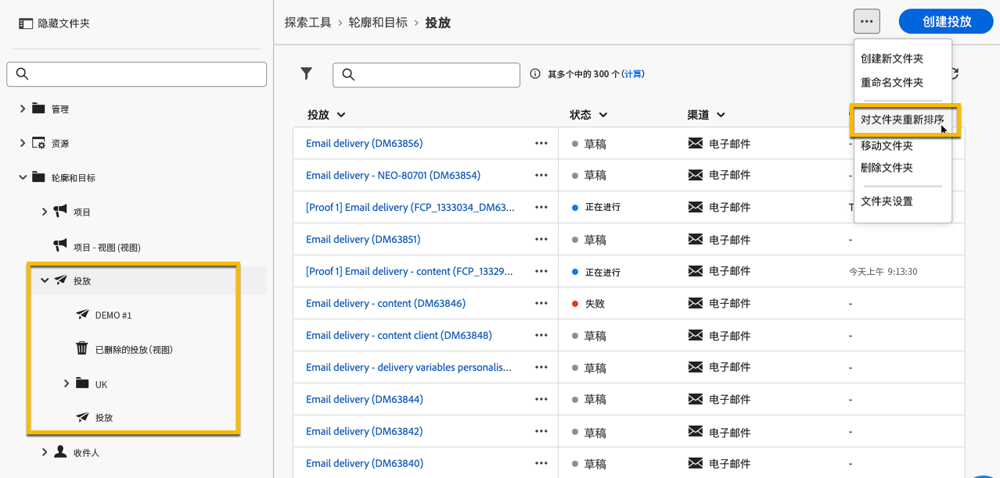{zoomable="yes"}</ph></source>
<target xml:lang="en-XX"><ph id="1" ctype="x-IMAGE">{zoomable="yes"}</ph></target>
</trans-unit>
<trans-unit id="tu39" xml:space="preserve">
<source xml:lang="en-US">You can change the order of folders either by <ph id="1" ctype="x-STRONG_EMPHASIS">**</ph>drag and drop<ph id="2" ctype="x-STRONG_EMPHASIS">**</ph> or by using <ph id="3" ctype="x-STRONG_EMPHASIS">**</ph>up and down arrows<ph id="4" ctype="x-STRONG_EMPHASIS">**</ph>.</source>
<target xml:lang="en-XX">您可以通过<ph id="1" ctype="x-STRONG_EMPHASIS">**</ph>拖放<ph id="2" ctype="x-STRONG_EMPHASIS">**</ph>或使用<ph id="3" ctype="x-STRONG_EMPHASIS">**</ph>上下箭头<ph id="4" ctype="x-STRONG_EMPHASIS">**</ph>来更改文件夹的顺序。</target>
</trans-unit>
<trans-unit id="tu40" xml:space="preserve">
<source xml:lang="en-US"><ph id="1" ctype="x-IMAGE">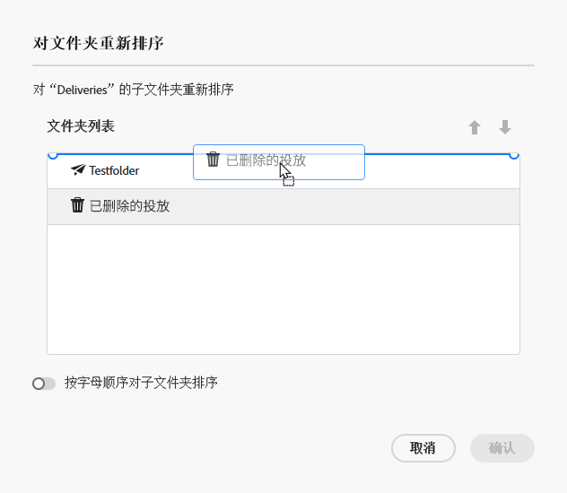{zoomable="yes"}</ph></source>
<target xml:lang="en-XX"><ph id="1" ctype="x-IMAGE">{zoomable="yes"}</ph></target>
</trans-unit>
<trans-unit id="tu41" xml:space="preserve">
<source xml:lang="en-US">Favorite folders</source>
<target xml:lang="en-XX">收藏夹</target>
</trans-unit>
<trans-unit id="tu42" xml:space="preserve">
<source xml:lang="en-US">Favorites</source>
<target xml:lang="en-XX">收藏</target>
</trans-unit>
<trans-unit id="tu43" xml:space="preserve">
<source xml:lang="en-US">Your favorite folders will be displayed at the top of the left tab.</source>
<target xml:lang="en-XX">您收藏的文件夹将显示在左侧标签页的顶部。</target>
</trans-unit>
<trans-unit id="tu44" xml:space="preserve">
<source xml:lang="en-US">The folders that have been marked as "Favorite" will always be shown at the top of the left tab.</source>
<target xml:lang="en-XX">标记为“收藏”的文件夹将始终显示在左侧标签页的顶部。</target>
</trans-unit>
<trans-unit id="tu45" xml:space="preserve">
<source xml:lang="en-US">You can add folders as favorite by clicking on the star button at the top-right corner when viewing a folder.</source>
<target xml:lang="en-XX">在查看文件夹时，点击右上角的星形按钮即可将该文件夹添加为收藏。</target>
</trans-unit>
<trans-unit id="tu46" xml:space="preserve">
<source xml:lang="en-US"><ph id="1" ctype="x-IMAGE">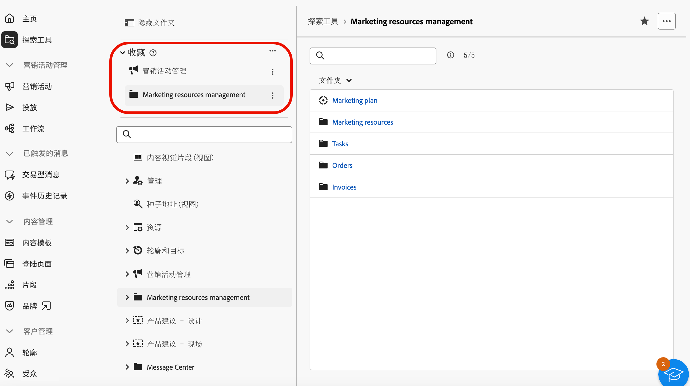{zoomable="yes"}</ph></source>
<target xml:lang="en-XX"><ph id="1" ctype="x-IMAGE">{zoomable="yes"}</ph></target>
</trans-unit>
<trans-unit id="tu47" xml:space="preserve">
<source xml:lang="en-US">Delete a folder</source>
<target xml:lang="en-XX">删除文件夹</target>
</trans-unit>
<trans-unit id="tu48" xml:space="preserve">
<source xml:lang="en-US"><ph id="1" ctype="x-regxph" equiv-text="[!CAUTION">[!CAUTION]</ph></source>
<target xml:lang="en-XX"><ph id="1" ctype="x-regxph" equiv-text="[!CAUTION">[!CAUTION]</ph></target>
</trans-unit>
<trans-unit id="tu49" xml:space="preserve">
<source xml:lang="en-US">When deleting a folder, all data stored in the folder is also deleted.</source>
<target xml:lang="en-XX">在删除某个文件夹时，还将删除存储在该文件夹中的所有数据。</target>
</trans-unit>
<trans-unit id="tu50" xml:space="preserve">
<source xml:lang="en-US">To delete a folder, select it in your <ph id="1" ctype="x-STRONG_EMPHASIS">**[!UICONTROL </ph>Explorer<ph id="3" ctype="x-LINK_REF">]**</ph> tree, and click on the <ph id="5" ctype="x-STRONG_EMPHASIS">**[!UICONTROL </ph>...<ph id="7" ctype="x-LINK_REF">]**</ph> menu. Choose <ph id="9" ctype="x-STRONG_EMPHASIS">**[!UICONTROL </ph>Delete folder<ph id="11" ctype="x-LINK_REF">]**</ph>.</source>
<target xml:lang="en-XX">要删除文件夹，请在<ph id="1" ctype="x-STRONG_EMPHASIS">**[!UICONTROL </ph>资源管理器<ph id="3" ctype="x-LINK_REF">]**</ph>树中选择该文件夹，然后单击 <ph id="5" ctype="x-STRONG_EMPHASIS">**[!UICONTROL </ph>...<ph id="7" ctype="x-LINK_REF">]**</ph> 菜单。 选择<ph id="9" ctype="x-STRONG_EMPHASIS">**[!UICONTROL </ph>删除文件夹<ph id="11" ctype="x-LINK_REF">]**</ph>。</target>
</trans-unit>
<trans-unit id="tu51" xml:space="preserve">
<source xml:lang="en-US"><ph id="1" ctype="x-IMAGE">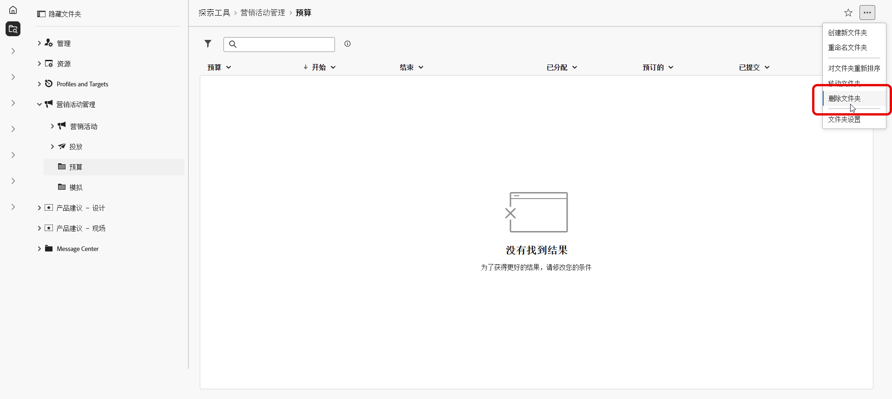{zoomable="yes"}</ph></source>
<target xml:lang="en-XX"><ph id="1" ctype="x-IMAGE">{zoomable="yes"}</ph></target>
</trans-unit>
<trans-unit id="tu52" xml:space="preserve">
<source xml:lang="en-US">Distribution of values in a folder</source>
<target xml:lang="en-XX">文件夹中的值分布</target>
</trans-unit>
<trans-unit id="tu53" xml:space="preserve">
<source xml:lang="en-US">The distribution of values helps you understand the percentage of a value in a column within a table.</source>
<target xml:lang="en-XX">值的分布有助于您了解表中某一列中某个值的百分比。</target>
</trans-unit>
<trans-unit id="tu54" xml:space="preserve">
<source xml:lang="en-US">To view the distribution of values in a folder, proceed as explained below.</source>
<target xml:lang="en-XX">要查看文件夹中值的分布，请按照以下说明操作。</target>
</trans-unit>
<trans-unit id="tu55" xml:space="preserve">
<source xml:lang="en-US">For example, among the deliveries, you may want to know the distribution of values in the <ph id="1" ctype="x-STRONG_EMPHASIS">**</ph>Channel<ph id="2" ctype="x-STRONG_EMPHASIS">**</ph> column.</source>
<target xml:lang="en-XX">例如，在投放中，您可能想知道<ph id="1" ctype="x-STRONG_EMPHASIS">**</ph>渠道<ph id="2" ctype="x-STRONG_EMPHASIS">**</ph>列内的值的分布。</target>
</trans-unit>
<trans-unit id="tu56" xml:space="preserve">
<source xml:lang="en-US">To get this information, go to the <ph id="1" ctype="x-STRONG_EMPHASIS">**[!UICONTROL </ph>Deliveries<ph id="3" ctype="x-LINK_REF">]**</ph> folder and click the <ph id="5" ctype="x-STRONG_EMPHASIS">**[!UICONTROL </ph>Configure columns<ph id="7" ctype="x-LINK_REF">]**</ph> icon.</source>
<target xml:lang="en-XX">要获取此信息，请转到<ph id="1" ctype="x-STRONG_EMPHASIS">**[!UICONTROL </ph>投放<ph id="3" ctype="x-LINK_REF">]**</ph>文件夹，并单击<ph id="5" ctype="x-STRONG_EMPHASIS">**[!UICONTROL </ph>配置列<ph id="7" ctype="x-LINK_REF">]**</ph>图标。</target>
</trans-unit>
<trans-unit id="tu57" xml:space="preserve">
<source xml:lang="en-US">In the <ph id="1" ctype="x-STRONG_EMPHASIS">**[!UICONTROL </ph>Configure columns<ph id="3" ctype="x-LINK_REF">]**</ph> window, click the <ph id="5" ctype="x-STRONG_EMPHASIS">**[!UICONTROL </ph>Information<ph id="7" ctype="x-LINK_REF">]**</ph> icon related to the column you want to analyze. Then, click on the <ph id="9" ctype="x-STRONG_EMPHASIS">**[!UICONTROL </ph>Distribution of values<ph id="11" ctype="x-LINK_REF">]**</ph> button.</source>
<target xml:lang="en-XX">在<ph id="1" ctype="x-STRONG_EMPHASIS">**[!UICONTROL </ph>配置列<ph id="3" ctype="x-LINK_REF">]**</ph>窗口中，点击您想要分析的列的<ph id="5" ctype="x-STRONG_EMPHASIS">**[!UICONTROL </ph>信息<ph id="7" ctype="x-LINK_REF">]**</ph>图标。 然后，点击<ph id="9" ctype="x-STRONG_EMPHASIS">**[!UICONTROL </ph>值分布<ph id="11" ctype="x-LINK_REF">]**</ph>按钮。</target>
</trans-unit>
<trans-unit id="tu58" xml:space="preserve">
<source xml:lang="en-US"><ph id="1" ctype="x-IMAGE">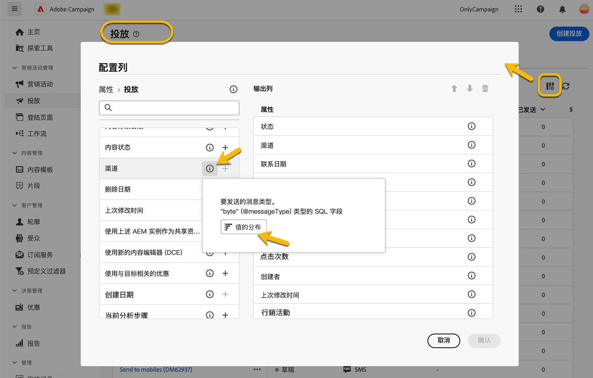{zoomable="yes"}</ph></source>
<target xml:lang="en-XX"><ph id="1" ctype="x-IMAGE">{zoomable="yes"}</ph></target>
</trans-unit>
<trans-unit id="tu59" xml:space="preserve">
<source xml:lang="en-US">You will see the percentage of values in the <ph id="1" ctype="x-STRONG_EMPHASIS">**[!UICONTROL </ph>Channel<ph id="3" ctype="x-LINK_REF">]**</ph> column.</source>
<target xml:lang="en-XX">您会看到<ph id="1" ctype="x-STRONG_EMPHASIS">**[!UICONTROL </ph>渠道<ph id="3" ctype="x-LINK_REF">]**</ph>列中的值的百分比。</target>
</trans-unit>
<trans-unit id="tu60" xml:space="preserve">
<source xml:lang="en-US"><ph id="1" ctype="x-IMAGE">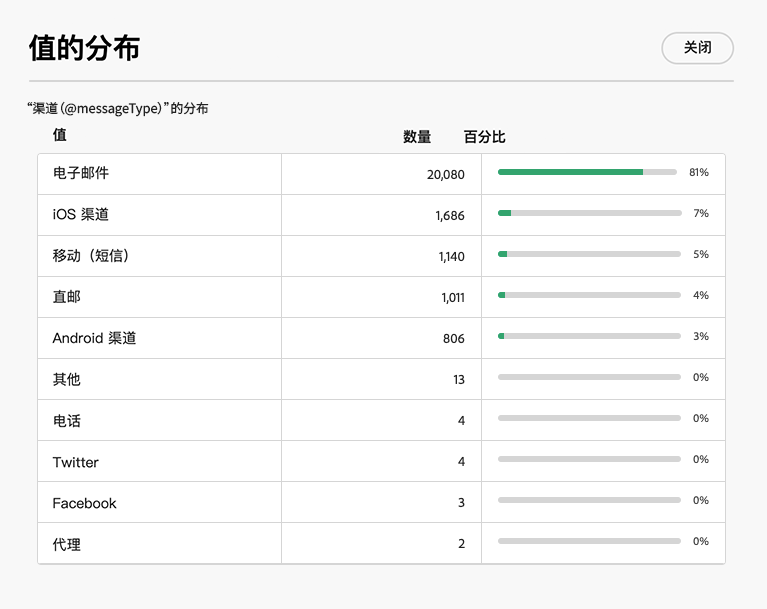{zoomable="yes"}</ph></source>
<target xml:lang="en-XX"><ph id="1" ctype="x-IMAGE">{zoomable="yes"}</ph></target>
</trans-unit>
<trans-unit id="tu61" xml:space="preserve">
<source xml:lang="en-US"><ph id="1" ctype="x-regxph" equiv-text="[!NOTE">[!NOTE]</ph></source>
<target xml:lang="en-XX"><ph id="1" ctype="x-regxph" equiv-text="[!NOTE">[!NOTE]</ph></target>
</trans-unit>
<trans-unit id="tu62" xml:space="preserve">
<source xml:lang="en-US">For columns with many values, only the first twenty values are displayed. A notification <ph id="1" ctype="x-STRONG_EMPHASIS">**[!UICONTROL </ph>Partial load<ph id="3" ctype="x-LINK_REF">]**</ph> warns you.</source>
<target xml:lang="en-XX">对于具有许多值的列，仅会显示前二十个值。 通知<ph id="1" ctype="x-STRONG_EMPHASIS">**[!UICONTROL </ph>部分加载<ph id="3" ctype="x-LINK_REF">]**</ph>会发出警告。</target>
</trans-unit>
<trans-unit id="tu63" xml:space="preserve">
<source xml:lang="en-US">You can also view the distribution of values for a link.</source>
<target xml:lang="en-XX">您还可以查看链接的值分布。</target>
</trans-unit>
<trans-unit id="tu64" xml:space="preserve">
<source xml:lang="en-US">In the attributes list, click the <ph id="1" ctype="x-STRONG_EMPHASIS">**</ph>+<ph id="2" ctype="x-STRONG_EMPHASIS">**</ph> button next to the desired link, as shown below. This adds the link to the <ph id="3" ctype="x-STRONG_EMPHASIS">**[!UICONTROL </ph>Output columns<ph id="5" ctype="x-LINK_REF">]**</ph>. You can now access the <ph id="7" ctype="x-STRONG_EMPHASIS">**[!UICONTROL </ph>Information<ph id="9" ctype="x-LINK_REF">]**</ph> icon, allowing you to view the distribution of its values. If you do not want to keep the link in the <ph id="11" ctype="x-STRONG_EMPHASIS">**[!UICONTROL </ph>Output columns<ph id="13" ctype="x-LINK_REF">]**</ph>, click the <ph id="15" ctype="x-STRONG_EMPHASIS">**[!UICONTROL </ph>Cancel<ph id="17" ctype="x-LINK_REF">]**</ph> button.</source>
<target xml:lang="en-XX">在属性列表中，点击所需链接旁边的 <ph id="1" ctype="x-STRONG_EMPHASIS">**</ph>+<ph id="2" ctype="x-STRONG_EMPHASIS">**</ph> 按钮，如下所示。 这会将链接添加到 <ph id="3" ctype="x-STRONG_EMPHASIS">**[!UICONTROL </ph>输出列<ph id="5" ctype="x-LINK_REF">]**</ph>。 您现在可以访问<ph id="7" ctype="x-STRONG_EMPHASIS">**[!UICONTROL </ph>信息<ph id="9" ctype="x-LINK_REF">]**</ph>图标，以便查看其值的分布。 如果您不想保留<ph id="11" ctype="x-STRONG_EMPHASIS">**[!UICONTROL </ph>输出列<ph id="13" ctype="x-LINK_REF">]**</ph>中的链接，请点击<ph id="15" ctype="x-STRONG_EMPHASIS">**[!UICONTROL </ph>取消<ph id="17" ctype="x-LINK_REF">]**</ph>按钮。</target>
</trans-unit>
<trans-unit id="tu65" xml:space="preserve">
<source xml:lang="en-US"><ph id="1" ctype="x-IMAGE">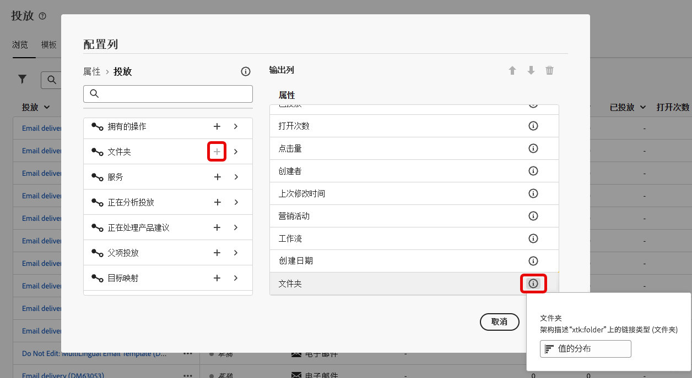{zoomable="yes"}</ph></source>
<target xml:lang="en-XX"><ph id="1" ctype="x-IMAGE">{zoomable="yes"}</ph></target>
</trans-unit>
<trans-unit id="tu66" xml:space="preserve">
<source xml:lang="en-US">It is also possible to view the distribution of values in a query modeler. <ph id="1" ctype="x-LINK">[</ph>Learn more here<ph id="2" ctype="x-LINK">](../query/build-query.md#distribution-of-values-in-a-query)</ph>.</source>
<target xml:lang="en-XX">也可以在查询模型器中查看值分布。 <ph id="1" ctype="x-LINK">[</ph>在此处了解详情<ph id="2" ctype="x-LINK">](../query/build-query.md#distribution-of-values-in-a-query)</ph>。</target>
</trans-unit>
<trans-unit id="tu67" xml:space="preserve">
<source xml:lang="en-US">Filter the values</source>
<target xml:lang="en-XX">过滤值</target>
</trans-unit>
<trans-unit id="tu68" xml:space="preserve">
<source xml:lang="en-US">By using the <ph id="1" ctype="x-STRONG_EMPHASIS">**[!UICONTROL </ph>Advanced filters<ph id="3" ctype="x-LINK_REF">]**</ph> in the distribution of values window, you can filter results based on specified conditions.</source>
<target xml:lang="en-XX">通过使用值分布窗口中的<ph id="1" ctype="x-STRONG_EMPHASIS">**[!UICONTROL </ph>高级过滤器<ph id="3" ctype="x-LINK_REF">]**</ph>，您可以根据指定的条件过滤结果。</target>
</trans-unit>
<trans-unit id="tu69" xml:space="preserve">
<source xml:lang="en-US">In the example of the delivery list above, which shows the distribution per channel, you can filter it to display only deliveries with a status of <ph id="1" ctype="x-STRONG_EMPHASIS">**</ph>Finished<ph id="2" ctype="x-STRONG_EMPHASIS">**</ph>.</source>
<target xml:lang="en-XX">在上面的投放列表示例中，该列表显示了按渠道的分布，您可以通过过滤仅显示状态为<ph id="1" ctype="x-STRONG_EMPHASIS">**</ph>已完成<ph id="2" ctype="x-STRONG_EMPHASIS">**</ph>的投放。</target>
</trans-unit>
<trans-unit id="tu70" xml:space="preserve">
<source xml:lang="en-US"><ph id="1" ctype="x-IMAGE">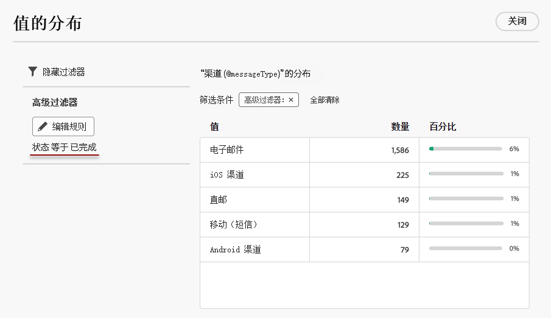{zoomable="yes"}</ph></source>
<target xml:lang="en-XX"><ph id="1" ctype="x-IMAGE">{zoomable="yes"}</ph></target>
</trans-unit>
</body>
</file>
</xliff>