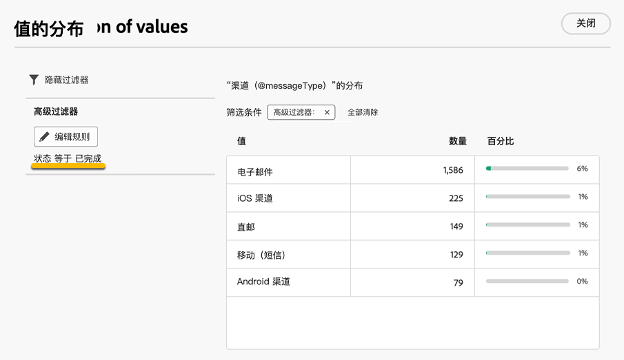

# 使用文件夹 {#folders}

>[!CONTEXTUALHELP]
>id="acw_folder_properties"
>title="文件夹属性"
>abstract="文件夹属性"

>[!CONTEXTUALHELP]
>id="acw_folder_security"
>title="文件夹安全性"
>abstract="文件夹安全性"

>[!CONTEXTUALHELP]
>id="acw_folder_restrictions"
>title="文件夹限制"
>abstract="文件夹限制"

>[!CONTEXTUALHELP]
>id="acw_folder_schedule"
>title="文件夹计划"
>abstract="文件夹计划"

## 关于文件夹 {#about-folders}

文件夹是 Adobe Campaign 中的对象，可用于组织组件和数据。

您可以在导航树中创建、重命名、重新排序和移动文件夹。您还可以根据您的权限删除这些区段。

{zoomable="yes"}

您可以设置文件夹类型。例如，投放文件夹。 文件夹图标会根据其类型而发生更改。

## 创建新文件夹 {#create-a-folder}

要在 Adobe Campaign Web UI 中创建新文件夹，请按照以下步骤操作：

1. 在&#x200B;**[!UICONTROL 资源管理器]**&#x200B;中，转到要创建新文件夹的文件夹。 在&#x200B;**[!UICONTROL ...]**&#x200B;菜单下，选择&#x200B;**[!UICONTROL 创建新文件夹]**。

{zoomable="yes"}

创建新文件夹时，文件夹类型默认为父文件夹的类型。 在此示例中，在&#x200B;**[!UICONTROL Deliveries]**&#x200B;文件夹中创建了一个文件夹。

{zoomable="yes"}

1. 根据需要单击文件夹类型图标更改文件夹类型，然后从显示的列表中选择所需的类型，如下所示：

{zoomable="yes"}

单击&#x200B;**[!UICONTROL 确认]**&#x200B;按钮设置文件夹类型。

如果要创建没有特定类型的文件夹，请选择&#x200B;**[!UICONTROL 通用文件夹]**&#x200B;类型。

您还可以 [在 Adobe Campaign 控制台中创建和管理文件夹](https://experienceleague.adobe.com/zh-hans/docs/campaign/campaign-v8/config/configuration/folders-and-views)。

## 对文件夹重新排序 {#reorder-folders}

您可以根据需要对文件夹重新排序。 为此，请单击&#x200B;**[!UICONTROL 重新排序文件夹]**，如下所示。

在此示例中，**投放**&#x200B;文件夹包含四个子文件夹。

{zoomable="yes"}

您可以通过&#x200B;**拖放**&#x200B;或使用&#x200B;**上下箭头**&#x200B;来更改文件夹的顺序。

{zoomable="yes"}

## 删除文件夹 {#delete-a-folder}

>[!CAUTION]
>
>在删除某个文件夹时，还将删除存储在该文件夹中的所有数据。

要删除文件夹，请在&#x200B;**[!UICONTROL 资源管理器]**&#x200B;树中选择该文件夹，然后单击&#x200B;**[!UICONTROL ...]**&#x200B;菜单。 选择 **[!UICONTROL 删除文件夹]**。

在“资源管理器”菜单中{zoomable="yes"}

## 文件夹中的值分布 {#distribution-values-folder}

值的分布可帮助您了解表中某列值的百分比。

要查看某个文件夹中值的分布情况，请按照以下说明继续操作。

例如，在投放中，您可能希望了解&#x200B;**渠道**&#x200B;列中的值分布。

若要获取此信息，请转到&#x200B;**[!UICONTROL 投放]**&#x200B;文件夹，然后单击&#x200B;**[!UICONTROL 配置列]**&#x200B;图标。

在&#x200B;**[!UICONTROL 配置列]**&#x200B;窗口中，单击与要分析的列相关的&#x200B;**[!UICONTROL 信息]**&#x200B;图标。 然后，点击 **[!UICONTROL 值分布]** 按钮。

{zoomable="yes"}

您将在&#x200B;**[!UICONTROL 渠道]**&#x200B;列中看到值的百分比。

{zoomable="yes"}中值的百分比分布

>[!NOTE]
>
>对于具有许多值的列，仅显示前20个值。 通知&#x200B;**[!UICONTROL 部分加载]**&#x200B;警告您。

您还可以查看链接值的分布情况。

在属性列表中，点击所需链接旁边的 **+** 按钮，如下所示。这会将链接添加到 **[!UICONTROL 输出列]**。您现在可以访问&#x200B;**[!UICONTROL 信息]**&#x200B;图标，以查看其值的分布情况。 如果不希望链接保留在&#x200B;**[!UICONTROL 输出列]**&#x200B;中，请单击&#x200B;**[!UICONTROL 取消]**&#x200B;按钮。

{zoomable="yes"}

也可以在查询建模器中查看值的分布情况。 [在此处了解详情](../query/build-query.md#distribution-of-values-in-a-query)。

### 过滤值 {#filter-values}

通过使用值分布窗口中的&#x200B;**[!UICONTROL 高级筛选器]**，您可以根据指定的条件筛选结果。

在上面的投放列表示例中（显示每个渠道的分布），您可以对其进行筛选，以仅显示状态为&#x200B;**已完成**&#x200B;的投放。

{zoomable="yes"}