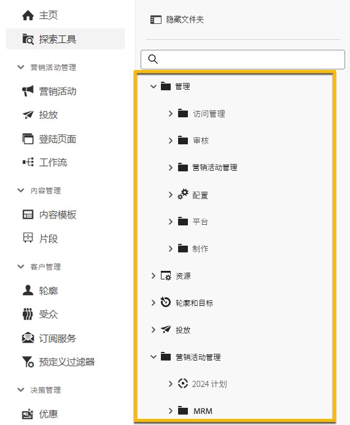
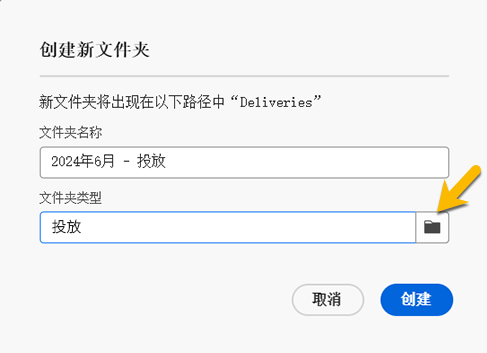

# 使用文件夹 {#folders}

>[!CONTEXTUALHELP]
>id="acw_folder_properties"
>title="文件夹属性"
>abstract="文件夹属性"

>[!CONTEXTUALHELP]
>id="acw_folder_security"
>title="文件夹安全性"
>abstract="文件夹安全性"

>[!CONTEXTUALHELP]
>id="acw_folder_restrictions"
>title="文件夹限制"
>abstract="文件夹限制"

>[!CONTEXTUALHELP]
>id="acw_folder_schedule"
>title="文件夹计划"
>abstract="文件夹计划"

## 关于文件夹

文件夹是 Adobe Campaign 中的对象，可用于组织组件和数据。

您可以在导航树中创建、重命名、重新排序和移动文件夹。您也可以根据您的权利删除它们。

{zoomable="yes"}

您可以设置文件夹类型。例如：一个交付文件夹。
文件夹的图标将根据此类型而改变。

## 创建新文件夹

要在 Adobe Campaign Web UI 中创建新文件夹，请按照以下步骤操作：

1. 在 **[!UICONTROL 资源管理器]**中，转到您想要创建新文件夹的文件夹。
在 **[!UICONTROL ...]** 菜单下，您可以 **[!UICONTROL 创建新文件夹]**

{zoomable="yes"}

当你创建一个新文件夹时，默认情况下，文件夹类型是文件夹父级的类型。
在我们的示例中，我们在 **[!UICONTROL 交付]** 文件夹中创建一个文件夹。

{zoomable="yes"}

1. 如果需要，可以通过单击文件夹类型的图标来更改文件夹的类型，然后在显示的列表中选择它，如下所示：

{zoomable="yes"}

点击 **[!UICONTROL 确认]** 按钮设置文件夹类型。

如果您想创建没有特定类型的文件夹，请选择 **[!UICONTROL 通用文件夹]** 类型。

您还可以 [在 Adobe Campaign 控制台中创建和管理文件夹](https://experienceleague.adobe.com/zh-hans/docs/campaign/campaign-v8/config/configuration/folders-and-views)。

## 删除文件夹

>[!CAUTION]
>
>在删除某个文件夹时，还将删除存储在该文件夹中的所有数据。

要删除文件夹，请在 **[!UICONTROL 资源管理器]** 树中选择该文件夹，然后单击 **[!UICONTROL ...]** 菜单。
选择 **[!UICONTROL 删除文件夹]**。

{zoomable="yes"}
