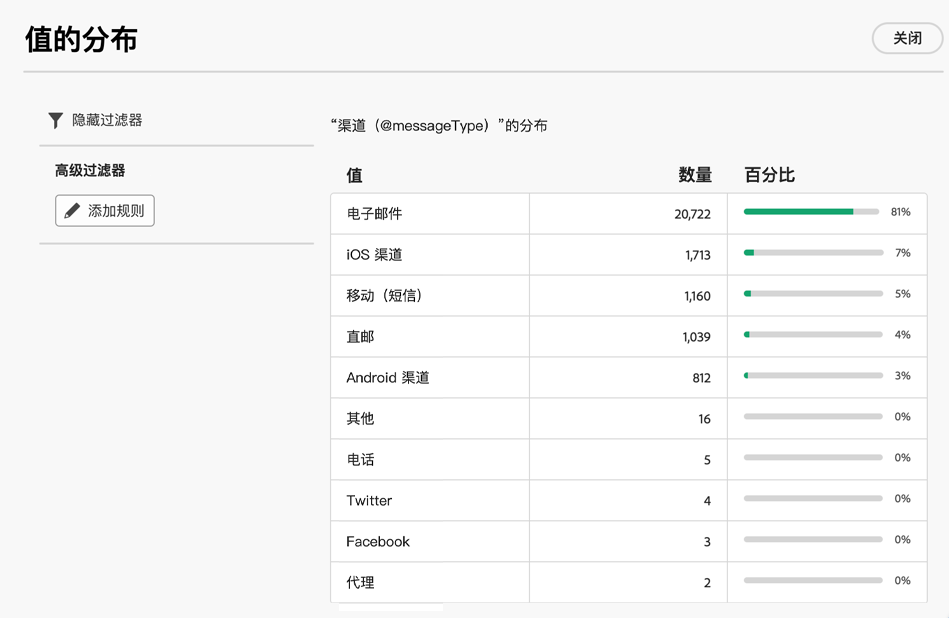
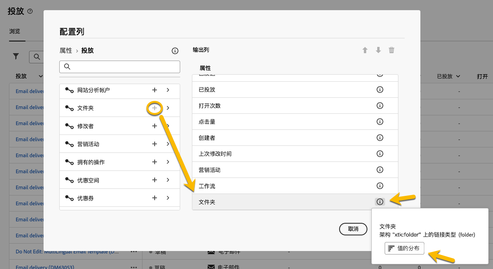

# 使用文件夹 {#folders}

>[!CONTEXTUALHELP]
>id="acw_folder_properties"
>title="文件夹属性"
>abstract="文件夹属性"

>[!CONTEXTUALHELP]
>id="acw_folder_security"
>title="文件夹安全性"
>abstract="文件夹安全性"

>[!CONTEXTUALHELP]
>id="acw_folder_restrictions"
>title="文件夹限制"
>abstract="文件夹限制"

>[!CONTEXTUALHELP]
>id="acw_folder_schedule"
>title="文件夹计划"
>abstract="文件夹计划"

## 关于文件夹 {#about-folders}

文件夹是 Adobe Campaign 中的对象，可用于组织组件和数据。

您可以在导航树中创建、重命名、重新排序和移动文件夹。您也可以根据您的权利删除它们。

{zoomable="yes"}

您可以设置文件夹类型。例如：一个交付文件夹。
文件夹的图标将根据此类型而改变。

## 创建新文件夹 {#create-a-folder}

要在 Adobe Campaign Web UI 中创建新文件夹，请按照以下步骤操作：

1. 在 **[!UICONTROL 资源管理器]**中，转到您想要创建新文件夹的文件夹。
在 **[!UICONTROL ...]** 菜单下，您可以 **[!UICONTROL 创建新文件夹]**

{zoomable="yes"}

当你创建一个新文件夹时，默认情况下，文件夹类型是文件夹父级的类型。在我们的示例中，我们在 **[!UICONTROL 交付]** 文件夹中创建一个文件夹。

{zoomable="yes"}

1. 如果需要，可以通过单击文件夹类型的图标来更改文件夹的类型，然后在显示的列表中选择它，如下所示：

{zoomable="yes"}

点击 **[!UICONTROL 确认]** 按钮设置文件夹类型。

如果您想创建没有特定类型的文件夹，请选择 **[!UICONTROL 通用文件夹]** 类型。

您还可以 [在 Adobe Campaign 控制台中创建和管理文件夹](https://experienceleague.adobe.com/zh-hans/docs/campaign/campaign-v8/config/configuration/folders-and-views)。

## 对文件夹重新排序 {#reorder-folders}

您可以根据需要重新排列文件夹的顺序。为此，请点击 **[!UICONTROL 重新排序文件夹]**，如下所示。

在我们的示例中，文件夹 **“传递”** 包含 4 个文件夹。

{zoomable="yes"}

您可以通过 **拖放**&#x200B;或使用 **上下箭头**&#x200B;来更改文件夹的顺序。

{zoomable="yes"}

## 删除文件夹 {#delete-a-folder}

>[!CAUTION]
>
>在删除某个文件夹时，还将删除存储在该文件夹中的所有数据。

要删除文件夹，请在 **[!UICONTROL 资源管理器]** 树中选择该文件夹，然后单击 **[!UICONTROL ...]** 菜单。
选择 **[!UICONTROL 删除文件夹]**。

{zoomable="yes"}

## 文件夹中的值分布 {#distribution-values-folder}

值的分布有助于了解表中某一列中某个值的百分比。

要了解文件夹中值的分布，请按以下步骤操作：

例如，在交付中，我们想知道 **渠道** 列的值的分布。

要获取此信息，请转到 **[!UICONTROL 交付]** 文件夹并单击 **[!UICONTROL 配置列]** 图标。

在 **[!UICONTROL 配置列]** 窗口中，点击您想要了解的列的 **[!UICONTROL 信息]** 图标。然后，点击 **[!UICONTROL 值分布]** 按钮。

{zoomable="yes"}

您将获得 **[!UICONTROL 渠道]** 列中的值的百分比。

{zoomable="yes"}

>[!NOTE]
>
> 对于具有许多值的列，仅显示前二十个值。通知 **[!UICONTROL 部分加载]** 将警告您。

您还可以获得链接值的分布。

在属性列表中，点击所需链接旁边的 **+** 按钮，如下所示。这会将链接添加到 **[!UICONTROL 输出列]**。您现在可以获得 **[!UICONTROL 信息]** 图标，以便查看其值的分布。如果您不想保留 **[!UICONTROL 输出列]**&#x200B;中的链接，请务必点击 **[!UICONTROL 取消]** 按钮。

{zoomable="yes"}

查询建模器中也可以有值的分布。[在此处了解详情](../query/build-query.md#distribution-of-values-in-a-query)。

### 过滤值 {#filter-values}

通过使用值分布窗口中的 **[!UICONTROL 高级过滤器]**，您可以根据指定的条件过滤结果。

在上面显示的是每个渠道的分布的交付清单示例中，您可以对其进行过滤，以仅显示状态为 **已完成**&#x200B;的交付。

{zoomable="yes"}
