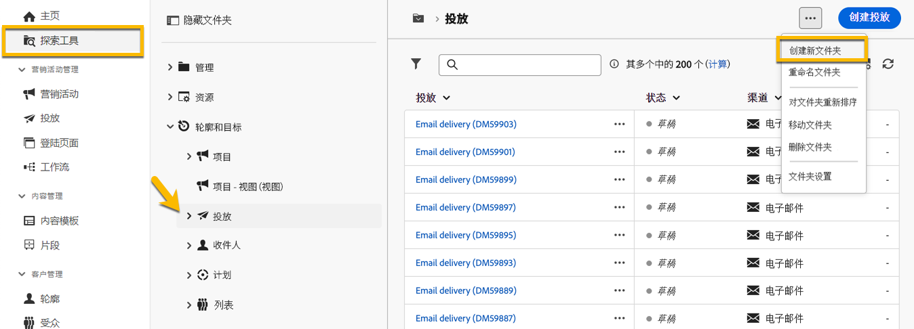
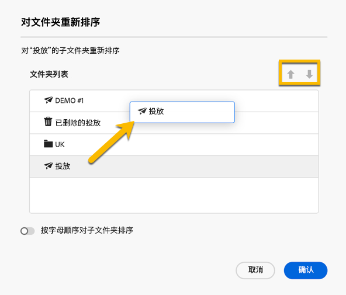

# 使用文件夹 {#folders}

>[!CONTEXTUALHELP]
>id="acw_folder_properties"
>title="文件夹属性"
>abstract="文件夹属性"

>[!CONTEXTUALHELP]
>id="acw_folder_security"
>title="文件夹安全性"
>abstract="文件夹安全性"

>[!CONTEXTUALHELP]
>id="acw_folder_schedule"
>title="文件夹计划"
>abstract="文件夹计划"

## 关于文件夹 {#about-folders}

文件夹是 Adobe Campaign 中的对象，可用于组织组件和数据。

您可以在导航树中创建、重命名、重新排序和移动文件夹。您也可以根据您的权限删除它们。

{zoomable="yes"}

您可以设置文件夹类型。例如：一个投放文件夹。文件夹图标会根据其类型而变化。

>[!CONTEXTUALHELP]
>id="acw_folder_restrictions"
>title="文件夹限制"
>abstract="左侧面板中的 “Objects created automatically” 文件夹与 “Technical workflows” 文件夹为受限内容，无法查看。"

>[!IMPORTANT]
>
>文件夹&#x200B;**[!UICONTROL 自动创建的对象]**&#x200B;和&#x200B;**[!UICONTROL 技术工作流]**&#x200B;受到限制，无法在左侧面板中查看。

## 创建新文件夹 {#create-a-folder}

要在 Adobe Campaign Web UI 中创建新文件夹，请按照以下步骤操作：

1. 在 **[!UICONTROL 资源管理器]**&#x200B;中，转到您想要创建新文件夹的文件夹。在 **[!UICONTROL ...]** 菜单下，选择&#x200B;**[!UICONTROL 创建新文件夹]**。

{zoomable="yes"}

当你创建一个新文件夹时，默认情况下，文件夹类型是父级文件夹的类型。在该示例中，会在&#x200B;**[!UICONTROL 投放]**&#x200B;文件夹中创建一个子文件夹。

{zoomable="yes"}

1. 如果需要，可以通过单击文件夹类型的图标来更改文件夹的类型，然后在显示的列表中选择所需的类型，如下所示：

{zoomable="yes"}

单击&#x200B;**[!UICONTROL 确认]**&#x200B;按钮设置文件夹类型。

如果您想创建没有特定类型的文件夹，请选择&#x200B;**[!UICONTROL 通用文件夹]**&#x200B;类型。

您还可以[在 Adobe Campaign 控制台中创建和管理文件夹](https://experienceleague.adobe.com/zh-hans/docs/campaign/campaign-v8/config/configuration/folders-and-views)。

## 对文件夹重新排序 {#reorder-folders}

您可以根据需要重新排序文件夹。为此，请点击&#x200B;**[!UICONTROL 重新排序文件夹]**，如下所示。

在该示例中，**投放**&#x200B;文件夹包含四个子文件夹。

{zoomable="yes"}

您可以通过&#x200B;**拖放**&#x200B;或使用&#x200B;**上下箭头**&#x200B;来更改文件夹的顺序。

{zoomable="yes"}

### 收藏夹 {#favorite-folders}

>[!CONTEXTUALHELP]
>id="acw_folder_favorites"
>title="收藏"
>abstract="您收藏的文件夹将显示在左侧标签页的顶部。"

标记为“收藏”的文件夹将始终显示在左侧选项卡的顶部。

查看文件夹时，单击右上角的星形按钮可将文件夹添加为收藏夹。

{zoomable="yes"}

## 删除文件夹 {#delete-a-folder}

>[!CAUTION]
>
>在删除某个文件夹时，还将删除存储在该文件夹中的所有数据。

要删除文件夹，请在&#x200B;**[!UICONTROL 资源管理器]**&#x200B;树中选择该文件夹，然后单击 **[!UICONTROL ...]** 菜单。选择&#x200B;**[!UICONTROL 删除文件夹]**。

{zoomable="yes"}

## 文件夹中的值分布 {#distribution-values-folder}

值的分布有助于您了解表中某一列中某个值的百分比。

要查看文件夹中值的分布，请按照以下说明操作。

例如，在投放中，您可能想知道&#x200B;**渠道**&#x200B;列内的值的分布。

要获取此信息，请转到&#x200B;**[!UICONTROL 投放]**&#x200B;文件夹，并单击&#x200B;**[!UICONTROL 配置列]**&#x200B;图标。

在&#x200B;**[!UICONTROL 配置列]**&#x200B;窗口中，点击您想要分析的列的&#x200B;**[!UICONTROL 信息]**&#x200B;图标。然后，点击&#x200B;**[!UICONTROL 值分布]**&#x200B;按钮。

{zoomable="yes"}

您会看到&#x200B;**[!UICONTROL 渠道]**&#x200B;列中的值的百分比。

{zoomable="yes"}

>[!NOTE]
>
>对于具有许多值的列，仅会显示前二十个值。通知&#x200B;**[!UICONTROL 部分加载]**&#x200B;会发出警告。

您还可以查看链接的值分布。

在属性列表中，点击所需链接旁边的 **+** 按钮，如下所示。这会将链接添加到 **[!UICONTROL 输出列]**。您现在可以访问&#x200B;**[!UICONTROL 信息]**&#x200B;图标，以便查看其值的分布。如果您不想保留&#x200B;**[!UICONTROL 输出列]**&#x200B;中的链接，请点击&#x200B;**[!UICONTROL 取消]**&#x200B;按钮。

{zoomable="yes"}

也可以在查询模型器中查看值分布。[在此处了解详情](../query/build-query.md#distribution-of-values-in-a-query)。

### 过滤值 {#filter-values}

通过使用值分布窗口中的&#x200B;**[!UICONTROL 高级过滤器]**，您可以根据指定的条件过滤结果。

在上面的投放列表示例中，该列表显示了按渠道的分布，您可以通过过滤仅显示状态为&#x200B;**已完成**&#x200B;的投放。

{zoomable="yes"}