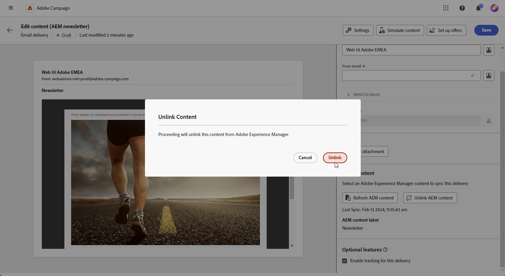

# 使用[!DNL Adobe Experience Manager as a Cloud Service]管理模板{#aem-assets}

## [!DNL Adobe Experience Manager as a Cloud Service] 入门{#create-aem}

Adobe Campaign Web界面与Adobe Experience Manager相集成，允许直接在Adobe Experience Manager平台中简化电子邮件投放内容和表单的管理。

[了解有关Adobe Experience Manager as a Cloud Service的更多信息](https://experienceleague.adobe.com/docs/experience-manager-cloud-service/content/sites/authoring/getting-started/quick-start.html?lang=en)

## 在[!DNL Adobe Experience Manager as a Cloud Service]中创建模板{#create-aem-template}

1. 导航到您的[!DNL Adobe Experience Manager]创作实例，然后单击页面左上角的Adobe Experience 。 从菜单中选择&#x200B;**[!UICONTROL 站点]**。

1. 访问&#x200B;**[!UICONTROL 营销活动>品牌名称>主区域>页面名称]**。

1. 单击&#x200B;**[!UICONTROL 创建]**，然后从下拉菜单中选择&#x200B;**[!UICONTROL 页面]**。

   

1. 选择&#x200B;**[!UICONTROL Adobe Campaign电子邮件]**&#x200B;模板，并命名您的新闻稿。

   ![[显示“Adobe Campaign电子邮件”模板选择和命名字段的屏幕截图。]](assets/aem_2.png)

1. 通过添加组件(例如Adobe Campaign中的个性化字段)自定义电子邮件内容。 [了解详情](https://experienceleague.adobe.com/docs/experience-manager-65/content/sites/authoring/aem-adobe-campaign/campaign.html?lang=en#editing-email-content)

1. 电子邮件准备就绪后，导航到&#x200B;**[!UICONTROL 页面信息]**&#x200B;菜单，然后单击&#x200B;**[!UICONTROL 启动工作流]**。

   

1. 从第一个下拉列表中，选择&#x200B;**[!UICONTROL 批准Adobe Campaign]**&#x200B;作为工作流模型，然后单击&#x200B;**[!UICONTROL 启动工作流]**。

1. 免责声明将显示在页面顶部，声明`This page is subject to the workflow Approve for Adobe Campaign`。 单击免责声明旁边的&#x200B;**[!UICONTROL 完成]**&#x200B;以确认审核，然后单击&#x200B;**[!UICONTROL 确定]**。

   

1. 再次单击&#x200B;**[!UICONTROL 完成]**，然后在&#x200B;**[!UICONTROL 下一步]**&#x200B;下拉列表中选择&#x200B;**[!UICONTROL 新闻稿审批]**。

您的新闻稿现已准备就绪，并已在Adobe Campaign中同步。

## 导入Adobe Experience Manager as a Cloud Service模板{#aem-templates-perso}

在Experience Manager模板作为内容模板出现在Adobe Campaign Web中后，您可以识别并合并电子邮件的必要内容，包括个性化。

1. 在Campaign Web中，从&#x200B;**[!UICONTROL 投放]**&#x200B;菜单中，单击&#x200B;**[!UICONTROL 创建投放]**。

1. 在电子邮件模板窗口中，选择内置的&#x200B;**[!UICONTROL 包含AEM内容的电子邮件投放]**&#x200B;模板。

   

1. 为投放输入&#x200B;**[!UICONTROL 标签]**，并根据需要配置其他选项：

   * **[!UICONTROL 内部名称]**：为投放分配一个唯一标识符。
   * **[!UICONTROL 文件夹]**：将投放存储在特定文件夹中。
   * **[!UICONTROL 投放代码]**：使用此字段根据您自己的命名惯例组织投放。
   * **[!UICONTROL 描述]**：为投放指定描述。
   * **[!UICONTROL 性质]**：指定电子邮件的性质以进行分类。

1. 为您的电子邮件定义&#x200B;**[!UICONTROL 受众]**。 [了解详情](../email/create-email.md#define-audience)

1. 单击&#x200B;**[!UICONTROL 编辑内容]**。

1. 从&#x200B;**[!UICONTROL 编辑内容]**&#x200B;菜单中，单击&#x200B;**[!UICONTROL 选择AEM内容]**。

   

1. 浏览AEM模板，然后选择要导入到Campaign Web的模板。

   

1. 请注意，内容不会自动同步。 如果直接在Adobe Experience Manager中更改了您的模板，请选择&#x200B;**[!UICONTROL 刷新AEM内容]**&#x200B;以更新到模板的最新版本。

1. 要删除Experience Manager与Campaign之间的链接，或在Email designer中进一步个性化Experience Manager模板，请单击&#x200B;**[!UICONTROL 取消链接AEM内容]**。

   

1. 如果您向Experience Manager模板添加了个性化内容，请单击&#x200B;**[!UICONTROL 模拟内容]**&#x200B;以使用测试用户档案预览该内容在邮件中的显示方式。

[了解有关预览和测试用户档案的更多信息](../preview-test/preview-content.md)

1. 在查看消息预览时，任何个性化元素都会自动替换为所选测试用户档案中的相应数据。

   如果需要，请通过&#x200B;**[!UICONTROL 管理测试配置文件]**&#x200B;按钮添加其他测试配置文件。

您的投放现已准备就绪，可供发送。