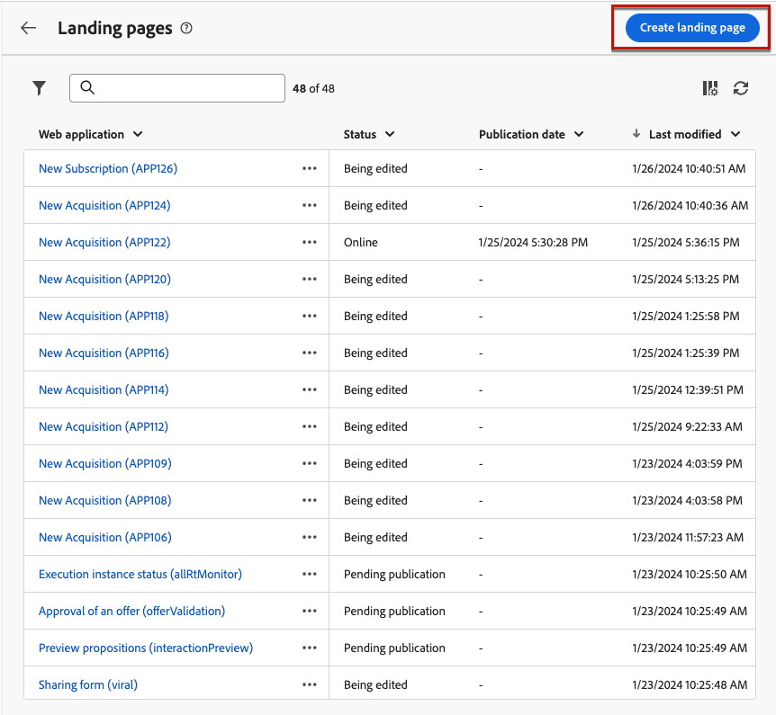
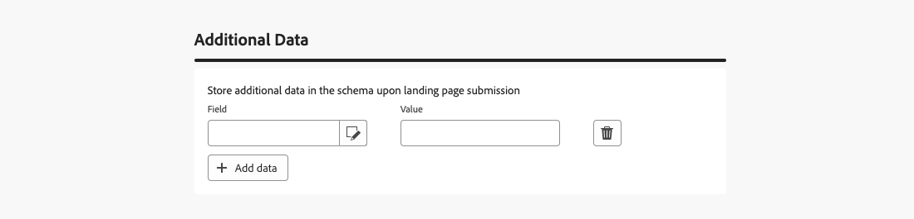
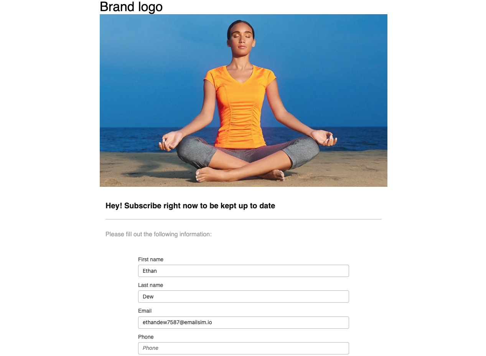

# 创建和发布登陆页面 {#create-lp}

>[!CONTEXTUALHELP]
>id="acw_landingpages_menu"
>title="创建和管理登陆页面"
>abstract="使用 Adobe Campaign，您可以创建、设计和共享登陆页面，从而将用户引导至在线网页，您可以在这些网页上根据内置模板管理客户获取、订阅/退订以及将用例列入阻止列表。"

Campaign Web用户界面允许您创建、设计和发布登陆页面。 发布后，您可以在投放中插入指向表单的链接。 收件人单击该链接后，会被定向到相应的登陆页面。

列入阻止列表 [!DNL Adobe Campaign]附带四个模板，用于管理以下用例：**客户获取**、**订阅**、**取消订阅**&#x200B;和&#x200B;**订阅**。 [了解详情](lp-use-cases.md)

## 访问登陆页面 {#access-landing-pages}

要访问登陆页面列表，请从左侧菜单中选择&#x200B;**[!UICONTROL 内容管理]** > **[!UICONTROL 登陆页面]**。

{zoomable="yes"}

**[!UICONTROL 登陆页面]**&#x200B;清单显示所有已创建的项目。 您可以使用&#x200B;**[!UICONTROL 显示筛选器]**&#x200B;按钮筛选它们。

* 您可以筛选创建或修改的项目。
* 您可以使用下拉列表将结果限制为特定的[文件夹](../get-started/permissions.md#folders)，或者使用[查询建模器](../query/query-modeler-overview.md)添加规则。

{zoomable="yes"}

<!--From this list, you can access the [landing page Live report](../reports/lp-report-live.md) or [landing page Global report](../reports/lp-report-global.md) for published items.-->

>[!CAUTION]
>
>在Campaign Web用户界面中，无法显示或编辑从客户端控制台（Web窗体）创建的登陆页面。 请参阅[Campaign控制台文档](https://experienceleague.adobe.com/docs/campaign/campaign-v8/content/webapps.html?lang=zh-Hans){target="_blank"}以了解详情。

<!--If you unpublish a landing page which is referenced in a message, the link to the landing page will be broken and an error page will be displayed. You cannot delete a published landing page. To delete it, you must first unpublish it.-->

您可以复制或删除登陆页面。 单击登陆页面旁边的省略号以选择所需的操作。

## 创建登陆页面 {#create-landing-page}

>[!CONTEXTUALHELP]
>id="acw_landingpages_properties"
>title="定义登陆页面属性"
>abstract="填写标签等属性字段并根据需要修改架构。此外，还可编辑内部名称、更改从中存储登陆页面的文件夹和提供描述。"

>[!CONTEXTUALHELP]
>id="acw_landingpages_pages_list"
>title="定义每个页面的内容"
>abstract="调整作为该登陆页面一部分的每个页面的内容，例如表单本身、提交表单时显示的确认页面或发生错误时将用户定向前往的页面。"

>[!CONTEXTUALHELP]
>id="acw_landingpages_schedule"
>title="安排您的登陆页面"
>abstract="定义登陆页面的开始日期和结束日期。当页面的有效期结束时，该表单将不再可用。而将显示&#x200B;**过期**&#x200B;页面。"

>[!CONTEXTUALHELP]
>id="acw_landingpages_preload"
>title="定义预加载选项"
>abstract="在选中&#x200B;**预先填入在表格中引用的数据**&#x200B;选项后，如果登陆页面的访客与数据库中的某个轮廓匹配，则自动在表单中预先加载该轮廓的信息。选中&#x200B;**授权无 ID** 选项后，任何访客（包括匿名用户）均可访问登陆页面。"

<!--With the **Skip preloading if no ID** option selected, each profile entered will be added to the database after approval of the form."-->

>[!CONTEXTUALHELP]
>id="acw_landingpages_storage"
>title="定义存储选项"
>abstract="通过预先加载部分，可指示如何查找数据库中要更新的记录。"

<!--The main steps to create landing pages are as follows:

{zoomable="yes"}-->

要创建登陆页面，请执行以下步骤：

1. 在&#x200B;**[!UICONTROL 登陆页面]**&#x200B;清单中，单击&#x200B;**[!UICONTROL 创建登陆页面]**。

   {zoomable="yes"}

1. 选择模板：
   * **[!UICONTROL 客户获取]**：这是登陆页面的默认模板，允许您捕获和更新配置文件数据。
   * **[!UICONTROL 订阅]**：使用此模板使用户能够订阅特定的[服务](../audience/manage-services.md)。
   * **[!UICONTROL 取消订阅]**：此模板可用于发送给服务订阅者的投放，以允许他们取消订阅此[服务](../audience/manage-services.md)。
   * **[!UICONTROL 阻止列表]**：当用户档案单击投放中的选择退出链接且不想再联系时，应使用此模板。

   {zoomable="yes"}

   >[!NOTE]
   >
   >了解如何在[此页面](lp-use-cases.md)中实施与每个模板对应的不同用例。

1. 单击&#x200B;**[!UICONTROL 创建]**。

1. 填写&#x200B;**[!UICONTROL 属性]**&#x200B;字段，如标签。

   默认情况下，登陆页面存储在&#x200B;**[!UICONTROL Web应用程序]**&#x200B;文件夹中。 您可以通过在&#x200B;**[!UICONTROL 其他选项]**&#x200B;中浏览到所需的位置来更改它。 [了解如何使用文件夹](../get-started/permissions.md#folders)。

   您还可以设置验证码以保护登陆页面。 [在此处了解详情](#captcha)。

   {zoomable="yes"}

1. 在&#x200B;**[!UICONTROL 数据预加载]**&#x200B;部分中，以下选项可用：

   * 在选中&#x200B;**[!UICONTROL 预先填入在表格中引用的数据]**&#x200B;选项后，如果登陆页面的访客与数据库中的某个轮廓匹配，则自动在表单中预先加载该轮廓的信息。用户只需填写缺少的字段并在需要时更新现有值。 这允许合并现有用户档案的数据，而不是创建重复项。

     >[!NOTE]
     >
     >默认情况下，会为所有登陆页面模板选择此选项。

   * **[!UICONTROL 授权缺少ID]**&#x200B;选项允许任何访客访问登陆页面。 取消选择此选项可阻止匿名访客使用它，这意味着只有已识别的用户才能访问和提交表单。

     >[!AVAILABILITY]
     >
     >此功能位于有限可用性(LA)中。 仅供&#x200B;**从 Adobe Campaign Standard 迁移到 Adobe Campaign v8** 的客户使用，并且不能部署在任何其他环境上。

     对于&#x200B;**[!UICONTROL 客户获取]**&#x200B;和&#x200B;**[!UICONTROL 订阅]**&#x200B;模板，默认情况下会选中此选项。 对于&#x200B;**[!UICONTROL 取消订阅]**&#x200B;和&#x200B;**[!UICONTROL 阻止列表]**&#x200B;模板，默认情况下将取消选择此选项，且无法修改此选项。

1. 登陆页面可以具有后续页面。 要添加页面，请浏览&#x200B;**[!UICONTROL 页面]**&#x200B;部分，然后单击要为此登陆页面设计的每个页面的&#x200B;**[!UICONTROL 编辑内容]**&#x200B;按钮。 每个页面的内容均已预填充。 根据需要编辑它们。 [了解详情](lp-content.md)。

   {zoomable="yes"}

1. 在&#x200B;**[!UICONTROL 存储]**&#x200B;部分中，默认选中&#x200B;**[!UICONTROL 更新预加载的记录]**&#x200B;选项。 它允许通过登陆页面更新存储在数据库中的用户档案。 通过预加载框，您可以指示如何在数据库中查找要更新的记录。

   您还可以从登陆页面当前上下文中的字段中进行选择，这些字段将用于查找数据库中的相应用户档案。 为此，请取消选择&#x200B;**[!UICONTROL 更新预加载的记录]**&#x200B;选项，并在&#x200B;**[!UICONTROL 协调选项]**&#x200B;下检查所需的字段。

   {zoomable="yes"}

1. 创建&#x200B;**[!UICONTROL 附加数据]**&#x200B;以在提交登陆页面时存储内部数据。 访问该页面的用户不会看到此数据。 仅考虑常量值。

   >[!AVAILABILITY]
   >
   >此功能位于有限可用性(LA)中。 仅供&#x200B;**从 Adobe Campaign Standard 迁移到 Adobe Campaign v8** 的客户使用，并且不能部署在任何其他环境上。

   {zoomable="yes"}

1. 可定义登陆页面的开始日期和结束日期。选择&#x200B;**[!UICONTROL 启用计划]**&#x200B;并设置日期。

   {zoomable="yes"}

   * 登陆页面会在指定的开始日期/时间自动发布。

     >[!NOTE]
     >
     >如果未定义开始日期，则登陆页面在发布后立即处于活动状态。

   * 当页面到达结束日期时，表单不再可用。 而将显示&#x200B;**[!UICONTROL 过期]**&#x200B;页面。

     >[!NOTE]
     >
     >出于安全原因和平台性能的考虑，Adobe建议您设置结束日期。

1. 单击&#x200B;**[!UICONTROL 审阅并发布]**。

定义所有设置和[设计](lp-content.md)所有页面后，您可以[测试](#test-landing-page)和[发布](#publish-landing-page)您的登陆页面，如下所述。

## 使用验证码保护登陆页面 {#captcha}

>[!AVAILABILITY]
>
>此功能位于有限可用性(LA)中。 它仅限于使用与上次修复版本&#x200B;**一起升级的** Adobe Campaign v8.7.2的客户，不能在任何其他环境中部署。

设置验证码可帮助您保护登陆页面免受垃圾邮件和滥用。

若要使用它，请转到登陆页面的&#x200B;**[!UICONTROL 属性]**。
在**[!UICONTROL 其他选项]**&#x200B;中。 激活&#x200B;**[!UICONTROL 其他启用验证码解决方案]**&#x200B;切换开关。

{zoomable="yes"}

要检查验证码设置，请单击&#x200B;**[!UICONTROL 审阅和发布]**&#x200B;按钮，然后单击&#x200B;**[!UICONTROL 模拟内容]**。 在提交表单时，您会看到验证码构件在验证期间正常工作，如下所示。

{zoomable="yes"}

>[!NOTE]
>
>Adobe Campaign v8中的captcha小组件是在浮动模式下运行的ALTCHA。 它会在验证期间显示，并在过程完成后消失。

## 测试登陆页面 {#test-landing-page}

>[!CONTEXTUALHELP]
>id="acw_landingpages_simulate"
>title="模拟您的登陆页面"
>abstract="可在 Campaign Web 用户界面中查看登陆页面的预览，或在新的 Web 浏览器标签页中打开它。"

>[!CONTEXTUALHELP]
>id="ac_preview_lp_profiles"
>title="预览和测试登陆页面"
>abstract="定义了登陆页面设置和内容之后，您可使用测试轮廓对其进行预览。"

定义登陆页面设置和内容后，您可以使用测试配置文件进行预览。 如果您插入[个性化内容](../personalization/gs-personalization.md)，则可以使用测试配置文件数据检查此内容在登陆页面中的显示方式。

>[!CAUTION]
>
>您必须具有可用的测试用户档案，才能预览消息并发送校样。 [了解有关测试用户档案的详细信息](../audience/test-profiles.md)

要测试登陆页面，请执行以下步骤：

1. 单击&#x200B;**[!UICONTROL 审阅和发布]**&#x200B;后，从登陆页面仪表板中选择&#x200B;**[!UICONTROL 模拟内容]**&#x200B;按钮以访问测试配置文件选择。

   {zoomable="yes"}

1. 从&#x200B;**[!UICONTROL 模拟]**&#x200B;屏幕中，选择一个或多个测试配置文件。

   选择测试用户档案的步骤与测试消息时的步骤相同。 在[预览和测试](../preview-test/preview-test.md)部分中有详细介绍。

1. 测试动态登陆页面时(选择了&#x200B;**[!UICONTROL 来自URL的服务]**&#x200B;选项 — [了解详情](../landing-pages/create-lp.md#define-actions-on-form-submission)

1. 选择&#x200B;**[!UICONTROL 打开预览]**&#x200B;以测试您的登陆页面。

   {zoomable="yes"}

1. 登陆页面的预览将在新选项卡中打开。 个性化的元素将由选定的测试配置文件数据替换。

   如果您在登陆页面设置中选择了&#x200B;**[!UICONTROL 使用表单]**&#x200B;中引用的数据预填充选项，则表单字段会自动预填充对应的测试配置文件数据。<!--TBC-->

   {zoomable="yes"}

1. 选择其他测试用户档案以预览登陆页面每个变体的渲染。

<!--Can you preview Confirmation/Error/Expiration pages?-->

## 发布登陆页面 {#publish-landing-page}

准备就绪并验证登陆页面后，将其发布，以便使用相应的按钮将其用于投放。

发布后：

* 登陆页面已添加到具有&#x200B;**[!UICONTROL 已发布]**&#x200B;状态的登陆页面列表。 它现已上线，并准备好在您的内容中引用。

* 您可以将页面顶部显示的&#x200B;**[!UICONTROL 登陆页面URL]**&#x200B;复制粘贴到Web浏览器中，以预览您的登陆页面。

>[!CAUTION]
>
>要全面测试或利用您的登陆页面，您无法将此链接直接复制并粘贴到 Web 浏览器或您的投放中。请改用[模拟内容](#test-landing-page)函数对其进行测试，并按照[此部分](lp-use-cases.md)中描述的步骤正确使用登陆页面。

{zoomable="yes"}

您可以通过日志<!--and specific reports-->监控登陆页面影响。 单击&#x200B;**[!UICONTROL 日志]**&#x200B;按钮。